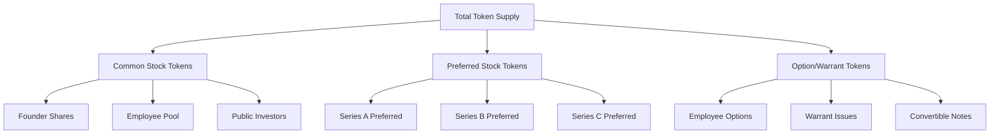
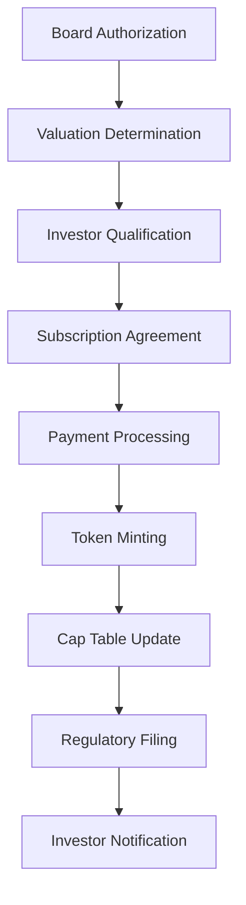
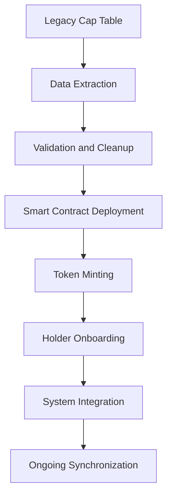

# Cap Table Management for Tokenized Assets

Capitalization table (cap table) management for tokenized assets requires sophisticated tracking, reporting, and administration capabilities that accommodate both traditional securities regulations and innovative blockchain technology. Bridge's comprehensive cap table management system provides real-time visibility, automated compliance, and seamless integration between digital tokens and traditional equity management practices.

## Understanding Tokenized Cap Tables

A tokenized cap table represents the ownership structure of an entity through digital tokens recorded on blockchain infrastructure, providing enhanced transparency, automated compliance, and real-time tracking capabilities while maintaining all legal rights and regulatory protections associated with traditional securities.

### Traditional vs. Tokenized Cap Tables

**Traditional Cap Table Characteristics:**
- Static spreadsheet or database records
- Periodic updates and reconciliation
- Manual transfer processing
- Limited real-time visibility
- Administrative overhead and errors
- Restricted liquidity and trading

**Tokenized Cap Table Advantages:**
- Real-time blockchain-based records
- Automated transfer processing
- Programmable compliance enforcement
- Enhanced transparency and accessibility
- Reduced administrative overhead
- Improved liquidity and market efficiency

### Key Components

**Ownership Records:**
- Token holder identification and verification
- Token allocation and balance tracking
- Acquisition date and price recording
- Transfer history and audit trails
- Voting power calculation and allocation
- Distribution entitlement tracking

**Rights and Preferences:**
- Liquidation preference hierarchies
- Dividend and distribution rights
- Conversion and exercise provisions
- Anti-dilution protection mechanisms
- Preemptive and participation rights
- Tag-along and drag-along provisions

**Compliance Framework:**
- Transfer restriction enforcement
- Investor qualification verification
- Regulatory requirement adherence
- Tax reporting and withholding
- International compliance coordination
- Audit and examination support

## Cap Table Structure and Hierarchy

### Equity Class Organization

**Common Stock Tokens:**


**Token Class Specifications:**

| Class | Token Symbol | Rights | Conversion | Voting | Dividend |
|-------|-------------|--------|------------|--------|----------|
| Common | COM | Full voting rights | 1:1 ratio | 1 vote per token | Participating |
| Series A | PREF-A | Liquidation preference | Optional | 1 vote per share | 8% cumulative |
| Series B | PREF-B | 2x liquidation preference | Optional | 1 vote per share | 10% cumulative |
| Options | OPT | Exercise rights | To common | None | None |
| Warrants | WAR | Purchase rights | To preferred | None | None |

### Ownership Distribution Tracking

**Real-Time Ownership Calculation:**
```solidity
contract CapTableManager {
    struct TokenClass {
        string name;
        string symbol;
        uint256 totalSupply;
        uint256 liquidationPreference;
        uint256 dividendRate;
        bool hasVotingRights;
        bool isConvertible;
    }
    
    struct Shareholder {
        address wallet;
        mapping(bytes32 => uint256) tokenBalances;
        uint256 totalVotingPower;
        bool isAccredited;
        string jurisdiction;
        uint256 acquisitionDate;
    }
    
    mapping(bytes32 => TokenClass) public tokenClasses;
    mapping(address => Shareholder) public shareholders;
    
    function getOwnershipPercentage(address shareholder, bytes32 tokenClass) 
        external view returns (uint256) {
        return (shareholders[shareholder].tokenBalances[tokenClass] * 10000) 
               / tokenClasses[tokenClass].totalSupply;
    }
    
    function getTotalVotingPower(address shareholder) 
        external view returns (uint256) {
        uint256 totalVotes = 0;
        
        for (uint i = 0; i < tokenClassIds.length; i++) {
            bytes32 classId = tokenClassIds[i];
            if (tokenClasses[classId].hasVotingRights) {
                totalVotes += shareholders[shareholder].tokenBalances[classId];
            }
        }
        
        return totalVotes;
    }
}
```

### Dilution and Anti-Dilution Mechanics

**Weighted Average Anti-Dilution:**
```solidity
function calculateAntiDilution(
    uint256 originalPrice,
    uint256 newPrice,
    uint256 newSharesIssued,
    uint256 sharesOutstandingBefore
) external pure returns (uint256 adjustedConversionPrice) {
    
    uint256 weightedAverage = (
        (sharesOutstandingBefore * originalPrice) + 
        (newSharesIssued * newPrice)
    ) / (sharesOutstandingBefore + newSharesIssued);
    
    return weightedAverage;
}
```

**Full Ratchet Anti-Dilution:**
```solidity
function applyFullRatchet(
    uint256 originalConversionPrice,
    uint256 newIssuePrice
) external pure returns (uint256 adjustedPrice) {
    return newIssuePrice < originalConversionPrice ? 
           newIssuePrice : originalConversionPrice;
}
```

## Token Issuance and Allocation

### Primary Issuance Process

**Issuance Workflow:**


**Smart Contract Issuance:**
```solidity
contract TokenIssuance {
    event TokensIssued(
        address indexed investor,
        bytes32 indexed tokenClass,
        uint256 amount,
        uint256 price,
        uint256 timestamp
    );
    
    function issueTokens(
        address investor,
        bytes32 tokenClass,
        uint256 amount,
        uint256 pricePerToken
    ) external onlyAuthorized {
        require(isQualifiedInvestor(investor), "Investor not qualified");
        require(amount > 0, "Amount must be positive");
        require(pricePerToken > 0, "Price must be positive");
        
        // Update cap table
        capTable.addIssuance(investor, tokenClass, amount, pricePerToken);
        
        // Mint tokens
        tokenContract.mint(investor, amount);
        
        // Record transaction
        emit TokensIssued(investor, tokenClass, amount, pricePerToken, block.timestamp);
        
        // Update voting power
        updateVotingPower(investor);
    }
}
```

### Employee Equity Programs

**Stock Option Pool Management:**
```solidity
contract EmployeeOptions {
    struct OptionGrant {
        address employee;
        uint256 totalOptions;
        uint256 exercisePrice;
        uint256 grantDate;
        uint256 vestingPeriod;
        uint256 cliffPeriod;
        uint256 exercisedOptions;
        bool isActive;
    }
    
    mapping(address => OptionGrant) public optionGrants;
    uint256 public totalPoolSize;
    uint256 public allocatedOptions;
    
    function calculateVestedOptions(address employee) 
        external view returns (uint256) {
        OptionGrant memory grant = optionGrants[employee];
        
        if (!grant.isActive) return 0;
        if (block.timestamp < grant.grantDate + grant.cliffPeriod) return 0;
        
        uint256 timeSinceGrant = block.timestamp - grant.grantDate;
        if (timeSinceGrant >= grant.vestingPeriod) {
            return grant.totalOptions - grant.exercisedOptions;
        }
        
        uint256 vestedAmount = (grant.totalOptions * timeSinceGrant) / grant.vestingPeriod;
        return vestedAmount - grant.exercisedOptions;
    }
    
    function exerciseOptions(uint256 amount) external payable {
        OptionGrant storage grant = optionGrants[msg.sender];
        uint256 vestedOptions = calculateVestedOptions(msg.sender);
        
        require(amount <= vestedOptions, "Insufficient vested options");
        require(msg.value >= amount * grant.exercisePrice, "Insufficient payment");
        
        grant.exercisedOptions += amount;
        
        // Issue common stock tokens
        capTable.issueTokens(msg.sender, "COMMON", amount, grant.exercisePrice);
    }
}
```

**Vesting Schedule Automation:**
- Time-based vesting triggers
- Performance milestone tracking
- Acceleration event handling
- Forfeiture and clawback mechanisms
- Tax optimization strategies

## Transfer Restrictions and Compliance

### Transfer Restriction Framework

**Compliance Rule Engine:**
```solidity
contract TransferRestrictions {
    struct RestrictionRule {
        bool isActive;
        uint256 maxHolders;
        uint256 minHoldingPeriod;
        mapping(string => bool) allowedJurisdictions;
        bool requiresAccreditation;
        uint256 maxTokensPerHolder;
    }
    
    mapping(bytes32 => RestrictionRule) public restrictionRules;
    
    function validateTransfer(
        address from,
        address to,
        bytes32 tokenClass,
        uint256 amount
    ) external view returns (bool isValid, string memory reason) {
        RestrictionRule storage rule = restrictionRules[tokenClass];
        
        if (!rule.isActive) return (true, "");
        
        // Check holder limit
        if (capTable.getHolderCount(tokenClass) >= rule.maxHolders && 
            capTable.getBalance(to, tokenClass) == 0) {
            return (false, "Exceeds maximum holder limit");
        }
        
        // Check holding period
        uint256 acquisitionDate = capTable.getAcquisitionDate(from, tokenClass);
        if (block.timestamp < acquisitionDate + rule.minHoldingPeriod) {
            return (false, "Minimum holding period not met");
        }
        
        // Check accreditation
        if (rule.requiresAccreditation && !isAccredited(to)) {
            return (false, "Recipient not accredited");
        }
        
        // Check jurisdiction
        string memory jurisdiction = getInvestorJurisdiction(to);
        if (!rule.allowedJurisdictions[jurisdiction]) {
            return (false, "Jurisdiction not allowed");
        }
        
        // Check per-holder limit
        uint256 newBalance = capTable.getBalance(to, tokenClass) + amount;
        if (newBalance > rule.maxTokensPerHolder) {
            return (false, "Exceeds per-holder limit");
        }
        
        return (true, "");
    }
}
```

### Automated Compliance Monitoring

**Real-Time Compliance Dashboard:**
- Transfer approval workflow
- Regulatory rule monitoring
- Exception reporting and alerts
- Audit trail maintenance
- Compliance status tracking

**Regulatory Filing Automation:**
- Form D filing coordination
- State notice filing management
- International reporting requirements
- Beneficial ownership reporting
- Anti-money laundering compliance

## Corporate Actions and Events

### Dividend and Distribution Management

**Distribution Calculation Engine:**
```solidity
contract DistributionManager {
    struct Distribution {
        uint256 distributionId;
        uint256 recordDate;
        uint256 paymentDate;
        mapping(bytes32 => uint256) amountPerToken;
        bool isPaid;
        string distributionType;
    }
    
    mapping(uint256 => Distribution) public distributions;
    
    function declareDistribution(
        uint256 recordDate,
        uint256 paymentDate,
        bytes32[] memory tokenClasses,
        uint256[] memory amountsPerToken,
        string memory distributionType
    ) external onlyBoard {
        uint256 distributionId = nextDistributionId++;
        Distribution storage dist = distributions[distributionId];
        
        dist.distributionId = distributionId;
        dist.recordDate = recordDate;
        dist.paymentDate = paymentDate;
        dist.distributionType = distributionType;
        
        for (uint i = 0; i < tokenClasses.length; i++) {
            dist.amountPerToken[tokenClasses[i]] = amountsPerToken[i];
        }
        
        calculateDistributionEntitlements(distributionId);
    }
    
    function calculateDistributionEntitlements(uint256 distributionId) 
        internal {
        Distribution storage dist = distributions[distributionId];
        
        for (uint i = 0; i < tokenClassIds.length; i++) {
            bytes32 classId = tokenClassIds[i];
            uint256 amountPerToken = dist.amountPerToken[classId];
            
            if (amountPerToken > 0) {
                address[] memory holders = capTable.getHolders(classId);
                
                for (uint j = 0; j < holders.length; j++) {
                    uint256 balance = capTable.getBalanceAtDate(
                        holders[j], 
                        classId, 
                        dist.recordDate
                    );
                    
                    uint256 entitlement = balance * amountPerToken;
                    distributionEntitlements[distributionId][holders[j]] = entitlement;
                }
            }
        }
    }
}
```

### Stock Splits and Combinations

**Automated Share Adjustment:**
```solidity
function executeStockSplit(
    bytes32 tokenClass,
    uint256 splitRatio // e.g., 200 for 2:1 split
) external onlyBoard {
    require(splitRatio > 100, "Split ratio must be greater than 1:1");
    
    address[] memory holders = capTable.getHolders(tokenClass);
    
    for (uint i = 0; i < holders.length; i++) {
        uint256 currentBalance = capTable.getBalance(holders[i], tokenClass);
        uint256 newBalance = (currentBalance * splitRatio) / 100;
        uint256 additionalTokens = newBalance - currentBalance;
        
        // Mint additional tokens
        tokenContract.mint(holders[i], additionalTokens);
        
        // Update cap table
        capTable.adjustBalance(holders[i], tokenClass, newBalance);
    }
    
    // Update total supply
    uint256 currentSupply = tokenClasses[tokenClass].totalSupply;
    tokenClasses[tokenClass].totalSupply = (currentSupply * splitRatio) / 100;
}
```

### Merger and Acquisition Processing

**M&A Transaction Support:**
- Shareholder approval voting
- Valuation and exchange ratio calculation
- Dissenter rights administration
- Escrow and holdback management
- Tax election coordination

## Reporting and Analytics

### Financial Reporting

**Cap Table Snapshot Generation:**
```solidity
contract CapTableReporting {
    function generateCapTableSnapshot(uint256 asOfDate) 
        external view returns (CapTableSnapshot memory) {
        CapTableSnapshot memory snapshot;
        snapshot.asOfDate = asOfDate;
        snapshot.totalHolders = getTotalHolders();
        
        for (uint i = 0; i < tokenClassIds.length; i++) {
            bytes32 classId = tokenClassIds[i];
            TokenClassSnapshot memory classSnapshot;
            
            classSnapshot.tokenClass = classId;
            classSnapshot.totalSupply = getSupplyAtDate(classId, asOfDate);
            classSnapshot.holderCount = getHolderCountAtDate(classId, asOfDate);
            classSnapshot.topHolders = getTopHoldersAtDate(classId, asOfDate, 10);
            
            snapshot.tokenClasses.push(classSnapshot);
        }
        
        return snapshot;
    }
}
```

**Performance Analytics:**

| Metric | Formula | Purpose |
|--------|---------|---------|
| Ownership Concentration | Top 10 holders / Total supply | Concentration analysis |
| Transfer Velocity | Monthly transfers / Total supply | Liquidity measurement |
| Holder Growth Rate | (New holders - Departing holders) / Total holders | Growth tracking |
| Average Holding Period | Sum of holding periods / Number of holders | Investment behavior |
| Price Performance | Current price / Previous price - 1 | Valuation trends |

### Regulatory Reporting

**Automated Filing Preparation:**
- Form D amendments and updates
- Schedule 13D beneficial ownership reporting
- International tax reporting
- Anti-money laundering suspicious activity reports
- Securities lending and borrowing reports

**Audit Trail Documentation:**
- Complete transaction history
- Authorization and approval records
- Corporate action documentation
- Compliance verification logs
- Exception and override tracking

## Integration and Interoperability

### Traditional Systems Integration

**Legacy Cap Table Migration:**


**Professional Service Integration:**
- Legal counsel collaboration
- Accounting firm coordination
- Transfer agent services
- Custodian and clearing systems
- Regulatory filing services

### Cross-Platform Compatibility

**Multi-Chain Support:**
- Ethereum mainnet deployment
- Layer 2 scaling solutions
- Cross-chain bridge protocols
- Multi-signature wallet integration
- Hardware security module support

**API and Webhook Integration:**
```javascript
// Cap table API integration example
const capTableAPI = {
    getOwnership: async (address, tokenClass) => {
        const response = await fetch(`/api/cap-table/ownership/${address}/${tokenClass}`);
        return response.json();
    },
    
    getDistributions: async (address) => {
        const response = await fetch(`/api/distributions/${address}`);
        return response.json();
    },
    
    subscribeToUpdates: (callback) => {
        const ws = new WebSocket('wss://api.bridge.com/cap-table/updates');
        ws.onmessage = (event) => {
            const update = JSON.parse(event.data);
            callback(update);
        };
    }
};
```

## Investor Experience and Access

### Investor Portal Features

**Real-Time Portfolio Tracking:**
- Current ownership percentages
- Voting power calculations
- Distribution history and projections
- Valuation updates and trends
- Transaction history and documentation

**Self-Service Capabilities:**
- Address and contact updates
- Tax document downloads
- Proxy voting participation
- Distribution preference settings
- Communication preference management

### Mobile and Web Access

**Cross-Platform Accessibility:**
- Responsive web application
- Native mobile applications
- Hardware wallet integration
- Multi-factor authentication
- Biometric security options

**Notification Systems:**
- Real-time transaction alerts
- Corporate action notifications
- Distribution announcements
- Voting deadline reminders
- Compliance requirement updates

## Risk Management and Security

### Operational Risk Controls

**Access Control Systems:**
- Role-based permission management
- Multi-signature transaction requirements
- Time-delayed administrative actions
- Emergency pause mechanisms
- Audit log monitoring

**Data Integrity Protection:**
- Blockchain immutability features
- Cryptographic hash verification
- Redundant backup systems
- Disaster recovery procedures
- Third-party validation services

### Compliance Risk Mitigation

**Regulatory Monitoring:**
- Real-time compliance checking
- Automated restriction enforcement
- Exception reporting and escalation
- Regular compliance audits
- Professional service coordination

**Legal Risk Management:**
- Professional liability insurance
- Legal opinion requirements
- Document retention policies
- Dispute resolution procedures
- Regulatory examination support

## Future Developments

### Technology Enhancements

**Advanced Analytics:**
- AI-powered ownership analysis
- Predictive compliance monitoring
- Market trend identification
- Risk assessment automation
- Performance optimization recommendations

**Automation Expansion:**
- Smart contract governance
- Autonomous corporate actions
- Dynamic compliance rules
- Predictive analytics integration
- Machine learning optimization

### Regulatory Evolution

**Digital Securities Infrastructure:**
- Central Securities Depository integration
- Real-time gross settlement systems
- Cross-border transaction facilitation
- Regulatory sandbox participation
- International coordination frameworks

**Market Development:**
- Institutional adoption acceleration
- Secondary market expansion
- Professional service standardization
- Technology certification programs
- Best practice establishment

Comprehensive cap table management forms the backbone of successful tokenized asset projects, providing transparency, compliance, and operational efficiency while maintaining the highest standards of investor protection and regulatory adherence. Bridge's advanced cap table management platform enables asset sponsors to efficiently manage complex ownership structures while providing investors with unprecedented visibility and control over their investments. As the tokenization market continues to mature, sophisticated cap table management will become increasingly critical for institutional adoption and regulatory acceptance.