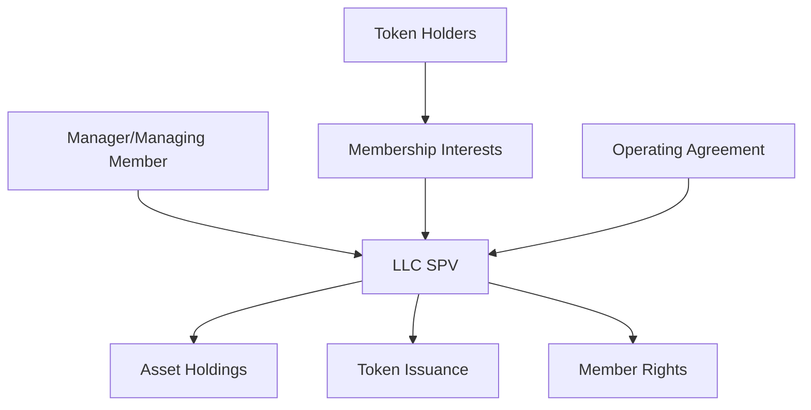
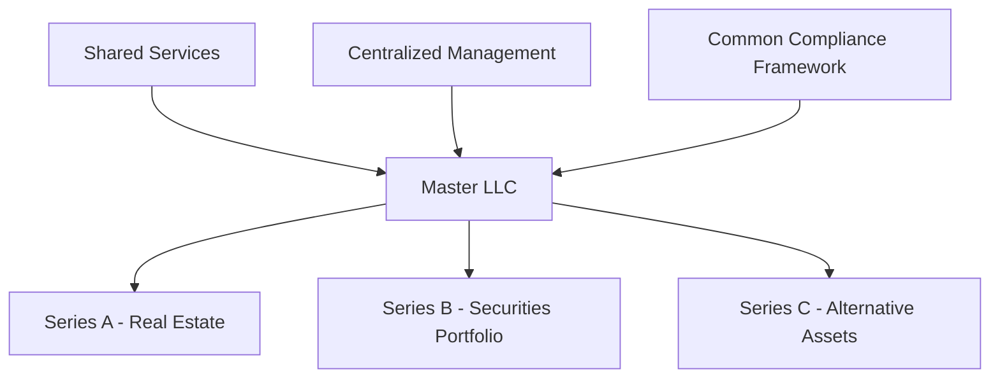
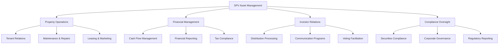

# Special Purpose Vehicle (SPV) Setup and Management

Special Purpose Vehicles (SPVs) serve as the legal foundation for asset tokenization projects, providing the necessary corporate structure to hold assets, issue tokens, and manage investor relationships while maintaining regulatory compliance and operational efficiency. Bridge's SPV framework enables seamless tokenization while protecting all stakeholders through established legal structures and governance mechanisms.

## Understanding SPVs in Tokenization

An SPV is a separate legal entity created specifically to hold and manage tokenized assets, isolate risks, and facilitate investor participation. The SPV serves as the bridge between traditional asset ownership and digital token representation, ensuring that token holders have legitimate ownership rights while maintaining compliance with securities and corporate law.

### Core Functions of SPVs

**Asset Ownership:** The SPV holds legal title to the underlying asset, whether real estate, securities, or other investment vehicles, ensuring clear chain of title and ownership rights.

**Token Issuance:** The SPV issues digital tokens that represent fractional ownership interests in the SPV and, by extension, the underlying assets.

**Investor Relations:** The SPV manages relationships with token holders, including distributions, communications, voting, and compliance requirements.

**Regulatory Compliance:** The SPV ensures ongoing compliance with securities laws, tax regulations, and industry-specific requirements.

**Risk Isolation:** The SPV structure protects both the underlying asset and the sponsor from liabilities associated with the tokenization project.

## SPV Entity Selection

### Limited Liability Company (LLC)

**Advantages:**
- Operational flexibility and simplified governance
- Pass-through tax treatment avoiding double taxation
- Customizable operating agreements
- Professional manager structure options
- Member-managed or manager-managed structures

**Typical Structure:**


**Use Cases:**
- Real estate tokenization projects
- Private placement offerings
- Alternative investment structures
- Single-asset vehicles
- Small to medium-sized issuances

**Delaware LLC Benefits:**
- Well-established legal framework
- Favorable court system and case law
- Flexible statutory provisions
- Strong asset protection features
- Professional service infrastructure

### Delaware Statutory Trust (DST)

**Advantages:**
- Tax transparency for federal purposes
- Limited liability for beneficial owners
- Flexible distribution structures
- Professional trustee management
- Institutional investor familiarity

**Governance Structure:**
- Independent trustee management
- Trust agreement governing document
- Beneficial interest certificates
- Limited beneficial owner involvement
- Professional oversight and reporting

**Regulatory Considerations:**
- Securities law compliance requirements
- Investment Company Act analysis
- State registration and filing obligations
- Trustee fiduciary duty standards
- Regulatory examination protocols

### Series LLC Structure

**Benefits:**
- Multiple asset segregation within single entity
- Cost-effective multi-project structure
- Liability isolation between series
- Centralized administration
- Scalable expansion capabilities

**Implementation:**


**Use Cases:**
- Multiple asset tokenization programs
- Diversified investment platforms
- Ongoing issuance programs
- Professional fund managers
- Institutional sponsor arrangements

## Formation and Documentation

### Entity Formation Process

**Jurisdiction Selection:**
Delaware remains the preferred jurisdiction for SPV formation due to:
- Sophisticated corporate law framework
- Experienced professional service providers
- Favorable court system and precedents
- Strong asset protection statutes
- Institutional investor familiarity

**Formation Steps:**
1. **Name Selection and Reservation**
   - Delaware Division of Corporations search
   - Name availability verification
   - Trademark and domain considerations
   - Professional naming conventions

2. **Registered Agent Appointment**
   - Delaware registered agent requirement
   - Professional service provider selection
   - Ongoing compliance monitoring
   - Legal notice and service handling

3. **Certificate of Formation Filing**
   - Delaware Secretary of State submission
   - Required information disclosure
   - Filing fee payment
   - Expedited processing options

4. **Operating Agreement Preparation**
   - Customized governance provisions
   - Token holder rights definition
   - Management structure establishment
   - Distribution and liquidation terms

### Key Documentation Requirements

**Operating Agreement Provisions:**

```text
ARTICLE I - ORGANIZATION AND PURPOSE
1.1 Formation: The Company has been formed as a limited liability company 
    under the Delaware Limited Liability Company Act.
1.2 Purpose: To acquire, hold, and manage [Asset Description] and issue 
    digital tokens representing membership interests.

ARTICLE II - MEMBERSHIP INTERESTS AND TOKENS
2.1 Token Issuance: The Company may issue digital tokens representing 
    fractional membership interests.
2.2 Rights and Obligations: Token holders shall have rights to distributions, 
    information, and voting as specified herein.
2.3 Transfer Restrictions: Tokens may only be transferred in compliance 
    with securities laws and this Agreement.

ARTICLE III - MANAGEMENT
3.1 Manager Authority: The Manager shall have full authority to manage 
    Company affairs subject to this Agreement.
3.2 Fiduciary Duties: The Manager owes fiduciary duties to the Company 
    and its Members.
3.3 Major Decisions: Certain decisions require Member approval as specified.

ARTICLE IV - DISTRIBUTIONS
4.1 Distribution Policy: Net cash flow shall be distributed quarterly 
    to Members pro rata.
4.2 Tax Distributions: The Company may make distributions for tax obligations.
4.3 Liquidation: Upon liquidation, proceeds shall be distributed according 
    to liquidation preferences.
```

**Token Purchase Agreement:**
- Investment terms and conditions
- Representations and warranties
- Risk factor disclosures
- Transfer restriction acknowledgments
- Regulatory compliance provisions

**Private Placement Memorandum:**
- Investment overview and strategy
- Risk factor identification
- Use of proceeds description
- Management team background
- Financial projections and assumptions

## Governance and Management Structure

### Management Options

**Professional Manager Model:**
Independent management company provides:
- Asset management expertise
- Regulatory compliance oversight
- Investor relations services
- Financial reporting and administration
- Strategic planning and execution

**Sponsor-Managed Structure:**
Asset sponsor retains control through:
- Managing member designation
- Day-to-day operational authority
- Strategic decision-making power
- Professional service coordination
- Investor communication responsibility

**Independent Board Structure:**
Professional board oversight including:
- Independent director appointments
- Fiduciary duty compliance
- Conflict of interest management
- Major decision approval authority
- Stakeholder representation

### Token Holder Rights

**Economic Rights:**
- Pro-rata distribution entitlements
- Liquidation preference participation
- Capital appreciation benefits
- Tax attribute pass-through
- Reinvestment option availability

**Information Rights:**
- Quarterly financial statements
- Annual audited reports
- Material event notifications
- Asset performance updates
- Market condition assessments

**Voting Rights:**
- Major decision participation
- Manager replacement authority
- Operating agreement amendments
- Asset disposition approvals
- Conflict resolution procedures

**Protective Rights:**
- Transfer restriction enforcement
- Dilution protection provisions
- Preemptive right availability
- Tag-along and drag-along rights
- Dissenter appraisal mechanisms

## Regulatory and Compliance Framework

### Securities Law Compliance

**Federal Securities Regulations:**
SPVs issuing tokens must comply with comprehensive securities laws:

**Securities Act of 1933:**
- Registration requirements or exemption qualification
- Disclosure obligation compliance
- Anti-fraud provision adherence
- Integration rule consideration
- Resale restriction implementation

**Securities Exchange Act of 1934:**
- Periodic reporting obligations
- Proxy statement requirements
- Insider trading restrictions
- Market manipulation prohibitions
- Recordkeeping and audit compliance

**Investment Company Act of 1940:**
- Investment company analysis and exemption
- Advisory relationship regulations
- Affiliated transaction restrictions
- Custody and safekeeping requirements
- Valuation and pricing standards

### State-Level Compliance

**Blue Sky Law Requirements:**
- State securities registration or exemption
- Merit review jurisdiction compliance
- Filing fee payment and document submission
- Ongoing reporting obligation fulfillment
- Enforcement cooperation requirements

**Corporate Law Compliance:**
- Annual report filing obligations
- Franchise tax payment requirements
- Registered agent maintenance
- Corporate book and record keeping
- Good standing certificate availability

### Tax Considerations

**Pass-Through Tax Treatment:**
LLC SPVs typically qualify for partnership tax treatment:
- No entity-level taxation
- Distributive share allocations
- K-1 reporting requirements
- Basis tracking obligations
- Tax distribution provisions

**Debt-Financed Property:**
- Unrelated business taxable income (UBTI)
- Tax-exempt investor considerations
- Debt allocation and tracking
- Income characterization issues
- Withholding and reporting requirements

## Asset Management and Operations

### Property Management (Real Estate SPVs)

**Operational Responsibilities:**


**Professional Service Coordination:**
- Property management company selection
- Leasing agent appointment
- Maintenance contractor management
- Insurance broker coordination
- Legal counsel engagement

### Financial Management

**Cash Flow Management:**
- Income collection and verification
- Expense payment and tracking
- Reserve fund maintenance
- Distribution calculation and processing
- Tax withholding and remittance

**Financial Reporting:**
- Monthly financial statements
- Quarterly investor reports
- Annual audited financials
- Tax return preparation
- Performance analytics

**Banking and Treasury:**
- SPV bank account establishment
- Signatory authority designation
- Cash management procedures
- Investment policy implementation
- Fraud prevention protocols

## Technology Integration

### Blockchain Infrastructure

**Smart Contract Implementation:**
```solidity
contract SPVTokenContract {
    struct TokenHolder {
        address wallet;
        uint256 tokens;
        uint256 acquisitionDate;
        bool isAccredited;
    }
    
    struct Distribution {
        uint256 distributionId;
        uint256 totalAmount;
        uint256 perTokenAmount;
        uint256 recordDate;
        uint256 paymentDate;
        bool isPaid;
    }
    
    mapping(address => TokenHolder) public tokenHolders;
    mapping(uint256 => Distribution) public distributions;
    
    address public spvManager;
    address public assetAddress;
    uint256 public totalTokenSupply;
    
    event TokensIssued(address indexed holder, uint256 amount);
    event DistributionDeclared(uint256 indexed distributionId, uint256 amount);
    event DistributionPaid(address indexed holder, uint256 amount);
    
    modifier onlyManager() {
        require(msg.sender == spvManager, "Only SPV manager can execute");
        _;
    }
    
    function issueTokens(address to, uint256 amount) external onlyManager {
        require(isQualifiedInvestor(to), "Investor not qualified");
        tokenHolders[to].tokens += amount;
        tokenHolders[to].acquisitionDate = block.timestamp;
        totalTokenSupply += amount;
        emit TokensIssued(to, amount);
    }
    
    function declareDistribution(uint256 totalAmount) external onlyManager {
        uint256 distributionId = nextDistributionId++;
        uint256 perTokenAmount = totalAmount / totalTokenSupply;
        
        distributions[distributionId] = Distribution({
            distributionId: distributionId,
            totalAmount: totalAmount,
            perTokenAmount: perTokenAmount,
            recordDate: block.timestamp,
            paymentDate: block.timestamp + 30 days,
            isPaid: false
        });
        
        emit DistributionDeclared(distributionId, totalAmount);
    }
}
```

**Integration Systems:**
- Property management software connectivity
- Accounting system synchronization
- Banking API integration
- Compliance monitoring platforms
- Investor portal development

### Data Management and Analytics

**Performance Tracking:**
- Asset-level performance metrics
- Portfolio analytics and reporting
- Benchmark comparison analysis
- Risk assessment and monitoring
- Market data integration

**Investor Dashboard:**
- Real-time portfolio valuation
- Distribution history and projections
- Document access and storage
- Communication and voting interface
- Tax reporting assistance

## Risk Management

### Operational Risk Mitigation

**Professional Service Network:**
- Experienced legal counsel
- Qualified accounting firms
- Professional property managers
- Compliance consultants
- Technology service providers

**Insurance Coverage:**
- General liability insurance
- Professional liability coverage
- Directors and officers protection
- Cyber security insurance
- Property and casualty coverage

**Internal Controls:**
- Segregation of duties
- Approval authority limits
- Regular audit procedures
- Fraud prevention protocols
- Emergency response planning

### Legal and Regulatory Risks

**Documentation Quality:**
- Professional legal document preparation
- Regular legal review and updates
- Compliance monitoring systems
- Regulatory change tracking
- Professional opinion letters

**Dispute Resolution:**
- Alternative dispute resolution procedures
- Arbitration and mediation provisions
- Legal counsel engagement protocols
- Insurance claim procedures
- Stakeholder communication plans

## Performance Measurement

### Financial Metrics

**Return Analysis:**
- Internal rate of return (IRR) calculation
- Cash-on-cash return measurement
- Total return computation
- Risk-adjusted return assessment
- Benchmark performance comparison

**Operational Efficiency:**
- Administrative cost ratios
- Management fee analysis
- Technology cost assessment
- Professional service efficiency
- Scale economy realization

### Stakeholder Satisfaction

**Investor Relations:**
- Communication effectiveness surveys
- Response time measurement
- Information quality assessment
- Technology platform utilization
- Overall satisfaction tracking

**Service Provider Performance:**
- Professional service evaluation
- Cost-effectiveness analysis
- Quality and timeliness metrics
- Innovation and improvement initiatives
- Relationship management assessment

## Future Developments

### Regulatory Evolution

**Digital Asset Frameworks:**
- SPV structure modernization
- Regulatory sandbox participation
- International coordination efforts
- Professional standard development
- Technology integration guidance

**Market Infrastructure:**
- Institutional custody solutions
- Professional service standardization
- Technology platform certification
- Compliance automation tools
- Cross-border operation facilitation

### Technology Advancement

**Automation Enhancement:**
- AI-powered asset management
- Smart contract automation expansion
- Predictive analytics integration
- Dynamic compliance monitoring
- Operational efficiency optimization

**Interoperability Development:**
- Cross-chain SPV structures
- Multi-platform token support
- Standardized interface development
- Integration protocol advancement
- Ecosystem collaboration enhancement

SPV structures provide the essential legal foundation for successful asset tokenization projects. Bridge's comprehensive SPV formation and management services ensure that tokenization initiatives benefit from established legal frameworks while incorporating innovative technology solutions. Professional SPV structuring enables asset sponsors to access global capital markets while providing investors with transparent, compliant, and efficient investment opportunities. As the regulatory landscape continues to evolve, well-structured SPVs will remain the cornerstone of institutional-quality tokenization projects.