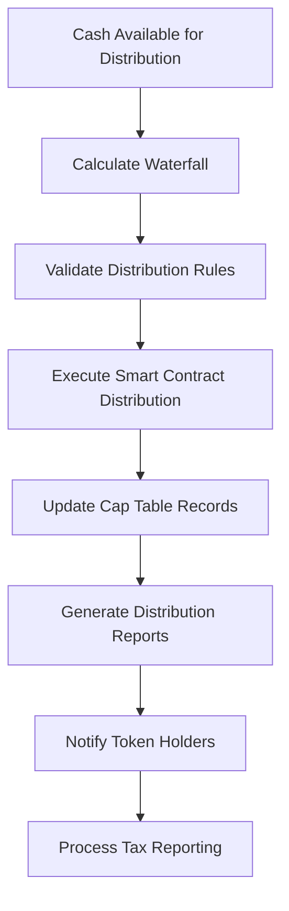

# Distribution Waterfall Mechanisms

Distribution waterfalls define the order and methodology for distributing cash flows, profits, and liquidation proceeds among different classes of investors in tokenized assets. Bridge's sophisticated waterfall management system automates complex distribution calculations while ensuring transparency, accuracy, and compliance with legal agreements and regulatory requirements.

## Understanding Distribution Waterfalls

A distribution waterfall is a structured mechanism that determines how cash flows from an investment are allocated among various stakeholders according to predefined priorities, preferences, and participation rights. In tokenized assets, waterfalls are implemented through smart contracts that automatically calculate and execute distributions based on programmed rules and real-time asset performance.

### Core Waterfall Principles

**Priority Structure:** Different classes of investors receive distributions in a specific order, with senior classes receiving payments before subordinate classes.

**Preference Rights:** Certain investor classes may have liquidation preferences or preferred return requirements that must be satisfied before other distributions.

**Participation Rights:** Some classes may participate in distributions beyond their preference amount, sharing in additional profits according to specified formulas.

**Catch-up Provisions:** Mechanisms that allow certain parties to "catch up" to target return thresholds before profit sharing resumes on a pro-rata basis.

**Hurdle Rates:** Minimum return thresholds that must be achieved before certain distribution tiers become active.

## Types of Distribution Waterfalls

### Simple Preference Waterfall

**Structure Overview:**
The most basic waterfall structure provides preferred investors with priority distributions up to their liquidation preference, with remaining proceeds flowing to common holders.

**Distribution Order:**
1. Preferred stockholders receive 1x liquidation preference
2. Remaining proceeds distributed to common stockholders

**Smart Contract Implementation:**
```solidity
contract SimplePreferenceWaterfall {
    struct InvestorClass {
        string className;
        uint256 liquidationPreference;
        uint256 totalShares;
        mapping(address => uint256) shareholdings;
        bool isPreferred;
    }
    
    mapping(bytes32 => InvestorClass) public investorClasses;
    bytes32[] public classOrder; // Ordered by priority
    
    function calculateDistribution(uint256 totalProceeds) 
        external view returns (uint256[] memory distributions) {
        distributions = new uint256[](classOrder.length);
        uint256 remainingProceeds = totalProceeds;
        
        // First, satisfy preferred liquidation preferences
        for (uint i = 0; i < classOrder.length; i++) {
            bytes32 classId = classOrder[i];
            InvestorClass storage class = investorClasses[classId];
            
            if (class.isPreferred) {
                uint256 preferenceAmount = class.liquidationPreference;
                uint256 distribution = remainingProceeds >= preferenceAmount ? 
                                     preferenceAmount : remainingProceeds;
                
                distributions[i] = distribution;
                remainingProceeds -= distribution;
                
                if (remainingProceeds == 0) break;
            }
        }
        
        // Distribute remaining proceeds to common holders
        if (remainingProceeds > 0) {
            for (uint i = 0; i < classOrder.length; i++) {
                bytes32 classId = classOrder[i];
                InvestorClass storage class = investorClasses[classId];
                
                if (!class.isPreferred) {
                    uint256 totalCommonShares = getTotalCommonShares();
                    uint256 classDistribution = (remainingProceeds * class.totalShares) / totalCommonShares;
                    distributions[i] += classDistribution;
                }
            }
        }
        
        return distributions;
    }
}
```

### Participating Preferred Waterfall

**Enhanced Structure:**
Participating preferred structures allow preferred investors to receive both their liquidation preference and participate in remaining proceeds alongside common holders.

**Distribution Mechanics:**
1. Preferred investors receive liquidation preference
2. Common investors receive distributions up to an equivalent amount
3. Remaining proceeds shared pro-rata between all investors

**Implementation Example:**
```solidity
contract ParticipatingPreferredWaterfall {
    struct PreferredClass {
        uint256 liquidationPreference;
        uint256 participationCap; // Multiple of preference (0 = uncapped)
        bool isParticipating;
        uint256 totalShares;
    }
    
    mapping(bytes32 => PreferredClass) public preferredClasses;
    
    function calculateParticipatingDistribution(
        uint256 totalProceeds,
        bytes32 preferredClassId,
        bytes32 commonClassId
    ) external view returns (uint256 preferredDistribution, uint256 commonDistribution) {
        
        PreferredClass storage preferred = preferredClasses[preferredClassId];
        uint256 commonShares = investorClasses[commonClassId].totalShares;
        uint256 totalShares = preferred.totalShares + commonShares;
        
        // Step 1: Preferred receives liquidation preference
        uint256 preferenceAmount = preferred.liquidationPreference;
        preferredDistribution = totalProceeds >= preferenceAmount ? 
                               preferenceAmount : totalProceeds;
        
        uint256 remainingProceeds = totalProceeds - preferredDistribution;
        
        if (remainingProceeds > 0 && preferred.isParticipating) {
            // Step 2: Calculate pro-rata participation
            uint256 preferredProRata = (remainingProceeds * preferred.totalShares) / totalShares;
            uint256 commonProRata = (remainingProceeds * commonShares) / totalShares;
            
            // Step 3: Apply participation cap if applicable
            if (preferred.participationCap > 0) {
                uint256 maxParticipation = preferred.liquidationPreference * preferred.participationCap;
                uint256 totalPreferredReceived = preferredDistribution + preferredProRata;
                
                if (totalPreferredReceived > maxParticipation) {
                    preferredProRata = maxParticipation - preferredDistribution;
                    commonProRata = remainingProceeds - preferredProRata;
                }
            }
            
            preferredDistribution += preferredProRata;
            commonDistribution = commonProRata;
        } else {
            commonDistribution = remainingProceeds;
        }
    }
}
```

### Multi-Tier Waterfall with Hurdles

**Complex Structure Components:**
Advanced waterfalls incorporate multiple tiers with different hurdle rates and distribution percentages for each tier.

**Typical Tier Structure:**
1. **Return of Capital:** Investors receive their initial investment
2. **Preferred Return:** Investors receive agreed-upon preferred return (e.g., 8% IRR)
3. **Catch-up Tier:** Sponsor receives distributions to reach target profit share
4. **Profit Sharing:** Remaining proceeds split according to agreed percentages

**Multi-Tier Implementation:**
```solidity
contract MultiTierWaterfall {
    struct WaterfallTier {
        string tierName;
        uint256 hurdleRate; // Basis points annually
        uint256 sponsorShare; // Percentage to sponsor (basis points)
        uint256 investorShare; // Percentage to investors (basis points)
        bool isAccumulative; // Whether hurdle accumulates over time
        uint256 tierCap; // Maximum amount for this tier (0 = uncapped)
    }
    
    struct InvestmentMetrics {
        uint256 initialInvestment;
        uint256 investmentDate;
        uint256 cumulativeDistributions;
        uint256 accumulatedPreferredReturn;
    }
    
    WaterfallTier[] public waterfallTiers;
    mapping(address => InvestmentMetrics) public investorMetrics;
    
    address public sponsor;
    uint256 public totalInvestorCapital;
    uint256 public totalDistributionsToDate;
    
    function calculateWaterfallDistribution(uint256 availableCash) 
        external view returns (
            uint256 sponsorDistribution,
            uint256 investorDistribution,
            uint256[] memory tierDistributions
        ) {
        
        tierDistributions = new uint256[](waterfallTiers.length);
        uint256 remainingCash = availableCash;
        uint256 totalSponsorAmount = 0;
        uint256 totalInvestorAmount = 0;
        
        for (uint i = 0; i < waterfallTiers.length; i++) {
            WaterfallTier memory tier = waterfallTiers[i];
            
            uint256 tierRequirement = calculateTierRequirement(i);
            uint256 tierSatisfied = getTierSatisfiedAmount(i);
            uint256 tierRemaining = tierRequirement > tierSatisfied ? 
                                   tierRequirement - tierSatisfied : 0;
            
            if (tierRemaining > 0 && remainingCash > 0) {
                uint256 tierDistribution = remainingCash >= tierRemaining ? 
                                         tierRemaining : remainingCash;
                
                // Apply tier cap if applicable
                if (tier.tierCap > 0 && tierDistribution > tier.tierCap) {
                    tierDistribution = tier.tierCap;
                }
                
                uint256 tierSponsorAmount = (tierDistribution * tier.sponsorShare) / 10000;
                uint256 tierInvestorAmount = tierDistribution - tierSponsorAmount;
                
                totalSponsorAmount += tierSponsorAmount;
                totalInvestorAmount += tierInvestorAmount;
                tierDistributions[i] = tierDistribution;
                
                remainingCash -= tierDistribution;
            }
        }
        
        return (totalSponsorAmount, totalInvestorAmount, tierDistributions);
    }
    
    function calculateTierRequirement(uint256 tierIndex) 
        internal view returns (uint256) {
        WaterfallTier memory tier = waterfallTiers[tierIndex];
        
        if (tierIndex == 0) {
            // Return of capital tier
            return totalInvestorCapital;
        } else if (tierIndex == 1) {
            // Preferred return tier
            uint256 timeElapsed = block.timestamp - getAverageInvestmentDate();
            uint256 annualizedReturn = (totalInvestorCapital * tier.hurdleRate) / 10000;
            return (annualizedReturn * timeElapsed) / 365 days;
        } else {
            // Subsequent tiers based on cumulative requirements
            return calculateCumulativeTierRequirement(tierIndex);
        }
    }
}
```

## Real Estate Waterfall Structures

### Typical Real Estate Waterfall Tiers

**Tier 1 - Return of Capital:**
- Investors receive 100% of distributions until initial capital is returned
- No payments to sponsor during this tier
- Tracks cumulative capital contributions

**Tier 2 - Preferred Return:**
- Investors receive preferred return (typically 6-10% annually)
- Calculated on unreturned capital
- May be cumulative or non-cumulative

**Tier 3 - Sponsor Catch-up:**
- Sponsor receives distributions to achieve target profit share
- Typically allows sponsor to reach 20-30% of total profits
- Calculated based on cumulative profits to date

**Tier 4 - Profit Sharing:**
- Remaining distributions split between investors and sponsor
- Common splits: 70%/30% or 80%/20% (investor/sponsor)
- May include additional hurdle rates for higher sponsor percentages

**Real Estate Implementation:**
```solidity
contract RealEstateWaterfall {
    struct PropertyMetrics {
        uint256 acquisitionCost;
        uint256 totalCapitalImprovements;
        uint256 cumulativeRentalIncome;
        uint256 cumulativeDistributions;
        uint256 currentValue;
    }
    
    struct WaterfallParameters {
        uint256 preferredReturnRate; // Annual rate in basis points
        uint256 sponsorCatchupRate; // Sponsor percentage in catch-up tier
        uint256 sponsorPromoteShare; // Sponsor share in profit-sharing tier
        bool isPerpetual; // Whether waterfall resets on refinancing
    }
    
    PropertyMetrics public property;
    WaterfallParameters public waterfall;
    
    uint256 public totalInvestorCapital;
    uint256 public sponsorContribution;
    uint256 public cumulativeDistributionsToInvestors;
    uint256 public cumulativeDistributionsToSponsor;
    
    function processQuarterlyDistribution(uint256 availableCash) 
        external onlyPropertyManager returns (
            uint256 investorDistribution,
            uint256 sponsorDistribution
        ) {
        
        // Tier 1: Return of unreturned capital
        uint256 unreturnedCapital = totalInvestorCapital - cumulativeDistributionsToInvestors;
        uint256 tier1Distribution = 0;
        
        if (unreturnedCapital > 0 && availableCash > 0) {
            tier1Distribution = availableCash >= unreturnedCapital ? 
                               unreturnedCapital : availableCash;
            investorDistribution += tier1Distribution;
            availableCash -= tier1Distribution;
        }
        
        // Tier 2: Preferred return on unreturned capital
        if (availableCash > 0) {
            uint256 quarterlyPreferredReturn = calculateQuarterlyPreferredReturn();
            uint256 tier2Distribution = availableCash >= quarterlyPreferredReturn ? 
                                       quarterlyPreferredReturn : availableCash;
            investorDistribution += tier2Distribution;
            availableCash -= tier2Distribution;
        }
        
        // Tier 3: Sponsor catch-up
        if (availableCash > 0) {
            uint256 catchupRequired = calculateSponsorCatchup();
            uint256 tier3Distribution = availableCash >= catchupRequired ? 
                                       catchupRequired : availableCash;
            sponsorDistribution += tier3Distribution;
            availableCash -= tier3Distribution;
        }
        
        // Tier 4: Profit sharing
        if (availableCash > 0) {
            uint256 investorShare = (availableCash * (10000 - waterfall.sponsorPromoteShare)) / 10000;
            uint256 sponsorShare = availableCash - investorShare;
            
            investorDistribution += investorShare;
            sponsorDistribution += sponsorShare;
        }
        
        // Update cumulative tracking
        cumulativeDistributionsToInvestors += investorDistribution;
        cumulativeDistributionsToSponsor += sponsorDistribution;
        
        return (investorDistribution, sponsorDistribution);
    }
    
    function calculateQuarterlyPreferredReturn() internal view returns (uint256) {
        uint256 unreturnedCapital = totalInvestorCapital - cumulativeDistributionsToInvestors;
        uint256 annualPreferredReturn = (unreturnedCapital * waterfall.preferredReturnRate) / 10000;
        return annualPreferredReturn / 4; // Quarterly amount
    }
    
    function calculateSponsorCatchup() internal view returns (uint256) {
        uint256 totalInvestorProceeds = cumulativeDistributionsToInvestors;
        uint256 targetSponsorShare = (totalInvestorProceeds * waterfall.sponsorCatchupRate) / 10000;
        uint256 currentSponsorProceeds = cumulativeDistributionsToSponsor;
        
        return targetSponsorShare > currentSponsorProceeds ? 
               targetSponsorShare - currentSponsorProceeds : 0;
    }
}
```

## Private Equity Waterfall Models

### American vs. European Waterfall Models

**American Waterfall (Deal-by-Deal):**
- Carried interest calculated on each individual investment
- Sponsor receives carry as soon as hurdle rate is exceeded on any investment
- No clawback provisions typically required
- Higher risk for limited partners if later investments underperform

**European Waterfall (Whole Fund):**
- Carried interest calculated on entire fund performance
- Sponsor only receives carry after entire fund exceeds hurdle rate
- Clawback provisions protect limited partners
- More conservative approach favoring limited partners

**European Waterfall Implementation:**
```solidity
contract EuropeanWaterfall {
    struct FundInvestment {
        string investmentId;
        uint256 costBasis;
        uint256 currentValue;
        uint256 realizedValue;
        bool isExited;
        uint256 exitDate;
    }
    
    struct FundMetrics {
        uint256 totalCommitments;
        uint256 totalContributions;
        uint256 totalDistributions;
        uint256 managementFeesAccrued;
        uint256 hurdleRate; // Annual IRR in basis points
        uint256 carryRate; // Carried interest percentage
    }
    
    mapping(string => FundInvestment) public investments;
    string[] public investmentIds;
    FundMetrics public fund;
    
    uint256 public cumulativePreferredReturn;
    uint256 public carryAccrued;
    uint256 public carryDistributed;
    
    function calculateFundWaterfall(uint256 distributionAmount) 
        external view returns (
            uint256 lpDistribution,
            uint256 gpDistribution,
            uint256 carryAmount
        ) {
        
        // Calculate total fund performance
        uint256 totalValue = calculateTotalFundValue();
        uint256 totalCost = fund.totalContributions;
        
        if (totalValue <= totalCost) {
            // Fund below cost basis - no carry
            return (distributionAmount, 0, 0);
        }
        
        // Calculate required preferred return
        uint256 requiredPreferredReturn = calculateCumulativePreferredReturn();
        uint256 preferredReturnShortfall = requiredPreferredReturn > cumulativePreferredReturn ?
                                          requiredPreferredReturn - cumulativePreferredReturn : 0;
        
        uint256 remainingDistribution = distributionAmount;
        
        // First, satisfy preferred return shortfall
        if (preferredReturnShortfall > 0) {
            uint256 preferredPayment = remainingDistribution >= preferredReturnShortfall ?
                                     preferredReturnShortfall : remainingDistribution;
            lpDistribution += preferredPayment;
            remainingDistribution -= preferredPayment;
        }
        
        // Then, pay GP catch-up (if fund has exceeded hurdle)
        if (remainingDistribution > 0 && totalValue > totalCost + requiredPreferredReturn) {
            uint256 excessReturn = totalValue - totalCost - requiredPreferredReturn;
            uint256 targetCarry = (excessReturn * fund.carryRate) / 10000;
            uint256 carryShortfall = targetCarry > carryAccrued ? 
                                   targetCarry - carryAccrued : 0;
            
            uint256 carryPayment = remainingDistribution >= carryShortfall ?
                                 carryShortfall : remainingDistribution;
            gpDistribution += carryPayment;
            carryAmount = carryPayment;
            remainingDistribution -= carryPayment;
        }
        
        // Finally, split remaining proceeds
        if (remainingDistribution > 0) {
            uint256 lpShare = (remainingDistribution * (10000 - fund.carryRate)) / 10000;
            uint256 gpShare = remainingDistribution - lpShare;
            
            lpDistribution += lpShare;
            gpDistribution += gpShare;
            carryAmount += gpShare;
        }
        
        return (lpDistribution, gpDistribution, carryAmount);
    }
}
```

## Asset-Backed Securities Waterfalls

### ABS Payment Priorities

**Senior/Subordinated Structure:**
Asset-backed securities typically employ payment waterfalls that prioritize senior tranches over subordinate classes.

**Typical Payment Order:**
1. Servicing fees and administrative costs
2. Senior tranche interest payments
3. Senior tranche principal payments
4. Subordinate tranche interest payments
5. Subordinate tranche principal payments
6. Excess spread to residual interests

**ABS Waterfall Implementation:**
```solidity
contract ABSWaterfall {
    struct Tranche {
        string trancheName;
        uint256 originalBalance;
        uint256 currentBalance;
        uint256 interestRate;
        uint256 priority;
        bool isInterestOnly;
        address trancheToken;
    }
    
    struct Collection {
        uint256 principalCollections;
        uint256 interestCollections;
        uint256 fees;
        uint256 recoveries;
        uint256 prepayments;
    }
    
    mapping(uint256 => Tranche) public tranches;
    uint256[] public tranchePriorities;
    
    function processCollections(Collection memory collections) 
        external onlyServicer returns (uint256[] memory distributions) {
        
        distributions = new uint256[](tranchePriorities.length);
        uint256 availableFunds = collections.principalCollections + 
                                collections.interestCollections + 
                                collections.recoveries;
        
        // Deduct servicing fees first
        availableFunds -= collections.fees;
        
        // Process interest payments by priority
        for (uint i = 0; i < tranchePriorities.length; i++) {
            uint256 trancheId = tranchePriorities[i];
            Tranche storage tranche = tranches[trancheId];
            
            uint256 interestDue = calculateInterestDue(trancheId);
            uint256 interestPayment = availableFunds >= interestDue ? 
                                    interestDue : availableFunds;
            
            distributions[i] += interestPayment;
            availableFunds -= interestPayment;
            
            if (availableFunds == 0) break;
        }
        
        // Process principal payments by priority
        for (uint i = 0; i < tranchePriorities.length; i++) {
            uint256 trancheId = tranchePriorities[i];
            Tranche storage tranche = tranches[trancheId];
            
            if (!tranche.isInterestOnly && availableFunds > 0) {
                uint256 principalPayment = availableFunds >= tranche.currentBalance ?
                                         tranche.currentBalance : availableFunds;
                
                distributions[i] += principalPayment;
                tranche.currentBalance -= principalPayment;
                availableFunds -= principalPayment;
            }
        }
        
        return distributions;
    }
    
    function calculateInterestDue(uint256 trancheId) 
        internal view returns (uint256) {
        Tranche storage tranche = tranches[trancheId];
        return (tranche.currentBalance * tranche.interestRate) / (10000 * 12); // Monthly interest
    }
}
```

## Operational Implementation

### Automated Distribution Processing

**Distribution Workflow:**


**Smart Contract Distribution Engine:**
```solidity
contract DistributionEngine {
    struct DistributionEvent {
        uint256 distributionId;
        uint256 totalAmount;
        uint256 distributionDate;
        mapping(address => uint256) allocations;
        bool isExecuted;
        string distributionType;
    }
    
    mapping(uint256 => DistributionEvent) public distributions;
    uint256 public nextDistributionId;
    
    event DistributionCalculated(uint256 indexed distributionId, uint256 totalAmount);
    event DistributionExecuted(uint256 indexed distributionId, address indexed recipient, uint256 amount);
    
    function calculateAndExecuteDistribution(
        uint256 availableCash,
        string memory distributionType
    ) external onlyAuthorized returns (uint256 distributionId) {
        
        distributionId = nextDistributionId++;
        
        // Calculate waterfall distribution
        (uint256[] memory allocations, address[] memory recipients) = 
            waterfall.calculateDistribution(availableCash);
        
        // Create distribution record
        DistributionEvent storage dist = distributions[distributionId];
        dist.distributionId = distributionId;
        dist.totalAmount = availableCash;
        dist.distributionDate = block.timestamp;
        dist.distributionType = distributionType;
        
        // Record allocations
        for (uint i = 0; i < recipients.length; i++) {
            dist.allocations[recipients[i]] = allocations[i];
        }
        
        emit DistributionCalculated(distributionId, availableCash);
        
        // Execute distributions
        executeDistribution(distributionId);
        
        return distributionId;
    }
    
    function executeDistribution(uint256 distributionId) internal {
        DistributionEvent storage dist = distributions[distributionId];
        require(!dist.isExecuted, "Distribution already executed");
        
        // Process payments to each recipient
        for (uint i = 0; i < tokenHolders.length; i++) {
            address recipient = tokenHolders[i];
            uint256 amount = dist.allocations[recipient];
            
            if (amount > 0) {
                // Transfer funds
                payable(recipient).transfer(amount);
                emit DistributionExecuted(distributionId, recipient, amount);
            }
        }
        
        dist.isExecuted = true;
    }
}
```

### Performance Tracking and Reporting

**Waterfall Analytics:**
- Tier-by-tier distribution tracking
- Cumulative return calculations
- IRR and cash-on-cash return analysis
- Benchmark comparison reporting
- Sensitivity analysis and stress testing

**Investor Reporting:**
- Distribution statements and confirmations
- Waterfall position summaries
- Performance attribution analysis
- Tax reporting documentation
- Projected future distributions

## Compliance and Audit Considerations

### Regulatory Requirements

**Securities Law Compliance:**
- Distribution approval requirements
- Shareholder notification obligations
- Financial statement preparation
- Audit and examination support
- Tax reporting and withholding

**Documentation Requirements:**
- Distribution policies and procedures
- Waterfall calculation methodologies
- Approval and authorization records
- Payment processing documentation
- Exception handling procedures

### Audit Trail and Controls

**Transaction Verification:**
- Cryptographic hash validation
- Multi-signature approval requirements
- Real-time monitoring and alerting
- Exception reporting and escalation
- Independent verification processes

**Control Framework:**
- Segregation of duties
- Approval authority limits
- Regular reconciliation procedures
- External audit coordination
- Regulatory examination support

## Future Developments

### Advanced Analytics and AI

**Predictive Modeling:**
- Cash flow forecasting
- Distribution timing optimization
- Performance scenario analysis
- Risk assessment automation
- Market condition integration

**Dynamic Waterfall Optimization:**
- Real-time parameter adjustment
- Market-responsive hurdle rates
- Automated rebalancing mechanisms
- Performance-based modifications
- Stakeholder preference optimization

### Regulatory and Market Evolution

**Digital Asset Infrastructure:**
- Central bank digital currency integration
- Cross-border payment facilitation
- Real-time settlement systems
- Automated compliance monitoring
- International coordination frameworks

**Market Standardization:**
- Waterfall terminology standardization
- Calculation methodology harmonization
- Reporting format consistency
- Technology platform interoperability
- Professional service integration

Distribution waterfall mechanisms represent a critical component of sophisticated investment structures, enabling complex profit-sharing arrangements while maintaining transparency and automation through smart contract technology. Bridge's comprehensive waterfall management system provides the necessary tools to implement, monitor, and optimize distribution strategies that meet the diverse needs of investors, sponsors, and regulatory requirements. As the tokenization market continues to evolve, advanced waterfall capabilities will become increasingly important for attracting institutional capital and ensuring successful project outcomes.