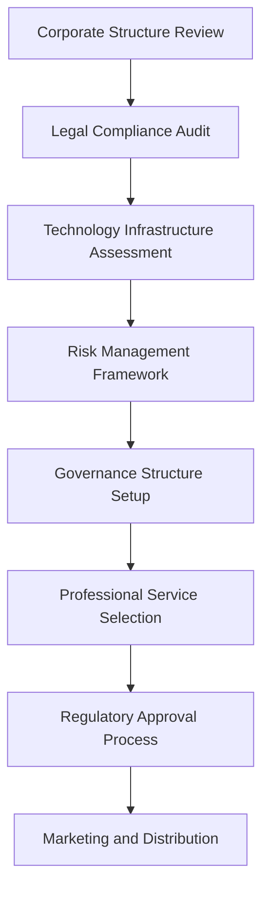

# Corporate Real-World Asset Tokenization

Corporate Real-World Asset (RWA) tokenization represents the digitization of traditional business assets and financial instruments, creating blockchain-based representations of corporate securities, debt instruments, and operational assets. This approach enables corporations to access new funding sources, enhance liquidity, and modernize their capital structures while maintaining regulatory compliance and investor protections.

## Understanding Corporate RWA Tokenization

Corporate RWA tokenization transforms traditional corporate assets into digital tokens that represent legal ownership rights, economic interests, or contractual claims. Unlike retail-focused tokenization, corporate RWA focuses on institutional-grade assets and professional investor markets, requiring sophisticated compliance frameworks and governance structures.

### Key Characteristics

**Institutional Focus:** Corporate RWA tokenization targets sophisticated investors including pension funds, insurance companies, family offices, and qualified institutional buyers who understand complex investment structures.

**Regulatory Sophistication:** Corporate tokens must comply with extensive securities regulations, corporate governance requirements, and institutional investor protection standards.

**Professional Management:** Corporate RWA requires experienced management teams, professional service providers, and institutional-grade operational infrastructure.

**Scale and Complexity:** Corporate tokenization projects typically involve larger asset values, more complex structures, and longer-term investment horizons than retail-focused initiatives.

## Corporate Asset Categories

### Equity Securities

**Common Stock Tokenization:**
Traditional equity shares converted to blockchain-based tokens while preserving all shareholder rights and protections.

**Key Features:**
- Voting rights automation and proxy management
- Dividend distribution programming
- Transfer restriction enforcement
- Shareholder communication enhancement
- Corporate action processing

**Benefits for Corporations:**
- Expanded investor base access
- Reduced administrative costs
- Enhanced transparency and reporting
- Improved liquidity for shareholders
- Modernized transfer agent services

**Benefits for Investors:**
- 24/7 trading capabilities
- Automated compliance verification
- Real-time settlement
- Enhanced portfolio tracking
- Reduced counterparty risk

### Preferred Stock and Hybrid Securities

**Preferred Stock Features:**
- Liquidation preferences and priorities
- Dividend payment automation
- Conversion rights management
- Anti-dilution protection enforcement
- Cumulative dividend tracking

**Convertible Securities:**
- Automated conversion triggers
- Price-based conversion mechanisms
- Time-based conversion windows
- Anti-dilution adjustments
- Redemption right management

**Implementation Considerations:**
- Complex term structure programming
- Multi-class voting arrangements
- Waterfall distribution calculations
- Corporate action coordination
- Regulatory compliance automation

### Corporate Debt Instruments

**Bond Tokenization:**
Corporate bonds converted to digital tokens with enhanced programmability and compliance features.

**Supported Bond Types:**
- Senior secured bonds
- Subordinated debt instruments
- Convertible bonds
- High-yield securities
- Asset-backed bonds

**Smart Contract Features:**
- Automated interest payments
- Covenant monitoring and enforcement
- Default detection and remediation
- Redemption mechanism management
- Secondary market facilitation

**Credit Enhancement:**
- Collateral management automation
- Security interest perfection
- Guarantee mechanism programming
- Credit support provider integration
- Recovery procedure automation

### Alternative Investment Structures

**Private Placement Opportunities:**
- Growth equity investments
- Management buyout financing
- Distressed debt restructuring
- Special situation investments
- Cross-border transactions

**Investment Fund Interests:**
- Private equity fund tokens
- Hedge fund interest digitization
- Real estate fund participations
- Infrastructure investment vehicles
- Specialty fund strategies

**Revenue-Based Financing:**
- Future revenue tokenization
- Royalty stream digitization
- Intellectual property monetization
- Cash flow-backed securities
- Performance-based instruments

## Legal and Regulatory Framework

### Securities Law Compliance

**Federal Securities Regulations:**
Corporate RWA tokens must comply with comprehensive federal securities laws including:

- Securities Act of 1933 registration requirements
- Securities Exchange Act of 1934 reporting obligations
- Investment Company Act of 1940 compliance
- Investment Advisers Act fiduciary duties
- Sarbanes-Oxley corporate governance standards

**Registration Strategies:**
- Form S-1 traditional registration
- Regulation A+ scaled offerings
- Private placement exemptions
- Institutional investor rules
- International offering coordination

### Corporate Governance Requirements

**Board Oversight Responsibilities:**
- Token issuance authorization
- Smart contract audit approval
- Cybersecurity oversight
- Regulatory compliance monitoring
- Investor protection measures

**Shareholder Rights Protection:**
- Information access rights
- Voting mechanism integrity
- Minority shareholder protections
- Dissenter appraisal rights
- Class action lawsuit preservation

**Management Accountability:**
- Fiduciary duty compliance
- Conflicts of interest management
- Performance measurement standards
- Compensation alignment
- Risk management frameworks

### Transfer Agent and Custody Requirements

**Digital Transfer Agent Services:**
- Blockchain-based shareholder registry
- Automated transfer processing
- Compliance rule enforcement
- Corporate action administration
- Proxy voting facilitation

**Qualified Custodian Standards:**
- SEC-registered custodian requirements
- Bank custody regulations
- Insurance and bonding requirements
- Segregation and safekeeping standards
- Audit and examination protocols

## Technology Infrastructure

### Enterprise Blockchain Architecture

**Platform Selection Criteria:**
- Enterprise-grade security and reliability
- Regulatory compliance capabilities
- Scalability and performance requirements
- Integration with existing systems
- Cost-effectiveness and efficiency

**Recommended Platforms:**
- **Ethereum:** Established ecosystem with comprehensive tooling
- **Hyperledger Fabric:** Enterprise permissioned network
- **R3 Corda:** Financial services-focused platform
- **JPM Coin:** Banking-specific blockchain solution
- **Digital Asset Platform:** Institutional DLT infrastructure

### Smart Contract Development

**Corporate Action Automation:**

```solidity
contract CorporateEquityToken {
    struct Shareholder {
        address wallet;
        uint256 shares;
        bool isAccredited;
        uint256 acquisitionDate;
        string jurisdiction;
    }
    
    struct Dividend {
        uint256 recordDate;
        uint256 paymentDate;
        uint256 amountPerShare;
        bool isPaid;
        mapping(address => bool) claimed;
    }
    
    mapping(address => Shareholder) public shareholders;
    mapping(uint256 => Dividend) public dividends;
    
    event DividendDeclared(uint256 indexed dividendId, uint256 recordDate, uint256 paymentDate, uint256 amount);
    event DividendPaid(address indexed shareholder, uint256 amount);
    
    function declareDividend(
        uint256 recordDate,
        uint256 paymentDate,
        uint256 amountPerShare
    ) external onlyBoard {
        uint256 dividendId = nextDividendId++;
        dividends[dividendId] = Dividend({
            recordDate: recordDate,
            paymentDate: paymentDate,
            amountPerShare: amountPerShare,
            isPaid: false
        });
        emit DividendDeclared(dividendId, recordDate, paymentDate, amountPerShare);
    }
    
    function claimDividend(uint256 dividendId) external {
        require(shareholders[msg.sender].shares > 0, "Not a shareholder");
        require(block.timestamp >= dividends[dividendId].paymentDate, "Payment date not reached");
        require(!dividends[dividendId].claimed[msg.sender], "Dividend already claimed");
        
        uint256 dividendAmount = shareholders[msg.sender].shares * dividends[dividendId].amountPerShare;
        dividends[dividendId].claimed[msg.sender] = true;
        
        // Process payment
        payable(msg.sender).transfer(dividendAmount);
        emit DividendPaid(msg.sender, dividendAmount);
    }
}
```

**Compliance and Governance Integration:**

```solidity
contract CorporateGovernance {
    struct Proposal {
        uint256 id;
        string title;
        string description;
        bytes proposalData;
        uint256 startTime;
        uint256 endTime;
        uint256 votesFor;
        uint256 votesAgainst;
        uint256 votesAbstain;
        bool executed;
        ProposalType proposalType;
    }
    
    enum ProposalType {
        BoardElection,
        ExecutiveCompensation,
        MergerAcquisition,
        AmendmentBylaw,
        CapitalStructure
    }
    
    mapping(uint256 => Proposal) public proposals;
    mapping(uint256 => mapping(address => Vote)) public votes;
    
    struct Vote {
        bool hasVoted;
        uint8 choice; // 0: Against, 1: For, 2: Abstain
        uint256 votingPower;
    }
    
    function submitProposal(
        string memory title,
        string memory description,
        bytes memory proposalData,
        ProposalType proposalType,
        uint256 votingPeriod
    ) external onlyAuthorized returns (uint256) {
        require(votingPeriod >= minVotingPeriod, "Voting period too short");
        require(votingPeriod <= maxVotingPeriod, "Voting period too long");
        
        uint256 proposalId = nextProposalId++;
        proposals[proposalId] = Proposal({
            id: proposalId,
            title: title,
            description: description,
            proposalData: proposalData,
            startTime: block.timestamp,
            endTime: block.timestamp + votingPeriod,
            votesFor: 0,
            votesAgainst: 0,
            votesAbstain: 0,
            executed: false,
            proposalType: proposalType
        });
        
        return proposalId;
    }
    
    function vote(uint256 proposalId, uint8 choice) external {
        require(choice <= 2, "Invalid vote choice");
        require(block.timestamp >= proposals[proposalId].startTime, "Voting not started");
        require(block.timestamp <= proposals[proposalId].endTime, "Voting ended");
        require(!votes[proposalId][msg.sender].hasVoted, "Already voted");
        
        uint256 votingPower = equityToken.balanceOf(msg.sender);
        require(votingPower > 0, "No voting power");
        
        votes[proposalId][msg.sender] = Vote({
            hasVoted: true,
            choice: choice,
            votingPower: votingPower
        });
        
        if (choice == 0) {
            proposals[proposalId].votesAgainst += votingPower;
        } else if (choice == 1) {
            proposals[proposalId].votesFor += votingPower;
        } else {
            proposals[proposalId].votesAbstain += votingPower;
        }
    }
}
```

### Enterprise Integration

**ERP System Connectivity:**
- SAP and Oracle integration
- Real-time data synchronization
- Financial reporting automation
- Audit trail maintenance
- Workflow management

**Capital Markets Integration:**
- Bloomberg Terminal connectivity
- Reuters data feeds
- SWIFT network integration
- FIX protocol implementation
- Clearing and settlement systems

## Issuance and Distribution Process

### Pre-Issuance Preparation

**Corporate Readiness Assessment:**



**Due Diligence Requirements:**
- Financial statement audits
- Legal opinion letters
- Technology security assessments
- Regulatory compliance verification
- Market analysis and positioning

### Token Issuance Process

**Primary Distribution:**
1. **Registration and Compliance**
   - Securities filing preparation
   - Regulatory approval obtainment
   - Legal documentation completion
   - Compliance framework implementation

2. **Investor Qualification**
   - Institutional investor verification
   - Accreditation documentation
   - KYC/AML compliance
   - Investment suitability assessment

3. **Token Allocation and Distribution**
   - Smart contract deployment
   - Token minting and allocation
   - Investor onboarding completion
   - Initial trading activation

### Secondary Market Development

**Institutional Trading Platforms:**
- Alternative Trading Systems (ATS)
- Electronic Communication Networks (ECN)
- Dark pool trading venues
- Block trading networks
- Cross-border trading platforms

**Market Making Services:**
- Liquidity provision programs
- Bid-ask spread management
- Volume guarantee arrangements
- Price stability mechanisms
- Risk management protocols

## Corporate Benefits and Use Cases

### Capital Raising Advantages

**Enhanced Access to Capital:**
- Global investor reach
- 24/7 market availability
- Reduced intermediary costs
- Faster settlement times
- Improved price discovery

**Operational Efficiency:**
- Automated compliance processes
- Reduced administrative overhead
- Enhanced transparency and reporting
- Streamlined investor communications
- Digital-first operations

### Strategic Applications

**Balance Sheet Optimization:**
- Asset monetization strategies
- Working capital improvement
- Debt refinancing opportunities
- Cost of capital reduction
- Financial flexibility enhancement

**Stakeholder Engagement:**
- Enhanced investor relations
- Improved transparency
- Real-time communication capabilities
- Automated reporting and updates
- Governance participation facilitation

## Risk Management Framework

### Operational Risk Assessment

**Technology Risks:**
- Smart contract vulnerabilities
- Cybersecurity threats
- System downtime and availability
- Data integrity and privacy
- Third-party dependencies

**Regulatory Risks:**
- Changing compliance requirements
- Enforcement action exposure
- International regulatory divergence
- Tax treatment uncertainty
- Legal precedent development

### Mitigation Strategies

**Risk Management Controls:**
- Comprehensive insurance coverage
- Professional liability protection
- Technology security protocols
- Operational redundancy systems
- Crisis management procedures

**Professional Service Network:**
- Legal counsel specialization
- Accounting and audit expertise
- Technology consulting services
- Regulatory compliance advisors
- Insurance and risk management

## Performance Measurement

### Financial Metrics

**Corporate Performance Indicators:**
- Cost of capital analysis
- Liquidity improvement measurement
- Administrative cost reduction
- Market valuation enhancement
- Investor base diversification

**Token Performance Metrics:**
- Trading volume and velocity
- Price stability and volatility
- Secondary market liquidity
- Bid-ask spread analysis
- Settlement efficiency

### Operational Excellence

**Process Automation Benefits:**
- Transaction processing speed
- Error reduction rates
- Compliance automation effectiveness
- Reporting timeliness improvement
- Stakeholder satisfaction scores

**Technology Platform Performance:**
- System uptime and reliability
- Transaction throughput capacity
- Security incident frequency
- User experience metrics
- Integration effectiveness

## Regulatory Developments

### Current Regulatory Landscape

**Federal Agency Coordination:**
- SEC digital asset guidance
- CFTC commodity jurisdiction
- OCC banking regulation
- Federal Reserve oversight
- Treasury Department coordination

**State-Level Requirements:**
- Blue sky law compliance
- Corporate formation regulations
- Professional licensing requirements
- Consumer protection rules
- Enforcement coordination

### Future Regulatory Framework

**Digital Asset Legislation:**
- Comprehensive regulatory clarity
- Safe harbor provisions
- Innovation sandbox programs
- International coordination efforts
- Market infrastructure development

**Institutional Infrastructure:**
- Qualified custodian standards
- Transfer agent modernization
- Clearing and settlement systems
- Market maker regulations
- Investor protection enhancements

## Future Outlook

### Market Development Trends

**Institutional Adoption Growth:**
- Pension fund participation
- Insurance company allocation
- Sovereign wealth fund interest
- Corporate treasury adoption
- Endowment and foundation access

**Technology Evolution:**
- Central Bank Digital Currency integration
- Cross-chain interoperability
- AI and machine learning enhancement
- Quantum-resistant security
- Decentralized finance integration

### Strategic Implications

**Capital Markets Transformation:**
- Traditional finance integration
- New product development opportunities
- Competitive advantage creation
- Operational efficiency gains
- Global market participation

**Corporate Strategy Integration:**
- Digital transformation acceleration
- Stakeholder engagement enhancement
- Financial flexibility improvement
- Innovation culture development
- Sustainable growth facilitation

Corporate RWA tokenization represents a fundamental shift in how corporations access capital markets and engage with investors. Bridge's enterprise-grade platform provides the comprehensive infrastructure necessary to implement sophisticated corporate tokenization strategies while maintaining the highest standards of regulatory compliance, security, and institutional investor protection. As the regulatory framework continues to evolve and institutional adoption accelerates, corporate RWA tokenization will become an essential component of modern corporate finance and capital markets.