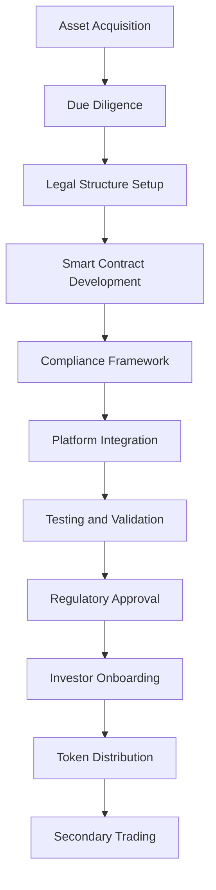
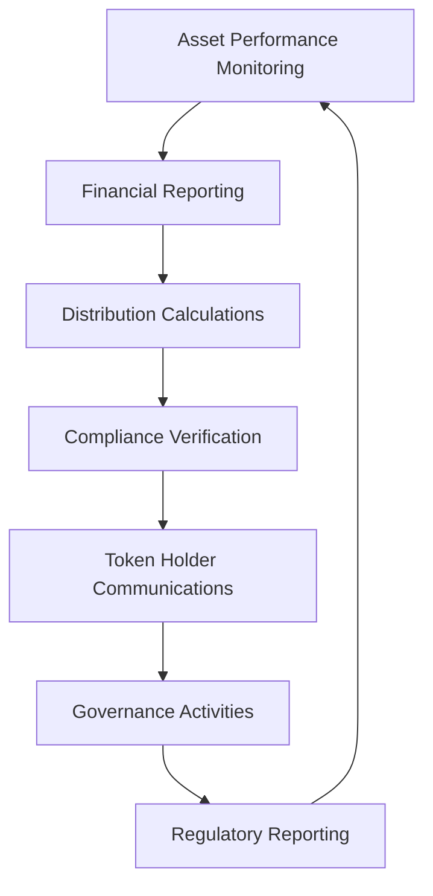

# Direct Asset Tokenization

Direct asset tokenization represents the purest form of asset digitization, where physical or traditional financial assets are directly converted into blockchain-based tokens without intermediary structures. This approach provides investors with direct ownership rights and exposure to the underlying asset's performance, creating a transparent and efficient investment vehicle.

## Understanding Direct Tokenization

Direct asset tokenization creates a one-to-one relationship between the digital token and the underlying asset, where token holders have direct legal and beneficial ownership rights. Unlike fractional or structured approaches, direct tokenization maintains the asset's original characteristics while adding blockchain-enabled features such as programmable compliance, automated distributions, and enhanced liquidity.

### Core Principles

**Direct Ownership:** Token holders maintain direct legal title to the underlying asset proportional to their token holdings, eliminating layers of intermediary structures that can complicate ownership rights and distributions.

**Asset Preservation:** The tokenization process preserves the fundamental characteristics, rights, and obligations associated with the original asset while enhancing them with digital capabilities.

**Regulatory Alignment:** Direct tokenization structures align closely with existing regulatory frameworks, as they mirror traditional ownership models with technological enhancements rather than creating novel investment structures.

## Asset Categories for Direct Tokenization

### Real Estate Properties

**Suitable Property Types:**
- Single-family residential properties
- Commercial office buildings
- Retail and industrial facilities
- Vacant land and development sites
- Income-producing real estate assets

**Direct Ownership Structure:**
Token holders receive fractional ownership interests in the property's title, with rights and responsibilities proportional to their token allocation. This structure provides direct access to:

- Rental income distributions
- Property appreciation
- Tax benefits and deductions
- Voting rights on major decisions
- Liquidation proceeds

**Implementation Process:**

1. **Property Acquisition and Title Review**
   - Comprehensive title search and insurance
   - Environmental assessments and inspections
   - Market valuation and appraisal
   - Legal structure optimization
   - Regulatory compliance verification

2. **Tokenization Structure Setup**
   - Blockchain platform selection
   - Smart contract development
   - Compliance framework implementation
   - Token distribution mechanics
   - Governance and voting systems

3. **Investor Onboarding and Distribution**
   - KYC/AML compliance procedures
   - Accreditation verification
   - Investment documentation
   - Token allocation and transfer
   - Ongoing reporting setup

### Equity Securities

**Direct Stock Tokenization:**
Traditional equity shares are converted into digital tokens that represent identical ownership rights and economic interests as the original securities.

**Key Features:**
- Voting rights preservation
- Dividend entitlements
- Liquidation preferences
- Anti-dilution protections
- Transfer restrictions compliance

**Benefits Over Traditional Shares:**
- 24/7 trading capabilities
- Programmable compliance
- Automated dividend distributions
- Enhanced transparency
- Reduced settlement times

**Regulatory Considerations:**
- Securities Act compliance
- State blue sky law requirements
- Transfer agent responsibilities
- Shareholder communication obligations
- Corporate governance standards

### Debt Instruments

**Bond Tokenization:**
Direct tokenization of bonds creates digital representations that maintain all original terms while enabling enhanced functionality.

**Preserved Characteristics:**
- Principal and interest payments
- Maturity dates and call provisions
- Credit ratings and covenants
- Security interests and collateral
- Default and remediation procedures

**Enhanced Features:**
- Automated coupon payments
- Real-time price discovery
- Instant settlement capabilities
- Programmable covenant monitoring
- Enhanced liquidity options

## Legal and Regulatory Framework

### Ownership Rights Structure

**Title and Registration:**
Direct tokenization requires careful consideration of how legal title is held and registered, ensuring that token holders have enforceable ownership rights.

**Trust Structures:**
Many direct tokenization implementations utilize trust structures where:
- A qualified trustee holds legal title
- Token holders are beneficial owners
- Trust agreements define rights and obligations
- Regulatory compliance is maintained
- Fiduciary duties are clearly established

**Registry and Record-Keeping:**
Blockchain-based ownership registries provide:
- Immutable ownership records
- Real-time transfer tracking
- Automated compliance monitoring
- Transparent voting mechanisms
- Efficient distribution processing

### Securities Law Compliance

**Registration Requirements:**
Direct asset tokens typically qualify as securities and must comply with applicable registration requirements or exemptions.

**Common Exemptions:**
- Regulation D private placements
- Regulation S offshore offerings
- Regulation A+ public offerings
- Intrastate offering exemptions
- Institutional investor exemptions

**Ongoing Compliance Obligations:**
- Periodic reporting requirements
- Material change disclosures
- Financial statement preparation
- Auditor relationships
- Regulatory examination cooperation

### Transfer Restrictions

**Lock-up Periods:**
Initial token distributions often include lock-up periods to comply with securities regulations and maintain market stability.

**Qualified Investor Requirements:**
Transfer restrictions ensure tokens are only held by qualified investors meeting regulatory criteria.

**Automated Compliance:**
Smart contracts enforce transfer restrictions through:
- Investor qualification verification
- Holding period compliance
- Geographic restrictions
- Trading volume limitations
- Real-time regulatory updates

## Technology Infrastructure

### Blockchain Platform Selection

**Ethereum-Based Solutions:**
- ERC-20 compatibility for fungible tokens
- ERC-1400 security token standards
- Established infrastructure and tools
- Extensive developer ecosystem
- Proven security and reliability

**Alternative Platforms:**
- Polygon for lower transaction costs
- Binance Smart Chain for speed
- Solana for high-throughput applications
- Private blockchain for institutional use
- Hybrid solutions for specific requirements

### Smart Contract Architecture

**Core Contract Components:**

1. **Token Contract**
   - Token minting and burning
   - Transfer functionality
   - Balance tracking
   - Ownership verification
   - Compliance enforcement

2. **Compliance Contract**
   - Investor whitelist management
   - Transfer restriction enforcement
   - KYC/AML verification
   - Regulatory rule implementation
   - Automated reporting

3. **Distribution Contract**
   - Income distribution calculations
   - Payment processing automation
   - Tax withholding compliance
   - Distribution history tracking
   - Reinvestment options

4. **Governance Contract**
   - Voting mechanism implementation
   - Proposal submission and tracking
   - Quorum and approval requirements
   - Decision execution automation
   - Transparency and audit trails

### Security and Audit Requirements

**Smart Contract Security:**
- Comprehensive code audits
- Penetration testing
- Formal verification processes
- Multi-signature controls
- Upgrade mechanisms

**Operational Security:**
- Key management procedures
- Access control systems
- Monitoring and alerting
- Incident response planning
- Regular security assessments

## Asset Management and Operations

### Property Management (Real Estate)

**Day-to-Day Operations:**
- Tenant relations and leasing
- Maintenance and repairs
- Financial management
- Insurance and risk management
- Regulatory compliance

**Token Holder Communications:**
- Monthly performance reports
- Annual financial statements
- Major decision notifications
- Voting opportunities
- Distribution announcements

**Decision-Making Processes:**
- Management company oversight
- Token holder voting rights
- Advisory committee participation
- Major decision thresholds
- Conflict resolution procedures

### Corporate Actions (Securities)

**Dividend Distributions:**
- Declaration and record dates
- Payment calculation and processing
- Tax withholding compliance
- International considerations
- Reinvestment programs

**Stock Splits and Combinations:**
- Token adjustment mechanisms
- Holder notification procedures
- Regulatory filing requirements
- System testing and validation
- Implementation coordination

**Merger and Acquisition Activities:**
- Shareholder approval processes
- Valuation and exchange ratios
- Dissenter rights protection
- Regulatory approval coordination
- Integration planning

## Operational Workflows

### Initial Token Issuance

### Ongoing Asset Management

## Investor Experience

### Investment Process

**Initial Investment:**
1. Platform registration and KYC
2. Accreditation verification
3. Investment documentation review
4. Fund transfer and token allocation
5. Wallet setup and custody options

**Ongoing Management:**
- Real-time portfolio tracking
- Performance analytics and reporting
- Distribution history and projections
- Tax documentation and support
- Secondary market access

**Liquidity Options:**
- Peer-to-peer transfers
- Secondary market trading
- Automated market makers
- Institutional buyer networks
- Redemption mechanisms

### Rights and Protections

**Economic Rights:**
- Proportional income distributions
- Capital appreciation participation
- Liquidation proceeds
- Tax benefit pass-through
- Reinvestment opportunities

**Governance Rights:**
- Voting on major decisions
- Information access rights
- Inspection and audit rights
- Dissenter protection
- Fiduciary oversight

**Transfer Rights:**
- Subject to compliance requirements
- Secondary market participation
- Peer-to-peer transactions
- Estate planning considerations
- International transfer capabilities

## Risk Management

### Asset-Specific Risks

**Real Estate Risks:**
- Market value fluctuations
- Tenant default and vacancy
- Property damage and insurance
- Environmental liabilities
- Regulatory and zoning changes

**Securities Risks:**
- Market volatility
- Credit and default risk
- Liquidity constraints
- Regulatory changes
- Counterparty exposures

### Technology Risks

**Smart Contract Risks:**
- Code vulnerabilities
- Upgrade and governance risks
- Oracle dependencies
- Network congestion
- Gas fee volatility

**Operational Risks:**
- Key management security
- Platform availability
- Data integrity
- Cybersecurity threats
- Third-party dependencies

### Mitigation Strategies

**Due Diligence Processes:**
- Comprehensive asset evaluation
- Professional inspections and assessments
- Legal and regulatory review
- Financial analysis and modeling
- Market research and validation

**Insurance Coverage:**
- Property and casualty insurance
- Professional liability coverage
- Cyber security insurance
- Directors and officers protection
- Technology errors and omissions

**Diversification Approaches:**
- Multi-asset portfolios
- Geographic diversification
- Sector and strategy allocation
- Risk-return optimization
- Correlation analysis

## Performance Measurement

### Financial Metrics

**Return Calculations:**
- Total return analysis
- Income yield measurement
- Capital appreciation tracking
- Risk-adjusted returns
- Benchmark comparisons

**Cash Flow Analysis:**
- Distribution coverage ratios
- Funds from operations
- Net operating income
- Debt service coverage
- Capital expenditure requirements

### Operational Metrics

**Asset Utilization:**
- Occupancy rates and trends
- Rental rate growth
- Tenant retention statistics
- Lease expiration schedules
- Market absorption rates

**Efficiency Measures:**
- Operating expense ratios
- Administrative cost analysis
- Technology utilization metrics
- Process automation benefits
- Scale economy realization

## Future Developments

### Technology Enhancements

**Advanced Automation:**
- AI-powered asset management
- Predictive maintenance systems
- Dynamic pricing mechanisms
- Automated compliance monitoring
- Machine learning optimization

**Interoperability Solutions:**
- Cross-chain asset bridging
- Multi-platform integration
- Standardized protocols
- API connectivity enhancement
- Ecosystem collaboration

### Regulatory Evolution

**Digital Asset Frameworks:**
- Clarity in token classification
- Streamlined registration processes
- International coordination
- Investor protection enhancements
- Market infrastructure development

**Market Development:**
- Institutional adoption growth
- Secondary market liquidity
- Professional service evolution
- Technology standardization
- Best practice establishment

Direct asset tokenization represents a fundamental shift toward more efficient, transparent, and accessible investment markets. Bridge's platform provides the comprehensive infrastructure necessary to implement direct tokenization strategies while maintaining the highest standards of regulatory compliance and investor protection. As the technology and regulatory landscape continue to evolve, direct tokenization will play an increasingly important role in democratizing access to high-quality investment opportunities.