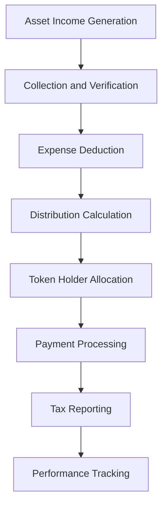

# Fractionalized Asset Tokenization

Fractionalized tokenization enables multiple investors to own portions of high-value assets that would typically be accessible only to wealthy individuals or institutions. By dividing expensive assets into smaller, tradeable digital tokens, Bridge creates new investment opportunities while maintaining proportional ownership rights and benefits for all participants.

## Understanding Fractionalization

Fractionalized tokenization breaks down the ownership of a single high-value asset into multiple digital tokens, each representing a fractional ownership interest. This approach democratizes access to premium assets while preserving the economic and legal rights associated with ownership.

### Core Concept

**Traditional Limitation:** Many valuable assets require substantial capital commitments that exclude smaller investors from participation. A commercial property worth $10 million, for example, typically requires institutional-level investment capacity.

**Fractionalized Solution:** The same $10 million property can be divided into 10,000 tokens worth $1,000 each, enabling broader investor participation while maintaining proportional rights to income, appreciation, and decision-making.

**Economic Alignment:** Token holders receive benefits proportional to their ownership percentage, including:
- Income distributions
- Capital appreciation
- Voting rights
- Liquidation proceeds
- Tax advantages

## Asset Categories for Fractionalization

### High-Value Real Estate

**Prime Commercial Properties:**
- Trophy office buildings in major markets
- Flagship retail properties and shopping centers
- Luxury hotels and hospitality assets
- Class A industrial and logistics facilities
- Mixed-use development projects

**Institutional-Grade Residential:**
- Luxury apartment complexes
- Build-to-rent communities
- Senior living facilities
- Student housing portfolios
- Resort and vacation properties

**Unique and Specialty Properties:**
- Historic landmarks and buildings
- Entertainment and sports venues
- Data centers and technology facilities
- Healthcare and medical properties
- Agricultural and timberland assets

### Fine Art and Collectibles

**Blue-Chip Artwork:**
- Museum-quality paintings and sculptures
- Works by renowned and emerging artists
- Photography and mixed media pieces
- Contemporary and modern art
- Digital art and NFT collections

**Luxury Collectibles:**
- Vintage automobiles and motorcycles
- Fine wines and rare spirits
- Jewelry and precious stones
- Watches and timepieces
- Sports memorabilia and cards

**Investment-Grade Collectibles:**
- Rare books and manuscripts
- Stamps and postal history
- Coins and precious metals
- Musical instruments
- Historical artifacts

### Alternative Investments

**Private Equity and Venture Capital:**
- Growth-stage company investments
- Buyout and restructuring opportunities
- Venture capital fund interests
- Special purpose acquisition companies
- Secondary market transactions

**Infrastructure Assets:**
- Renewable energy projects
- Transportation infrastructure
- Telecommunications networks
- Utility and power generation
- Social infrastructure investments

**Commodities and Natural Resources:**
- Precious metals and mining rights
- Energy exploration and production
- Agricultural land and operations
- Timber and forestry investments
- Water rights and resources

## Legal Structure and Framework

### Special Purpose Vehicle (SPV) Formation

**Entity Selection:**
Fractionalized assets typically require an SPV to hold legal title and facilitate token holder rights:

- **Limited Liability Company (LLC):** Provides operational flexibility and tax pass-through benefits
- **Delaware Statutory Trust (DST):** Offers favorable tax treatment and investor protection
- **Real Estate Investment Trust (REIT):** Enables public market access with specific requirements
- **Limited Partnership (LP):** Provides management structure and liability protection

**Governance Structure:**
- Management company or general partner oversight
- Token holder voting rights and procedures
- Advisory committee participation
- Major decision thresholds and approval processes
- Conflict resolution and dispute mechanisms

### Ownership Rights Definition

**Proportional Rights:**
Token holders receive rights proportional to their ownership percentage:

| Token Holdings | Ownership % | Monthly Income | Voting Power | Liquidation Rights |
|----------------|-------------|----------------|--------------|-------------------|
| 100 tokens     | 1%         | 1% of distributions | 1% of votes | 1% of proceeds |
| 500 tokens     | 5%         | 5% of distributions | 5% of votes | 5% of proceeds |
| 1,000 tokens   | 10%        | 10% of distributions | 10% of votes | 10% of proceeds |

**Reserved Rights:**
Certain decisions may require special approval thresholds:
- Major capital expenditures (75% approval)
- Asset disposition (80% approval)
- Management changes (66% approval)
- Refinancing decisions (60% approval)
- Distribution policy changes (majority approval)

### Securities Regulation Compliance

**Investment Contract Analysis:**
Fractionalized tokens typically qualify as securities under the Howey Test:
1. Investment of money
2. Common enterprise
3. Expectation of profits
4. Efforts of others

**Registration Requirements:**
- Securities Act registration or exemption
- State blue sky law compliance
- Investment Company Act considerations
- Investment Advisers Act obligations
- Anti-money laundering requirements

**Common Exemptions:**
- Regulation D Rule 506(b) and 506(c)
- Regulation A+ Tier I and Tier II
- Regulation CF crowdfunding
- Intrastate offering exemptions
- International Regulation S offerings

## Technology Implementation

### Smart Contract Architecture

**Token Contract:**
```solidity
contract FractionalAssetToken {
    // Token metadata and supply
    string public name;
    string public symbol;
    uint256 public totalSupply;
    
    // Asset information
    address public assetAddress;
    uint256 public assetValue;
    uint256 public lastValuation;
    
    // Distribution tracking
    mapping(address => uint256) public distributions;
    uint256 public totalDistributions;
    
    // Compliance integration
    address public complianceContract;
    
    function transfer(address to, uint256 amount) external {
        require(isQualifiedInvestor(to), "Recipient not qualified");
        require(complianceCheck(msg.sender, to, amount), "Transfer restricted");
        _transfer(msg.sender, to, amount);
    }
    
    function distribute() external onlyManager {
        uint256 totalIncome = getAssetIncome();
        for (uint256 i = 0; i < holders.length; i++) {
            uint256 holderShare = (balanceOf(holders[i]) * totalIncome) / totalSupply;
            _distributeToHolder(holders[i], holderShare);
        }
    }
}
```

**Governance Contract:**
```solidity
contract AssetGovernance {
    struct Proposal {
        uint256 id;
        string description;
        uint256 votesFor;
        uint256 votesAgainst;
        uint256 endTime;
        bool executed;
        ProposalType proposalType;
    }
    
    enum ProposalType {
        Management,
        CapitalExpenditure,
        Distribution,
        Disposition
    }
    
    mapping(uint256 => Proposal) public proposals;
    mapping(uint256 => mapping(address => bool)) public hasVoted;
    
    function submitProposal(
        string memory description,
        ProposalType proposalType
    ) external onlyTokenHolder returns (uint256) {
        uint256 proposalId = nextProposalId++;
        proposals[proposalId] = Proposal({
            id: proposalId,
            description: description,
            votesFor: 0,
            votesAgainst: 0,
            endTime: block.timestamp + votingPeriod,
            executed: false,
            proposalType: proposalType
        });
        return proposalId;
    }
    
    function vote(uint256 proposalId, bool support) external {
        require(tokenContract.balanceOf(msg.sender) > 0, "No voting power");
        require(!hasVoted[proposalId][msg.sender], "Already voted");
        
        uint256 votingPower = tokenContract.balanceOf(msg.sender);
        
        if (support) {
            proposals[proposalId].votesFor += votingPower;
        } else {
            proposals[proposalId].votesAgainst += votingPower;
        }
        
        hasVoted[proposalId][msg.sender] = true;
    }
}
```

### Valuation and Pricing

**Regular Valuation Updates:**
- Independent appraisal processes
- Market-based pricing mechanisms
- Net asset value calculations
- Performance-based adjustments
- Transparent reporting procedures

**Price Discovery Mechanisms:**
- Secondary market trading
- Automated market makers
- Bid/ask spread analysis
- Volume-weighted pricing
- Fair value estimations

## Operational Management

### Asset Management Services

**Professional Management:**
Fractionalized assets require experienced management teams to:
- Oversee day-to-day operations
- Implement strategic initiatives
- Maintain regulatory compliance
- Optimize financial performance
- Communicate with token holders

**Service Provider Network:**
- Property management companies
- Asset management firms
- Compliance specialists
- Accounting and tax professionals
- Legal and regulatory advisors

### Financial Operations

**Income Collection and Distribution:**



**Distribution Process:**
1. **Income Collection:** Rental income, dividends, or other cash flows
2. **Expense Allocation:** Operating costs, management fees, and reserves
3. **Net Income Calculation:** Available funds for distribution
4. **Pro-Rata Allocation:** Distribution based on token ownership
5. **Payment Processing:** Automated transfers to token holders
6. **Tax Documentation:** 1099 forms and other required reporting

### Compliance and Reporting

**Ongoing Obligations:**
- Monthly financial statements
- Quarterly performance reports
- Annual audited financials
- Tax return preparation
- Regulatory filings

**Token Holder Communications:**
- Regular performance updates
- Major decision notifications
- Voting opportunity announcements
- Distribution statements
- Annual meetings and reports

## Investment Process and Experience

### Initial Offering

**Pre-Launch Preparation:**
1. Asset acquisition and due diligence
2. Legal structure formation
3. Valuation and token pricing
4. Regulatory compliance setup
5. Technology platform integration

**Marketing and Distribution:**
- Investor education materials
- Marketing compliance review
- Placement agent coordination
- Digital marketing campaigns
- Investor roadshows

**Subscription Process:**
1. Platform registration
2. KYC/AML verification
3. Accreditation confirmation
4. Investment documentation
5. Funding and token allocation

### Secondary Market Trading

**Trading Platforms:**
- Regulated alternative trading systems
- Broker-dealer networks
- Peer-to-peer marketplaces
- Automated market makers
- Institutional trading platforms

**Liquidity Enhancement:**
- Market making services
- Buy-back programs
- Redemption mechanisms
- Cross-platform listings
- Liquidity pools

### Investor Services

**Portfolio Management Tools:**
- Real-time valuation tracking
- Performance analytics
- Distribution history
- Tax reporting assistance
- Reinvestment options

**Communication Channels:**
- Investor portal access
- Mobile application
- Email notifications
- Quarterly webinars
- Annual investor meetings

## Risk Management

### Asset-Specific Risks

**Concentration Risk:**
Single-asset exposure creates vulnerability to:
- Market downturns affecting the specific asset
- Management performance issues
- Regulatory changes impacting the asset class
- Natural disasters or physical damage
- Tenant or counterparty defaults

**Liquidity Risk:**
Limited secondary market activity may result in:
- Difficulty selling tokens quickly
- Wide bid-ask spreads
- Price volatility
- Limited price discovery
- Exit strategy constraints

### Operational Risks

**Management Risk:**
Dependence on management quality for:
- Strategic decision making
- Operational efficiency
- Regulatory compliance
- Financial performance
- Stakeholder relations

**Technology Risk:**
Smart contract and platform vulnerabilities:
- Code bugs and exploits
- Network congestion
- Oracle failures
- Key management issues
- Cybersecurity threats

### Mitigation Strategies

**Due Diligence Framework:**
- Comprehensive asset evaluation
- Management team assessment
- Market analysis and positioning
- Financial modeling and stress testing
- Legal and regulatory review

**Risk Monitoring:**
- Regular performance assessments
- Market condition analysis
- Compliance monitoring
- Technology security audits
- Insurance coverage review

## Performance Analytics

### Financial Metrics

**Return Analysis:**
- Total return calculation
- Income yield measurement
- Capital appreciation tracking
- Risk-adjusted performance
- Benchmark comparisons

**Cash Flow Metrics:**
- Funds from operations (FFO)
- Net operating income (NOI)
- Distribution coverage ratios
- Debt service coverage
- Capital expenditure analysis

### Operational Indicators

**Asset Performance:**
- Occupancy rates and trends
- Rental growth rates
- Operating expense ratios
- Capital improvement impact
- Market position analysis

**Token Performance:**
- Trading volume and frequency
- Price stability measures
- Holder concentration analysis
- Secondary market liquidity
- Redemption activity

## Tax Considerations

### Pass-Through Treatment

**Entity Selection Impact:**
- LLC and partnership structures
- Tax transparency benefits
- Avoiding double taxation
- State tax considerations
- International implications

**Investor Reporting:**
- Schedule K-1 preparation
- Tax basis tracking
- Distribution characterization
- Depreciation pass-through
- Loss limitation rules

### Compliance Requirements

**Withholding Obligations:**
- Backup withholding rules
- Foreign investor reporting
- State tax withholding
- Information return filing
- Penalty avoidance strategies

## Future Developments

### Market Evolution

**Institutional Adoption:**
- Pension fund participation
- Insurance company investments
- Sovereign wealth fund interest
- Endowment and foundation access
- Family office allocation

**Regulatory Clarity:**
- Digital asset frameworks
- Streamlined registration processes
- International coordination
- Investor protection enhancements
- Market infrastructure development

### Technology Advancement

**Enhanced Automation:**
- AI-powered asset management
- Predictive analytics integration
- Dynamic pricing mechanisms
- Automated compliance monitoring
- Machine learning optimization

**Interoperability Solutions:**
- Cross-chain compatibility
- Multi-platform integration
- Standardized protocols
- API connectivity
- Ecosystem collaboration

Fractionalized tokenization represents a powerful tool for democratizing access to high-value assets while maintaining professional management and regulatory compliance. Bridge's comprehensive platform provides the infrastructure necessary to implement successful fractionalization strategies, from initial token issuance through ongoing asset management and investor services. As the market continues to mature, fractionalized assets will play an increasingly important role in portfolio diversification and wealth creation strategies.