# What is Bridge?

## Tokenization & Capital Structuring Platform

Bridge is the tokenization engine of the DUC Capital Platform, transforming validated deals from Sagacity into live tokenized instruments with active investors. Designed for capital markets professionals and compliance officers, it handles ERC-3643 compliant tokenization, SPV management, and comprehensive investor onboarding.

---

## What Does Bridge Do?

### 🌉 **Complete Tokenization Infrastructure**

Bridge provides end-to-end tokenization capabilities for multiple asset types:

- **Direct Assets** - Real estate, infrastructure, commodities, and equipment
- **Fractionalized Assets** - Art, collectibles, high-value items, and luxury goods
- **Corporate RWAs** - Revenue streams, IP rights, and business assets
- **Infrastructure Projects** - Energy, transportation, and utilities
- **ERC-3643 Compliance** - Transfer restrictions, investor verification, and regulatory adherence
- **SPV Management** - Legal structure creation and cap table maintenance
- **Investor Registry** - KYC/AML processing, accreditation, and ongoing compliance monitoring

### 🏢 **Real-World Tokenization Example**

Consider a $25M commercial real estate tokenization:

**Inputs from Sagacity:**
- Validated property deal with completed due diligence
- Financial projections and risk analysis
- Legal structure and regulatory compliance review
- Investment terms and offering parameters

**Bridge Tokenization Process:**
1. Receives validated deal from Sagacity with complete due diligence package
2. Creates optimal SPV structure (Delaware LLC/LP) to hold the asset
3. Structures ERC-3643 compliant tokens with built-in transfer restrictions
4. Configures investor qualification criteria and compliance parameters
5. Processes investor KYC/AML verification, accreditation, and suitability testing
6. Issues tokens to qualified investors with vesting schedules if applicable
7. Maintains ongoing investor registry and compliance monitoring
8. Provides tokenized asset to Lift for performance monitoring and management

---

## Who Uses Bridge?

### 👨‍💼 **Tokenization & Capital Markets Professionals**

Bridge is operated by capital markets professionals who understand both traditional finance and tokenization:

- **Capital Markets Professionals** - Structure offerings and manage investor relations
- **Compliance Officers** - Ensure regulatory adherence across multiple jurisdictions
- **Tokenization Specialists** - Configure ERC-3643 compliance parameters and smart contracts
- **Legal Professionals** - Structure SPVs and manage securities law compliance
- **Operations Teams** - Handle investor onboarding, KYC/AML, and ongoing servicing
- **Portfolio Managers** - Coordinate with Lift for post-issuance asset management

### 👥 **Integration with Deal Teams**

**Bridge seamlessly receives validated deals from Sagacity:**

- **Investment bankers** in Sagacity prepare deals for tokenization
- **Bridge specialists** transform deals into compliant tokenized securities
- **Asset managers** in Lift receive tokenized assets for ongoing management
- **Investors** interact with Bridge for onboarding, compliance, and token management

---

## How Bridge Transforms Deal Execution

### ⚡ **Seamless Deal-to-Token Flow**

**Traditional Tokenization Process:**
- Investment banker completes deal structuring
- Manual handoff to tokenization team with documentation gaps
- Lengthy setup of SPV and compliance framework
- Separate investor onboarding and KYC processes
- Manual token creation and distribution
- Disconnected ongoing management

**With Bridge Integration:**
- Validated deal flows automatically from Sagacity
- Bridge extracts deal parameters and creates compliant token structure
- Automated SPV establishment with pre-configured compliance
- Streamlined investor onboarding with integrated KYC/AML
- Instant token creation and compliant distribution
- Seamless handoff to Lift for ongoing asset management

### 🔄 **Integrated Tokenization Workflow**

```mermaid
graph LR
    A[📊 Sagacity Deal] -->|Validated| B[🌉 Bridge]
    B --> C[🏢 SPV Creation]
    B --> D[🔐 Token Structure]
    B --> E[👥 Investor KYC]
    B --> F[📋 Compliance]
    B -->|Tokenized Asset| G[🚀 Lift]
    
    style A fill:#e1f5fe
    style B fill:#fff3e0
    style C fill:#e8f5e8
    style D fill:#f3e5f5
    style E fill:#fce4ec
    style F fill:#f1f8e9
    style G fill:#e3f2fd
```

**What This Means for Deal Teams:**
- Seamless transition from deal structuring to tokenization
- Automated compliance and regulatory adherence
- Integrated investor management and onboarding
- Real-time tokenization status and progress tracking

---

## Types of Assets Bridge Tokenizes

### 🏢 **Tangible Real-World Assets**
- **Commercial Real Estate** - Office buildings, retail centers, industrial facilities
- **Residential Real Estate** - Multi-family properties, single-family rentals
- **Infrastructure** - Renewable energy projects, transportation assets
- **Commodities** - Precious metals, agricultural products, energy resources
- **Equipment & Machinery** - Industrial equipment, vehicles, technology assets

### 💼 **Intangible Assets**
- **Intellectual Property** - Patents, trademarks, copyrights
- **Revenue Streams** - Royalties, licensing agreements, subscription businesses
- **Data Assets** - Proprietary databases, customer lists, algorithms
- **Brand Assets** - Trademarks, brand valuations, franchise rights

### 💰 **Financial Assets**
- **Debt Instruments** - Corporate bonds, loan portfolios, receivables
- **Equity Stakes** - Private company shares, fund interests
- **Structured Products** - Asset-backed securities, collateralized instruments
- **Alternative Investments** - Private equity, hedge fund interests, art collections

---

## How Bridge Ensures Compliance & Security

### 🔒 **Regulatory Compliance First**

Bridge prioritizes securities law compliance and investor protection:

**Securities Law Compliance:**
- ERC-3643 standard ensures transfer restrictions and investor verification
- Automated compliance with Rule 506(c) and Regulation D requirements
- Built-in accredited investor verification and suitability testing

**Investor Protection:**
- Comprehensive KYC/AML screening with sanctions list checking
- Transfer restrictions preventing non-compliant secondary trading
- Real-time compliance monitoring and reporting

**Data Security:**
- Bank-grade encryption for all investor data and financial information
- Multi-signature wallet security for token custody
- Regular third-party security audits and penetration testing

### 🛡️ **Regulatory Framework Adherence**

Bridge ensures compliance with:
- **Securities Regulations** (Securities Act of 1933, Securities Exchange Act of 1934)
- **Anti-Money Laundering** (Bank Secrecy Act, USA PATRIOT Act)
- **Data Protection** (GDPR, CCPA, state privacy laws)
- **Financial Standards** (SOC 2 Type II, ISO 27001, PCI DSS)

---

## What You See vs. What Bridge Does

### 👀 **What You Experience**

**In Sagacity:**
- Fresh data appears automatically
- Reports update without manual intervention
- Customer information stays current
- Team notifications arrive promptly

**What You Notice:**
- "Last updated" timestamps showing recent sync
- Occasional "Syncing..." messages (very brief)
- Data that matches across different systems
- Seamless workflow without system switching

### ⚙️ **What Bridge Does Behind the Scenes**

**Continuous Monitoring:**
- Watches for changes in connected systems
- Detects when new data arrives
- Monitors system health and performance
- Logs all activities for troubleshooting

**Intelligent Processing:**
- Translates data between different formats
- Applies business rules and validations
- Handles errors and retries automatically
- Manages data flow priorities

**Quality Assurance:**
- Verifies data accuracy before syncing
- Prevents duplicate information
- Maintains referential integrity
- Provides rollback capabilities if needed

---

## Common Bridge Tokenization Scenarios

### 🏢 **Commercial Real Estate Tokenization**

**The Opportunity:** $50M office building with stable tenant base and predictable cash flows.

**Bridge Process:**
1. Receives validated deal from Sagacity with complete due diligence
2. Creates Delaware SPV to hold property title and manage operations
3. Structures ERC-3643 tokens representing proportional ownership in SPV
4. Establishes qualified investor criteria (accredited investor minimum)
5. Processes investor KYC/AML and accreditation verification
6. Issues tokens to qualified investors with built-in transfer restrictions
7. Maintains ongoing compliance monitoring and investor reporting

### 💰 **Private Equity Fund Tokenization**

**The Opportunity:** Tokenizing interests in established private equity fund for broader investor access.

**Bridge Process:**
1. Structures compliant token representing limited partner interests
2. Integrates with existing fund administration and reporting systems
3. Manages sophisticated investor qualification and suitability requirements
4. Handles complex waterfall distributions and carried interest calculations
5. Provides ongoing regulatory reporting and investor communications

### 🔋 **Infrastructure Asset Tokenization**

**The Opportunity:** Solar energy project with long-term power purchase agreements.

**Bridge Process:**
1. Creates SPV structure optimized for renewable energy tax incentives
2. Tokenizes revenue streams from power sales and tax credit monetization
3. Manages environmental compliance and regulatory reporting requirements
4. Handles complex investor structures including institutional and retail participants
5. Integrates with project monitoring systems for performance reporting

---

## When You Might Need to Know About Bridge

### 🔧 **System Coordination Responsibilities**

If you're responsible for:
- Setting up connections between business systems
- Ensuring data consistency across platforms
- Managing integration projects
- Troubleshooting data flow issues

### 📊 **Data Quality Concerns**

You might work with Bridge when:
- Data appears incorrect or outdated in Sagacity
- Systems seem out of sync
- Duplicate information appears
- Integration errors need investigation

### 🏢 **Organizational Changes**

Bridge involvement might be needed for:
- Implementing new business systems
- Changing existing software applications
- Merging with another organization
- Updating data flow requirements

---

## Benefits of Having Bridge

### 🚀 **For Your Daily Work**
- **Always Current Information** - No stale data
- **Less Manual Work** - No copying data between systems
- **Fewer Errors** - Automated processes are more accurate
- **Faster Decisions** - Real-time information availability

### 🏢 **For Your Organization**
- **Improved Efficiency** - Streamlined business processes
- **Better Customer Service** - Complete, current customer views
- **Cost Reduction** - Less manual labor, fewer mistakes
- **Scalability** - Easy to add new systems and connections

### 👥 **For Your Team**
- **Better Collaboration** - Everyone works with same information
- **Reduced Frustration** - No more "which version is correct?"
- **More Productivity** - Time spent on valuable work, not data entry
- **Higher Accuracy** - Automated data flows reduce human error

---

## Getting Started with Bridge

### 🎯 **For Deal Teams: Seamless Integration**

If you're originating deals in Sagacity, Bridge integration is automatic. You'll:
- See tokenization options appear once deals are validated
- Receive guidance on tokenization readiness and requirements
- Access Bridge specialists for complex structuring needs
- Track tokenization progress through integrated dashboards

### 🔧 **For Tokenization Specialists**

If you're responsible for operating Bridge:

1. **Master Asset Tokenization** - [Tokenization Fundamentals](getting-started/tokenization.md)
2. **Configure SPV Structures** - [SPV Setup and Management](setup/spv-management.md)
3. **Manage Investor Onboarding** - [KYC/AML Processes](compliance/investor-onboarding.md)
4. **Handle Compliance** - [Regulatory Framework Guide](compliance/regulatory-guide.md)

---

## Common Questions

!!! question "Do I need Bridge access to originate deals in Sagacity?"
    No! Bridge receives deals automatically from Sagacity. Deal originators can track tokenization progress without direct Bridge access.

!!! question "What types of assets can Bridge tokenize?"
    Bridge handles tangible assets (real estate, infrastructure), intangible assets (IP, revenue streams), and financial assets (debt, equity). All tokenization follows ERC-3643 compliance standards.

!!! question "How does Bridge ensure regulatory compliance?"
    Bridge uses the ERC-3643 standard for compliant tokenization, includes built-in KYC/AML screening, maintains transfer restrictions, and provides comprehensive regulatory reporting.

!!! question "Can international investors participate in Bridge tokenizations?"
    Bridge supports global investor participation with jurisdiction-specific compliance frameworks and regulatory requirements.

!!! question "How long does the tokenization process take?"
    Timeline depends on asset complexity and regulatory requirements. Typical commercial real estate tokenization takes 4-8 weeks from validated deal to token issuance.

---

## Signs Bridge is Working Well

### ✅ **Positive Indicators**
- Data appears current (recent "last updated" times)
- Information matches across different views
- Reports generate successfully
- No error messages or sync warnings
- Team members see the same information you do

### 🔍 **When to Contact Support**
- Data seems outdated or incorrect
- Error messages appear repeatedly
- Information doesn't match between systems
- Sync processes seem stuck
- You notice duplicate records

---

## The Future of Tokenization with Bridge

### 🌟 **Continuous Innovation**

Bridge evolves with the tokenization market:
- **New Asset Classes** - Expanding support for emerging tokenizable assets
- **Enhanced Compliance** - Adapting to evolving regulatory frameworks globally
- **Improved Efficiency** - Faster tokenization with reduced complexity
- **Advanced Analytics** - Better investor insights and market analysis

### 🔮 **Emerging Capabilities**
- **Cross-Chain Interoperability** - Multi-blockchain token deployment and management
- **AI-Powered Due Diligence** - Automated compliance and risk assessment
- **Fractional Ownership Innovation** - Micro-investment capabilities and liquidity solutions
- **DeFi Integration** - Connecting tokenized assets with decentralized finance protocols

---

!!! success "Bridge: The Tokenization Engine"
    Bridge transforms the complex process of asset tokenization into a streamlined, compliant workflow. It bridges the gap between traditional finance and blockchain technology, making tokenization accessible to institutional and professional markets.

!!! info "Professional Integration"
    Bridge seamlessly integrates with existing deal workflows, requiring minimal learning curve for finance professionals while providing institutional-grade tokenization capabilities. It handles the technical complexity so you can focus on deal execution and client service.