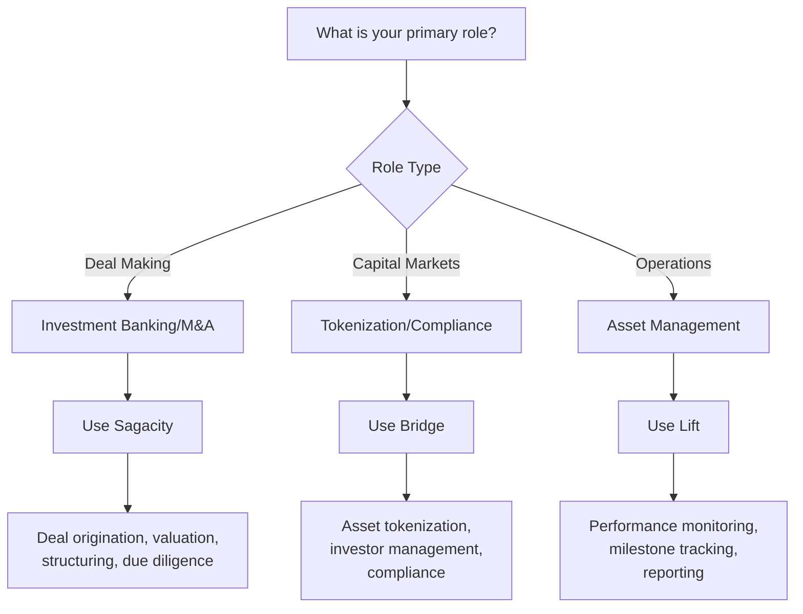

# Which Application Do You Need?

## Choosing the Right Tool for Your Role

The DUC Capital Platform consists of three specialized applications, each designed for specific stages of the capital lifecycle. This guide will help you identify which application(s) you need based on your role and objectives.

---

## Quick Decision Guide

---

## Application by Role

### 🏦 **Investment Professionals**

**Primary Application:** Sagacity

**You need Sagacity if you are:**
- Investment banker structuring deals
- M&A advisor evaluating transactions
- Corporate development professional
- Private equity analyst
- Venture capital associate

**Key Activities:**
- Originating and evaluating deals
- Building financial models and valuations
- Conducting due diligence
- Preparing investment committee materials
- Creating deal books for execution

**Typical Workflow:**
1. Source and screen opportunities in Sagacity
2. Run AI-driven valuations and risk analysis
3. Structure terms and prepare documentation
4. Hand off completed deal book to Bridge for tokenization

---

### 💼 **Capital Markets Professionals**

**Primary Application:** Bridge

**You need Bridge if you are:**
- Capital markets specialist
- Tokenization expert
- Compliance officer
- Investor relations manager
- Securities operations professional

**Key Activities:**
- Converting deals into tokenized securities
- Managing regulatory compliance
- Setting up SPVs and cap tables
- Onboarding investors
- Managing token issuance and distributions

**Typical Workflow:**
1. Receive validated deal book from Sagacity
2. Structure tokenization (direct, fractionalized, or corporate RWA)
3. Implement compliance framework (KYC/AML, transfer restrictions)
4. Manage investor onboarding and allocations
5. Issue tokens and hand off to Lift for monitoring

---

### 📊 **Asset & Operations Managers**

**Primary Application:** Lift

**You need Lift if you are:**
- Asset manager
- Portfolio manager
- Project manager
- Operations analyst
- Performance reporting specialist

**Key Activities:**
- Monitoring asset performance
- Tracking project milestones
- Managing operational metrics
- Ensuring covenant compliance
- Generating performance reports

**Typical Workflow:**
1. Receive tokenized assets from Bridge
2. Set up monitoring dashboards and KPIs
3. Track execution against plan
4. Monitor compliance and covenants
5. Feed performance data back to Bridge for investor updates

---

## Application by Deal Stage

### 📋 **Pre-Deal Stage**
**Application:** Sagacity
- Market research and opportunity identification
- Initial financial analysis
- Preliminary valuation
- Risk assessment

### 🤝 **Deal Structuring Stage**
**Application:** Sagacity → Bridge
- Final deal terms (Sagacity)
- Due diligence completion (Sagacity)
- Deal book preparation (Sagacity)
- Tokenization structure design (Bridge)

### 🎯 **Execution Stage**
**Application:** Bridge → Lift
- Token issuance (Bridge)
- Investor allocation (Bridge)
- Initial deployment (Lift)
- Milestone tracking begins (Lift)

### 📈 **Management Stage**
**Application:** Lift
- Ongoing performance monitoring
- Compliance tracking
- Investor reporting
- Portfolio analytics

---

## Multi-Application Scenarios

### **End-to-End Deal Professional**
You'll use all three applications if you:
- Manage deals from origination through ongoing management
- Oversee the complete capital lifecycle
- Lead integrated teams across functions

**Workflow:** Sagacity → Bridge → Lift

### **Deal Execution Specialist**
You'll use Sagacity and Bridge if you:
- Focus on deal structuring and capital raising
- Handle transaction execution but not ongoing management
- Specialize in deal-to-close activities

**Workflow:** Sagacity → Bridge

### **Post-Issuance Specialist**
You'll use Bridge and Lift if you:
- Manage tokenized assets post-issuance
- Handle investor relations and reporting
- Focus on operational performance

**Workflow:** Bridge → Lift

---

## Department-Based Selection

### **Investment Banking Department**
- **Primary:** Sagacity
- **Secondary:** Bridge (for understanding tokenization requirements)
- **Focus:** Deal origination, valuation, structuring

### **Capital Markets Department**
- **Primary:** Bridge
- **Secondary:** Lift (for performance data)
- **Focus:** Tokenization, compliance, investor management

### **Asset Management Department**
- **Primary:** Lift
- **Secondary:** Bridge (for token administration)
- **Focus:** Performance monitoring, reporting, optimization

### **Executive/Portfolio Management**
- **All Three Applications**
- **Focus:** Strategic oversight across entire lifecycle

---

## Quick Reference Table

| Your Goal | Primary App | Secondary App | Key Features Used |
|-----------|-------------|---------------|-------------------|
| Structure a new M&A deal | Sagacity | Bridge | Valuation models, deal structuring |
| Tokenize real estate assets | Bridge | Lift | Fractionalization, SPV setup |
| Monitor infrastructure project | Lift | Bridge | Milestone tracking, KPI monitoring |
| Raise capital via tokens | Bridge | Sagacity | Token issuance, investor onboarding |
| Analyze deal performance | Sagacity | Lift | Historical data, benchmarking |
| Manage investor relations | Bridge | Lift | Registry management, distributions |
| Ensure regulatory compliance | Bridge | Lift | KYC/AML, covenant monitoring |
| Create investment memo | Sagacity | - | AI-driven analysis, report generation |

---

## Getting Started Recommendations

### 🚀 **New to the Platform?**
1. Start with [Platform Overview](overview.md) to understand the ecosystem
2. Focus on your primary application based on your role
3. Learn integration points with adjacent applications

### 💡 **Experienced User Expanding Role?**
1. Review the [Deal Lifecycle Flow](lifecycle-flow.md)
2. Understand handoff points between applications
3. Practice with cross-application workflows

### 🎯 **Team Leader?**
1. Map your team's roles to applications
2. Establish clear handoff procedures
3. Set up integrated reporting across applications

---

!!! tip "Best Practice"
    While you may primarily use one application, understanding the basics of adjacent applications in the workflow will help you prepare better outputs and collaborate more effectively with other teams.

!!! info "Access Management"
    Your organization administrator will provision access to the appropriate applications based on your role. Contact your admin if you believe you need access to additional applications.