# How The Applications Work Together

## Understanding the Connection

Think of the DUC applications like a well-organized office building. Each application has its own purpose, but they all work together to make your work life easier and more efficient.

---

## The Simple Picture

```mermaid
graph LR
    A[👤 You] --> B[🎯 Sagacity<br/>Your Workspace]
    B <--> C[🌉 Bridge<br/>Data Highway]
    C <--> D[📊 External Systems]
    E[👑 Admin] --> F[🚀 Lift<br/>Control Center]
    F -.-> B
    F -.-> C
    
    style B fill:#e1f5fe
    style C fill:#f3e5f5
    style F fill:#fff3e0
```

### What This Means:
- **You work in Sagacity** - your main workspace
- **Bridge connects everything** - keeps data flowing smoothly
- **Lift controls access** - administrators manage who can do what

---

## Real-World Example: Your Monday Morning

Let's follow what happens when you start your workday:

### 🌅 8:00 AM - You Log In

1. **You open Sagacity** to start your day
2. **Lift checks** that you have permission to access
3. **Bridge automatically updates** your dashboard with fresh data
4. **You see** your tasks, messages, and reports - all current and ready

### 📧 8:15 AM - New Information Arrives

1. **New data comes** from your company's sales system
2. **Bridge notices** the update immediately
3. **Bridge translates** the data into a format Sagacity understands
4. **Your Sagacity dashboard** updates automatically
5. **You see** the new information without doing anything

### 👥 2:00 PM - Administrator Makes Changes

1. **Your manager uses Lift** to give you access to a new project
2. **Lift updates your permissions** across all applications
3. **Next time you refresh Sagacity**, you see the new project area
4. **Bridge ensures** any relevant data flows to your new workspace

---

## How Information Flows

### The Data Journey

### What Each Application Does:

**🎯 Sagacity (Your View):**
- Shows you exactly what you need to see
- Presents information in a user-friendly way
- Lets you complete your tasks efficiently
- Keeps everything organized

**🌉 Bridge (The Connector):**
- Watches for changes in connected systems
- Translates data between different formats
- Ensures nothing gets lost or duplicated
- Works 24/7 in the background

**🚀 Lift (The Controller):**
- Decides who can access what
- Manages user accounts and teams
- Controls system settings
- Monitors overall health

---

## Why This Matters to You

### ✅ **No Duplicate Work**
When information updates in one system, Bridge automatically updates it everywhere else. You never have to copy data manually.

### ✅ **Always Current**
Your Sagacity workspace always shows the latest information because Bridge keeps everything synchronized.

### ✅ **Secure Access**
Lift ensures you can access exactly what you need for your job - nothing more, nothing less.

### ✅ **Simple Experience**
You just use Sagacity. Everything else happens automatically behind the scenes.

---

## Connection Types

### 🔄 **Real-Time Sync**
Some connections update instantly:
- **Example:** When a sale is closed in your CRM, it immediately appears in Sagacity
- **Used for:** Critical business data, urgent notifications

### ⏰ **Scheduled Sync**
Some connections update at regular intervals:
- **Example:** Daily reports update every morning at 6 AM
- **Used for:** Reports, summaries, non-urgent data

### 🎯 **On-Demand Sync**
Some connections update when you request it:
- **Example:** Clicking "Refresh Data" to get the latest numbers
- **Used for:** Large datasets, detailed reports

---

## What You Don't Need to Worry About

### 🚫 **Technical Details**
You don't need to understand:
- How the data travels between systems
- What format the data is in
- Where the servers are located
- How the security works

### 🚫 **Setup and Maintenance**
You don't need to:
- Configure connections
- Set up synchronization rules
- Monitor system health
- Fix technical problems

### 🚫 **Managing Other Users**
You don't need to:
- Give access to new team members
- Change permissions
- Manage system settings
- Handle user accounts

---

## When Things Connect Smoothly

### 🎉 **Perfect Day Scenario:**

1. **You log in** → Everything loads instantly
2. **You see fresh data** → Bridge updated everything overnight
3. **You work efficiently** → All information is current and accurate
4. **You collaborate easily** → Team members see the same up-to-date information
5. **You finish tasks** → Updates automatically flow to other systems

### Signs Everything is Working:
- Your dashboard loads quickly
- Data appears current (recent timestamps)
- No error messages or warnings
- Team members see the same information

---

## When You Might Notice the Connections

### 🔍 **Visible Signs:**

**In Sagacity:**
- "Last updated" timestamps
- Data refresh indicators
- "Syncing..." messages (brief)
- Automatic updates appearing

**Status Indicators:**
- 🟢 Green dots = Everything connected
- 🟡 Yellow dots = Syncing in progress
- 🔴 Red dots = Connection issue (contact support)

---

## Common Questions

!!! question "Why do I sometimes see 'Syncing' messages?"
    Bridge is updating your data in real-time. These messages usually disappear within seconds.

!!! question "What if I see old data?"
    First, try refreshing your browser. If data still seems old, check with your administrator about Bridge connections.

!!! question "Do I need to do anything to maintain the connections?"
    No! Bridge and Lift handle all maintenance automatically. Just use Sagacity normally.

!!! question "What happens if one application is down?"
    The other applications continue working with the last available data. Updates resume automatically when everything is back online.

---

## Benefits of the Connected System

### 🚀 **For You:**
- One login for everything
- Always current information
- No manual data entry
- Seamless experience

### 🏢 **For Your Organization:**
- Reduced errors
- Improved efficiency
- Better collaboration
- Consistent data across teams

### 💼 **For Your Team:**
- Everyone sees the same information
- No confusion about "which version is current"
- Faster decision making
- Better coordination

---

## Next Steps

Now that you understand how everything connects:

1. **Ready to start?** → [Quick Start Guide](quick-start.md)
2. **Want to learn about Sagacity?** → [What is Sagacity?](../sagacity/what-is-sagacity.md)
3. **Need help choosing?** → [Which Application Do I Need?](choosing-app.md)

---

!!! tip "Remember"
    You don't need to understand all the technical details. Just know that the applications work together automatically to give you a smooth, efficient experience. Focus on using Sagacity for your daily work - everything else happens behind the scenes!