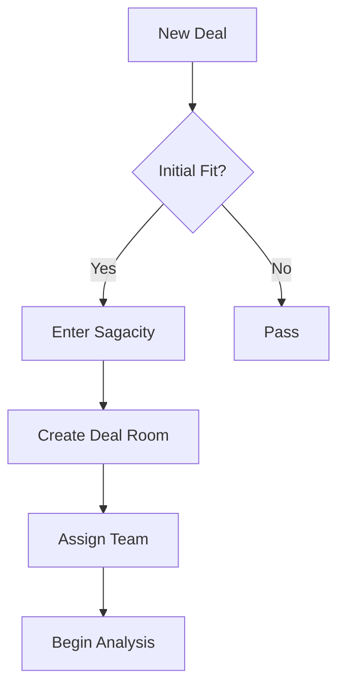
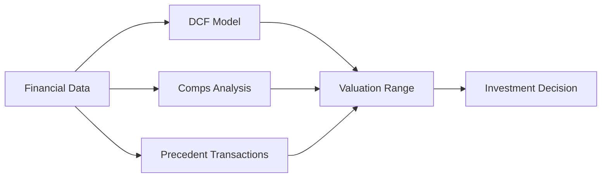
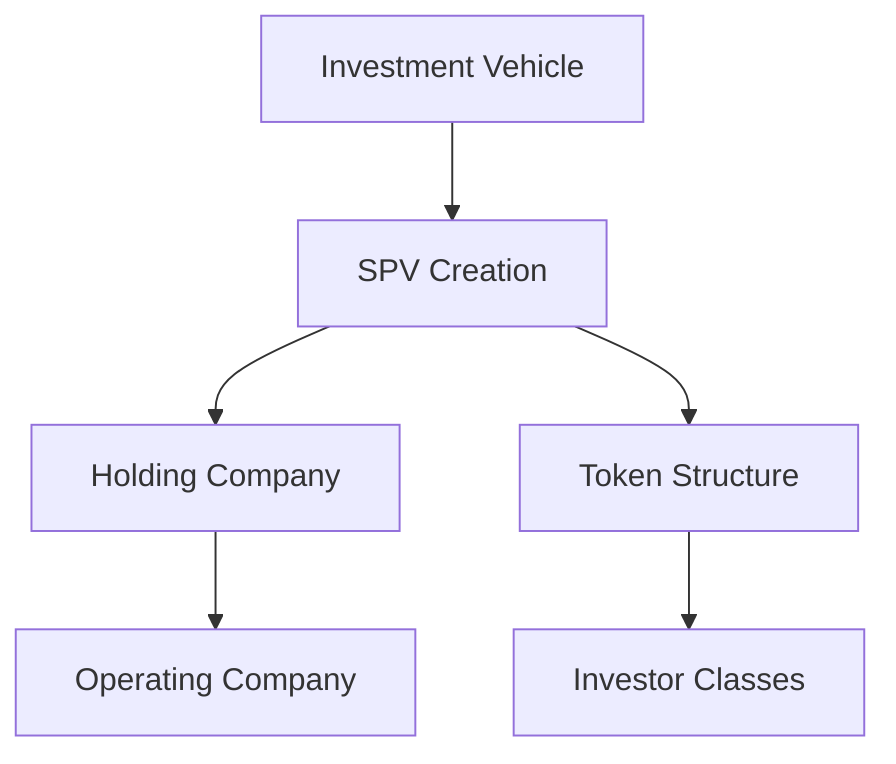
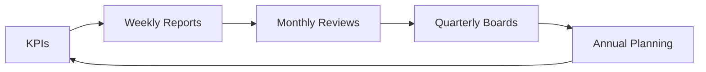
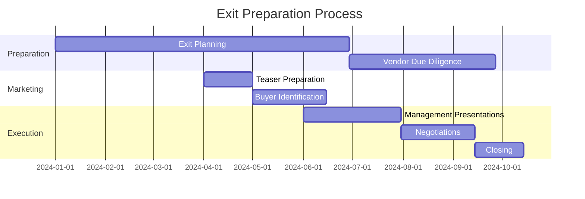
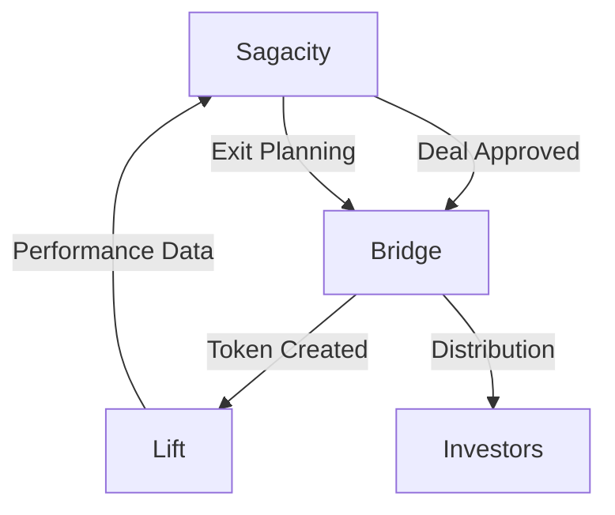

# Deal Lifecycle Flow

## Complete Journey from Origination to Exit

The DUC Capital Platform orchestrates the entire investment lifecycle through three integrated applications. This comprehensive guide explains how deals flow through each stage, from initial sourcing to final exit, with detailed workflows and decision points.

## The Five Phases of Investment

### Phase 1: Origination & Sourcing
**Primary Application:** Sagacity  
**Duration:** 2-4 weeks  
**Key Activities:**

#### Deal Sourcing
- **Direct Origination**: Proprietary deal flow from network relationships
- **Intermediary Channels**: Investment banks, brokers, and advisors
- **Market Scanning**: AI-powered identification of opportunities
- **Competitive Situations**: Auction processes and bilateral negotiations

#### Initial Screening


#### Data Collection
- Company information and financials
- Market position and competitive landscape
- Management team assessment
- Initial valuation parameters

### Phase 2: Evaluation & Analysis
**Primary Application:** Sagacity  
**Duration:** 4-8 weeks  
**Key Activities:**

#### Deep Dive Analysis

##### Financial Analysis
- Historical performance review (3-5 years)
- Quality of earnings assessment
- Working capital analysis
- Capital structure evaluation
- Debt capacity study

##### Strategic Analysis
- Market size and growth dynamics
- Competitive positioning
- Value creation opportunities
- Risk assessment matrix
- Exit strategy planning

##### Operational Review
- Management capabilities
- Operational efficiency
- Technology infrastructure
- Scalability assessment
- Integration planning

#### Valuation Modeling



##### Valuation Methodologies
1. **Discounted Cash Flow (DCF)**
   - 5-year projections
   - Terminal value calculation
   - WACC determination
   - Sensitivity analysis

2. **Comparable Company Analysis**
   - Peer group selection
   - Multiple analysis (EV/EBITDA, P/E, etc.)
   - Benchmarking metrics
   - Trading comparables

3. **Precedent Transaction Analysis**
   - Relevant transaction identification
   - Purchase price allocation
   - Control premium analysis
   - Market timing adjustments

### Phase 3: Structuring & Execution
**Primary Applications:** Sagacity → Bridge  
**Duration:** 6-12 weeks  
**Key Activities:**

#### Deal Structuring

##### Capital Structure Design
- Equity investment sizing
- Debt financing arrangement
- Hybrid instruments consideration
- Management incentive plans

##### Legal Structure


##### Term Sheet Negotiation
- Purchase price and adjustments
- Representations and warranties
- Indemnification provisions
- Closing conditions
- Post-closing covenants

#### Due Diligence Process

##### Comprehensive Review Areas
1. **Financial Due Diligence**
   - Audit of financial statements
   - Tax review and structuring
   - Working capital validation
   - Debt and cash verification

2. **Legal Due Diligence**
   - Corporate structure review
   - Material contracts analysis
   - Litigation assessment
   - Regulatory compliance
   - IP portfolio review

3. **Commercial Due Diligence**
   - Customer concentration
   - Supplier relationships
   - Market validation
   - Competitive dynamics
   - Growth assumptions testing

4. **Operational Due Diligence**
   - Systems and processes
   - Human resources review
   - IT infrastructure
   - Environmental assessment
   - Insurance coverage

### Phase 4: Tokenization & Distribution
**Primary Application:** Bridge  
**Duration:** 2-4 weeks  
**Key Activities:**

#### Asset Tokenization

##### Token Creation Process
1. **Asset Preparation**
   - Legal wrapper finalization
   - Rights and obligations definition
   - Compliance framework establishment
   - Smart contract development

2. **Token Minting**
   - Token standard selection (ERC-20, ERC-1400, etc.)
   - Supply determination
   - Distribution planning
   - Lock-up schedules

3. **Investor Classes**
   ```mermaid
   graph TD
       A[Total Investment] --> B[Class A - Institutional]
       A --> C[Class B - Accredited]
       A --> D[Class C - Employees]
       B --> E[Different Rights]
       C --> E
       D --> E
   ```

#### Capital Raising

##### Investor Onboarding
- KYC/AML verification
- Accreditation validation
- Subscription documentation
- Capital commitment tracking

##### Distribution Execution
- Offering memorandum distribution
- Roadshow management
- Book building process
- Allocation decisions
- Capital calls and funding

### Phase 5: Management & Monitoring
**Primary Application:** Lift  
**Duration:** 3-7 years (holding period)  
**Key Activities:**

#### Active Portfolio Management

##### Value Creation Execution
1. **Strategic Initiatives**
   - Revenue growth programs
   - Margin improvement initiatives
   - Add-on acquisitions
   - Digital transformation
   - Market expansion

2. **Operational Improvements**
   - Process optimization
   - Cost reduction programs
   - Working capital management
   - Capital expenditure optimization
   - Organizational development

##### Performance Monitoring



##### Key Metrics Tracked
- Financial performance vs. budget
- Operational KPIs
- Value creation milestones
- Market developments
- Competitive dynamics

#### Governance & Reporting

##### Board Governance
- Regular board meetings
- Strategic decision approval
- Performance reviews
- Risk management oversight
- Stakeholder communication

##### Investor Reporting
- Quarterly performance updates
- Annual audited financials
- NAV calculations
- Distribution notices
- Material event notifications

## Exit Planning & Execution

### Exit Preparation Timeline



### Exit Strategies

#### Strategic Options
1. **Trade Sale**
   - Strategic buyer identification
   - Synergy analysis
   - Integration planning
   - Earnout structuring

2. **Financial Sale**
   - Secondary buyout
   - Continuation funds
   - GP-led secondaries
   - Portfolio company mergers

3. **Public Markets**
   - IPO preparation
   - SPAC combinations
   - Direct listings
   - Dual-track processes

4. **Recapitalization**
   - Dividend recaps
   - Refinancing events
   - Partial liquidity
   - Management buyouts

## Integration Points

### Data Flow Between Applications



### Critical Handoffs

#### Sagacity to Bridge
- Investment committee approval
- Final deal terms
- Legal documentation
- Investor allocation

#### Bridge to Lift
- Token registry
- Investor database
- Compliance requirements
- Reporting obligations

#### Lift to Sagacity
- Performance metrics
- Exit readiness signals
- Market intelligence
- Portfolio insights

## Best Practices

### Success Factors

#### Origination Excellence
- **Strong Sourcing Network**: Maintain proprietary deal flow
- **Quick Response Time**: First-mover advantage in competitive situations
- **Clear Investment Thesis**: Well-defined criteria and focus areas
- **Relationship Management**: Long-term partnership approach

#### Rigorous Analysis
- **Data-Driven Decisions**: Comprehensive analytical framework
- **Risk Mitigation**: Thorough due diligence and structuring
- **Value Creation Planning**: Clear post-acquisition roadmap
- **Team Alignment**: Unified investment committee view

#### Effective Execution
- **Project Management**: Detailed workstreams and timelines
- **Communication**: Regular stakeholder updates
- **Flexibility**: Adapt to changing circumstances
- **Speed to Close**: Efficient execution capabilities

### Common Pitfalls to Avoid

#### During Origination
- ❌ Pursuing deals outside core competency
- ❌ Inadequate initial screening
- ❌ Overpaying in competitive auctions
- ❌ Missing red flags early

#### During Due Diligence
- ❌ Confirmation bias in analysis
- ❌ Inadequate management reference checks
- ❌ Overlooking integration challenges
- ❌ Underestimating capital requirements

#### During Portfolio Management
- ❌ Passive ownership approach
- ❌ Delayed intervention on issues
- ❌ Inadequate board composition
- ❌ Poor stakeholder communication

## Performance Metrics

### Lifecycle KPIs

| Phase | Key Metrics | Target Range | Measurement Frequency |
|-------|------------|--------------|----------------------|
| **Origination** | Deals Reviewed | 200-300/year | Monthly |
| | Conversion Rate | 2-3% | Quarterly |
| | Proprietary Deal % | >50% | Quarterly |
| **Analysis** | DD Completion Time | 6-8 weeks | Per Deal |
| | IC Approval Rate | 60-70% | Quarterly |
| | Valuation Accuracy | ±10% | Annual |
| **Execution** | Time to Close | 90-120 days | Per Deal |
| | Closing Certainty | >90% | Annual |
| | Structure Efficiency | Optimized | Per Deal |
| **Management** | Value Creation | 2.5-3.0x MOIC | Annual |
| | IRR Achievement | 20-25% | Annual |
| | Operational Improvement | 15-20% EBITDA | Annual |
| **Exit** | Exit Multiple | >3.0x | Per Exit |
| | Hold Period | 4-6 years | Per Investment |
| | LP Distributions | Top Quartile | Annual |

## Technology Integration

### Platform Automation

#### Automated Workflows
- Deal screening algorithms
- Document generation
- Compliance checks
- Report distribution
- Performance alerts

#### AI-Powered Features
- Market intelligence gathering
- Valuation modeling
- Risk assessment
- Document analysis
- Performance prediction

### Data Analytics

#### Real-Time Dashboards
- Pipeline tracking
- Portfolio performance
- Market comparables
- Risk monitoring
- Investor analytics

#### Predictive Analytics
- Exit timing optimization
- Value creation forecasting
- Market cycle analysis
- Risk prediction models
- Performance attribution

## Regulatory Compliance

### Compliance Throughout Lifecycle

#### Pre-Investment
- Fund formation compliance
- Marketing restrictions
- Investor qualification
- Conflict checking

#### During Investment
- Regulatory approvals
- Antitrust clearances
- Foreign investment reviews
- Industry-specific requirements

#### Post-Investment
- Ongoing reporting obligations
- Tax compliance
- Corporate governance
- ESG requirements

## Conclusion

The DUC Capital Platform's integrated approach ensures seamless execution throughout the investment lifecycle. By leveraging Sagacity for intelligent deal preparation, Bridge for efficient tokenization, and Lift for active portfolio management, investors can maximize returns while maintaining operational excellence.

### Key Takeaways
- **Integrated Platform**: Three applications working in harmony
- **Data-Driven Process**: Analytics and AI throughout the lifecycle
- **Active Management**: Hands-on value creation approach
- **Efficient Execution**: Streamlined workflows and automation
- **Comprehensive Monitoring**: Real-time visibility and control

---

*Next Steps: Learn about [Choosing Your Application](choosing-app.md) or dive into [Sagacity's Deal Origination](../sagacity/deals/origination.md) process.*