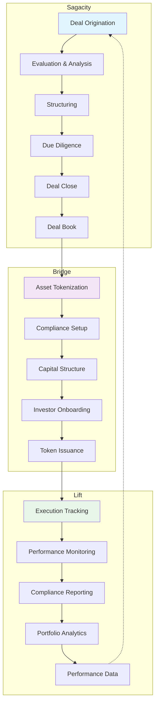

# Understanding the DUC Capital Platform

## A Complete Digital Infrastructure for Modern Capital Management

The DUC Capital Platform provides end-to-end management of the capital lifecycle through three integrated applications. From deal origination to tokenization to ongoing asset management, our platform streamlines complex financial processes while maintaining compliance and transparency.

---

## The Three Core Applications

### 📊 Sagacity - Corporate Finance & Deal Preparation

**Purpose:** Front-end of the capital lifecycle for deal origination, evaluation, and structuring.

**Target Users:**
- Investment bankers
- Corporate development teams
- M&A advisors
- Private equity professionals

**Core Capabilities:**
- **Deal Lifecycle Management:** Origination → Evaluation → Structuring → Due Diligence → Close
- **AI-Driven Analysis:** Automated valuation models, risk assessment, covenant checks
- **Financial Modeling:** Multi-method valuation (DCF, comparables, precedents), DuPont+ ROE analysis
- **Data Room:** Graph-RAG powered repository linking documents to model assumptions
- **Deliverables:** Investment committee memos, valuation reports, complete deal books

**Output:** Validated, structured deal book ready for tokenization in Bridge

---

### 🔗 Bridge - Tokenization & Capital Structuring

**Purpose:** Transform validated deals into compliant, investor-ready tokenized assets.

**Target Users:**
- Capital markets professionals
- Tokenization specialists
- Compliance officers
- Investor relations teams

**Core Capabilities:**
- **Asset Tokenization:** Direct assets, fractionalized assets, corporate RWAs, infrastructure projects
- **Compliance Framework:** ERC-3643 standard, KYC/AML, transfer restrictions, vesting schedules
- **Capital Structuring:** SPV management, cap table creation, equity/debt instruments
- **Investor Management:** Offer creation, allocations, onboarding, registry maintenance
- **Lifecycle Management:** Issuance → Syndication → Distributions → Corporate Actions → Redemption

**Output:** Live, compliant tokenized instruments with investors onboarded

---

### 📈 Lift - Execution & Asset Management

**Purpose:** Operational management and performance monitoring of tokenized assets.

**Target Users:**
- Asset managers
- Project managers
- Operations teams
- Performance analysts

**Core Capabilities:**
- **Execution Tracking:** Milestone monitoring, stage management, KPI tracking
- **Asset Performance:** Operational metrics, financial tracking, revenue performance
- **Compliance Monitoring:** Covenant adherence, regulatory checks, automated reporting
- **Portfolio Management:** Cross-asset visibility, integrated dashboards, performance analytics
- **Data Integration:** Real-time feeds to Bridge for investor updates

**Output:** Performance history and operational data feeding back to Sagacity for benchmarking

---

## Platform Integration Flow

---

## Portfolio Continuity Across Applications

The concept of "Portfolio" exists in all three applications with stage-specific meaning:

### In Sagacity
- **Closed Deals Archive:** Historical deal records and analytics
- **Benchmarking Data:** Performance metrics for future deal evaluation
- **Handoff Packages:** Complete deal books ready for tokenization

### In Bridge
- **Active Tokenized Assets:** Live tokens under capital structure management
- **Investor Registry:** Current ownership and transfer records
- **Distribution Management:** Ongoing corporate actions and payouts

### In Lift
- **Operational Assets:** Actively managed projects and assets
- **Performance Tracking:** Real-time KPIs and milestone achievement
- **Reporting Hub:** Consolidated performance data for all stakeholders

---

## Key Benefits of Integration

### ✅ **Seamless Data Flow**
Information flows automatically from deal preparation through tokenization to ongoing management, eliminating manual handoffs and reducing errors.

### ✅ **Compliance Throughout**
Built-in regulatory compliance at every stage, from initial deal structuring through token issuance to ongoing covenant monitoring.

### ✅ **Complete Visibility**
Single source of truth across the entire capital lifecycle, with role-based access to relevant information.

### ✅ **Performance Feedback**
Historical performance data from Lift feeds back to Sagacity, improving future deal evaluation and structuring.

### ✅ **Investor Confidence**
Transparent, auditable processes with real-time performance tracking and automated reporting.

---

## Common Use Cases

### Private Equity Deal
1. **Sagacity:** Structure and evaluate acquisition
2. **Bridge:** Tokenize equity stakes with vesting schedules
3. **Lift:** Monitor portfolio company performance

### Real Estate Development
1. **Sagacity:** Analyze project financials and structure funding
2. **Bridge:** Create fractionalized property tokens with SPV
3. **Lift:** Track construction milestones and rental income

### Infrastructure Project
1. **Sagacity:** Model P3 arrangement and risk allocation
2. **Bridge:** Issue multi-tranche tokens for different investor classes
3. **Lift:** Monitor operational KPIs and maintenance schedules

### Corporate Bond Issuance
1. **Sagacity:** Structure debt terms and covenants
2. **Bridge:** Tokenize bonds with automated compliance
3. **Lift:** Track issuer performance and covenant adherence

---

## Getting Started

Based on your role and objectives:

- **Deal Makers:** Start with [Sagacity Deal Origination](../sagacity/deals/origination.md)
- **Capital Markets:** Begin with [Bridge Tokenization](../bridge/getting-started/understanding.md)
- **Asset Managers:** Explore [Lift Portfolio Management](../lift/getting-started/portfolio.md)
- **New Users:** Review [Platform Lifecycle Flow](lifecycle-flow.md)

---

!!! tip "Platform Best Practice"
    While each application can function independently, the true power comes from using them as an integrated suite. A deal prepared in Sagacity seamlessly flows to Bridge for tokenization and then to Lift for ongoing management, creating a complete digital audit trail.