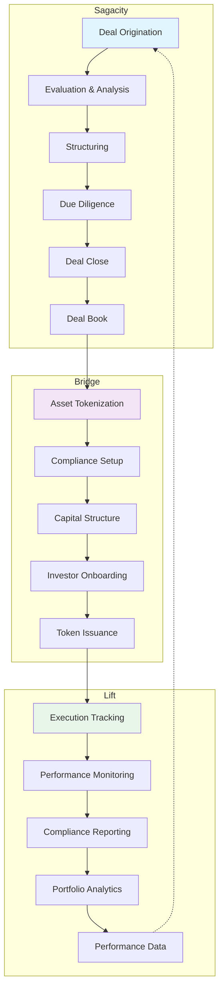

# Understanding the DUC Capital Platform

## The Next-Generation Capital Operating System for Smart, Programmable Capital

### Why a Capital OS is Needed Now

The convergence of artificial intelligence, blockchain technology, and digital twins is fundamentally transforming how capital markets operate. Traditional capital management systems were built for a paper-based, manually-processed world where deals took months, compliance was reactive, and performance tracking was backward-looking.

Today's capital markets demand something radically different:

- **Programmable Capital:** Smart contracts enable self-executing terms, automated compliance, and instant settlement
- **AI-Driven Intelligence:** Machine learning models provide real-time valuation, risk assessment, and predictive analytics
- **Digital Twin Architecture:** Every real-world asset has a synchronized digital representation with live data feeds
- **Automated Orchestration:** Complex multi-party transactions execute seamlessly without manual intervention

### What Makes This Different

**Traditional Capital Systems:**
- Siloed applications with manual data transfer
- Static documents and periodic reporting
- Human-dependent processes prone to delays and errors
- Reactive compliance and post-facto auditing
- Limited transparency and fragmented ownership records

**DUC Capital OS:**
- **Unified Intelligence Layer:** AI agents continuously analyze deals, monitor performance, and optimize structures
- **Programmable Workflows:** Smart contracts automate everything from covenant monitoring to distribution waterfalls
- **Digital Asset Twins:** Real-world assets are mirrored digitally with IoT feeds, blockchain records, and AI analytics
- **Proactive Compliance:** Built-in regulatory rules that prevent violations before they occur
- **Real-Time Everything:** Instant valuation updates, live performance tracking, immediate settlement

## A Complete Digital Infrastructure for Smart Capital Management

The DUC Capital Platform provides end-to-end management of the capital lifecycle through three integrated applications that function as a unified Capital OS. From AI-powered deal origination to blockchain-based tokenization to digital twin asset management, our platform doesn't just digitize existing processes—it fundamentally reimagines how capital should work in the 21st century.

### The Transformation Journey

The shift to a Capital OS represents a fundamental evolution in how we think about capital:

1. **From Static to Dynamic:** Capital structures that adapt in real-time to market conditions
2. **From Opaque to Transparent:** Every transaction, every decision, every outcome is traceable
3. **From Reactive to Predictive:** AI anticipates issues before they become problems
4. **From Fragmented to Unified:** Single source of truth across all stakeholders
5. **From Manual to Autonomous:** Self-executing agreements and automated operations

---

## The Three Core Applications as Capital OS Components

### 📊 Sagacity - The Intelligence Engine

**Purpose:** AI-powered deal intelligence and structuring engine that transforms unstructured opportunities into investment-ready digital assets.

**Target Users:**
- Investment bankers
- Corporate development teams
- M&A advisors
- Private equity professionals

**Next-Gen Capabilities:**
- **AI Deal Origination:** Machine learning algorithms identify and score opportunities from multiple data sources
- **Automated Due Diligence:** AI agents analyze documents, extract key terms, and identify risks automatically
- **Dynamic Valuation Models:** Real-time valuation updates based on market feeds and comparable transactions
- **Predictive Analytics:** Forecast deal outcomes, identify optimal structures, predict investor appetite
- **Graph-RAG Data Room:** Knowledge graph linking every assumption to source documents with AI reasoning

**Smart Capital Features:**
- Automated covenant extraction and monitoring setup
- AI-generated investment memos with supporting evidence chains
- Real-time collaboration with AI copilot assistance
- Predictive deal scoring and success probability

**Output:** Intelligent deal package with embedded smart contracts ready for tokenization

---

### 🔗 Bridge - The Programmable Capital Layer

**Purpose:** Blockchain-powered tokenization engine that transforms traditional assets into programmable, self-governing digital instruments.

**Target Users:**
- Capital markets professionals
- Tokenization specialists
- Compliance officers
- Investor relations teams

**Next-Gen Capabilities:**
- **Smart Contract Capital:** Self-executing agreements with embedded business logic and compliance rules
- **Automated Compliance:** Real-time KYC/AML, transfer restrictions, and regulatory reporting built into tokens
- **Dynamic Capital Structures:** Programmable waterfalls, automatic distributions, conditional conversions
- **Cross-Chain Interoperability:** Deploy across multiple blockchains with unified management
- **DeFi Integration:** Connect to liquidity pools, lending protocols, and decentralized exchanges

**Programmable Features:**
- Automated dividend distributions based on performance triggers
- Self-enforcing lock-ups and vesting schedules
- Dynamic pricing mechanisms responding to market conditions
- Instant settlement with atomic swaps
- Embedded governance voting and proposal systems

**Output:** Live programmable capital instruments with autonomous operation capabilities

---

### 📈 Lift - The Digital Twin Control System

**Purpose:** Digital twin platform that creates living, breathing digital representations of real-world assets with autonomous management capabilities.

**Target Users:**
- Asset managers
- Project managers
- Operations teams
- Performance analysts

**Next-Gen Capabilities:**
- **Digital Asset Twins:** Real-time synchronized digital replicas of physical assets with IoT integration
- **AI-Powered Operations:** Machine learning algorithms optimize performance and predict maintenance
- **Autonomous Execution:** Self-managing assets that respond to conditions without human intervention
- **Predictive Analytics:** Forecast performance, identify risks, and recommend optimizations
- **Real-Time Data Orchestration:** Continuous data flows from sensors, systems, and external sources

**Digital Twin Features:**
- IoT sensor integration for real-world asset monitoring
- AI agents that manage day-to-day operations
- Predictive maintenance scheduling based on usage patterns
- Automated performance optimization algorithms
- Virtual simulation of different operational scenarios
- Blockchain-verified audit trails of all activities

**Output:** Continuous performance data stream creating feedback loops for smarter capital allocation

---

## Platform Integration Flow

---

## Portfolio Continuity Across Applications

The concept of "Portfolio" exists in all three applications with stage-specific meaning:

### In Sagacity
- **Closed Deals Archive:** Historical deal records and analytics
- **Benchmarking Data:** Performance metrics for future deal evaluation
- **Handoff Packages:** Complete deal books ready for tokenization

### In Bridge
- **Active Tokenized Assets:** Live tokens under capital structure management
- **Investor Registry:** Current ownership and transfer records
- **Distribution Management:** Ongoing corporate actions and payouts

### In Lift
- **Operational Assets:** Actively managed projects and assets
- **Performance Tracking:** Real-time KPIs and milestone achievement
- **Reporting Hub:** Consolidated performance data for all stakeholders

---

## Key Benefits of Integration

### ✅ **Seamless Data Flow**
Information flows automatically from deal preparation through tokenization to ongoing management, eliminating manual handoffs and reducing errors.

### ✅ **Compliance Throughout**
Built-in regulatory compliance at every stage, from initial deal structuring through token issuance to ongoing covenant monitoring.

### ✅ **Complete Visibility**
Single source of truth across the entire capital lifecycle, with role-based access to relevant information.

### ✅ **Performance Feedback**
Historical performance data from Lift feeds back to Sagacity, improving future deal evaluation and structuring.

### ✅ **Investor Confidence**
Transparent, auditable processes with real-time performance tracking and automated reporting.

---

## Common Use Cases

### Private Equity Deal
1. **Sagacity:** Structure and evaluate acquisition
2. **Bridge:** Tokenize equity stakes with vesting schedules
3. **Lift:** Monitor portfolio company performance

### Real Estate Development
1. **Sagacity:** Analyze project financials and structure funding
2. **Bridge:** Create fractionalized property tokens with SPV
3. **Lift:** Track construction milestones and rental income

### Infrastructure Project
1. **Sagacity:** Model P3 arrangement and risk allocation
2. **Bridge:** Issue multi-tranche tokens for different investor classes
3. **Lift:** Monitor operational KPIs and maintenance schedules

### Corporate Bond Issuance
1. **Sagacity:** Structure debt terms and covenants
2. **Bridge:** Tokenize bonds with automated compliance
3. **Lift:** Track issuer performance and covenant adherence

---

## Getting Started

Based on your role and objectives:

- **Deal Makers:** Start with [Sagacity Deal Origination](../sagacity/deals/origination.md)
- **Capital Markets:** Begin with [Bridge Tokenization](../bridge/getting-started/understanding.md)
- **Asset Managers:** Explore [Lift Portfolio Management](../lift/getting-started/portfolio.md)
- **New Users:** Review [Platform Lifecycle Flow](lifecycle-flow.md)

---

## The Future of Smart Capital

### Where We're Heading

The DUC Capital OS is continuously evolving to stay ahead of the capital markets transformation:

**Near-Term Innovations:**
- **Autonomous Deal Execution:** AI agents that can negotiate and close deals independently
- **Cross-Chain Capital Markets:** Seamless movement of capital across all major blockchains
- **Predictive Risk Management:** AI that prevents problems before they occur
- **Natural Language Interfaces:** Conversational AI for all platform interactions

**Long-Term Vision:**
- **Self-Organizing Capital:** Assets that automatically reconfigure for optimal performance
- **Quantum-Resistant Security:** Future-proof cryptographic protection
- **Global Capital Mesh:** Interconnected network of smart capital across all markets
- **AI Capital Advisors:** Personalized AI agents for every investor and issuer

### Why This Matters

The transition to a Capital OS isn't just about efficiency—it's about fundamentally reimagining what's possible:

- **Democratized Access:** Anyone can participate in previously exclusive capital markets
- **Radical Transparency:** Every stakeholder has real-time visibility into performance
- **Reduced Friction:** Transactions that took weeks now complete in seconds
- **Enhanced Trust:** Cryptographic proof replaces trust in intermediaries
- **Global Scale:** Capital can flow seamlessly across borders and jurisdictions

### The Paradigm Shift

We're moving from a world where:
- **Capital is static** → to one where **capital is programmable**
- **Compliance is reactive** → to one where **compliance is preventive**
- **Data is siloed** → to one where **intelligence is unified**
- **Processes are manual** → to one where **operations are autonomous**
- **Assets are physical** → to one where **assets have digital twins**

---

!!! tip "Platform Best Practice"
    While each application can function independently, the true power comes from using them as an integrated Capital OS. A deal prepared in Sagacity seamlessly flows to Bridge for tokenization and then to Lift for digital twin management, creating not just a digital audit trail, but a living, intelligent capital ecosystem that continuously learns and improves.