# Quick Start Guide

## Get Up and Running in 15 Minutes

Welcome! This guide will help you start using the DUC applications quickly and confidently. We'll focus on the essentials you need to get productive right away.

---

## Before You Begin

### ✅ **What You'll Need:**
- [ ] Your login credentials (username and password)
- [ ] A web browser (Chrome, Firefox, Safari, or Edge)
- [ ] Internet connection
- [ ] 15 minutes of time

### 💡 **What You'll Learn:**
- How to log in and navigate
- Where to find your main work areas
- How to complete your first task
- Where to get help when you need it

---

## Step 1: Access Your Application

### 🌐 **Getting to Sagacity** (Most Common)

1. **Open your web browser**
2. **Go to your organization's Sagacity URL**
   - Usually something like: `https://your-company.sagacity.com`
   - Check with your administrator if you're not sure
3. **Bookmark this page** - you'll use it daily!

### 🔑 **Log In**

1. **Enter your username** (usually your email address)
2. **Enter your password**
3. **Click "Sign In"**

!!! tip "First Time Logging In?"
    If this is your first login, you might be asked to change your password or verify your email. Follow the prompts - it only takes a minute.

---

## Step 2: Your First Look Around

### 🏠 **The Dashboard - Your Home Base**

When you log in, you'll see your dashboard. Think of it as your digital desk where everything important is laid out:

```mermaid
graph TD
    A[🏠 Dashboard] --> B[📋 My Tasks]
    A --> C[📊 Quick Stats]
    A --> D[📢 Recent Updates]
    A --> E[🎯 Action Items]
    
    style A fill:#e1f5fe
    style B fill:#f1f8e9
    style C fill:#fce4ec
    style D fill:#fff3e0
    style E fill:#f3e5f5
```

### 👀 **Key Areas to Notice:**

**📋 My Tasks** - Your to-do list for today
- Shows what needs your attention
- Click any task to open it

**📊 Quick Stats** - Numbers that matter to your work
- Updated automatically throughout the day
- Click for more detailed views

**📢 Recent Updates** - What's new since you last logged in
- Messages from team members
- System notifications
- New assignments

---

## Step 3: Complete Your First Task

### 🎯 **Find a Task to Work On**

1. **Look at your "My Tasks" section**
2. **Choose something that looks familiar**
3. **Click on the task name** to open it

### ✏️ **Working with Tasks**

Most tasks follow this simple pattern:

1. **Read the description** - What needs to be done?
2. **Look for any attachments** - Supporting documents or data
3. **Make your updates** - Enter data, add notes, or make changes
4. **Save your work** - Click "Save" or "Update"
5. **Mark as complete** - When finished, mark it done

!!! tip "Don't Worry About Mistakes"
    Most actions can be undone or edited later. It's better to try something than to worry about getting it perfect the first time.

---

## Step 4: Basic Navigation

### 🧭 **Getting Around**

**Main Menu** (usually on the left or top):
- **Dashboard** - Your home page
- **Tasks** - All your assignments
- **Reports** - Data and analytics you need
- **Messages** - Communication with team members

**Quick Actions** (usually in the top-right):
- **Search** 🔍 - Find anything quickly
- **Notifications** 🔔 - See what's new
- **Profile** 👤 - Your account settings
- **Help** ❓ - Support and guides

### 🔍 **The Search Box is Your Friend**

Can't find something? Use the search box:
- Type what you're looking for
- Try names, project titles, or keywords
- Results appear as you type

---

## Step 5: Essential Features Everyone Uses

### 💬 **Quick Communication**

**Send a Message:**
1. Look for a "Messages" or "Chat" section
2. Start typing a colleague's name
3. Type your message
4. Hit Enter or click Send

**Reply to Messages:**
1. Click on any message notification
2. Type your response
3. Send it

### 📊 **Check Your Numbers**

**View Reports:**
1. Find the "Reports" section
2. Look for reports relevant to your role
3. Click to view details
4. Most reports update automatically

### ✅ **Manage Your Work**

**Update Task Status:**
- Open any task
- Change the status (In Progress, Complete, etc.)
- Add notes if needed
- Save your changes

---

## Step 6: Customizing Your Experience

### 🎨 **Make It Yours**

**Organize Your Dashboard:**
- Look for "Customize" or "Settings" options
- Drag widgets to rearrange them
- Hide sections you don't use
- Add shortcuts to frequently used features

**Set Your Preferences:**
- Click your profile picture or name
- Look for "Settings" or "Preferences"
- Set your timezone
- Choose notification preferences
- Update your contact information

---

## Common First-Day Tasks

### ✅ **Checklist for New Users**

- [ ] **Log in successfully**
- [ ] **Explore your dashboard**
- [ ] **Complete one simple task**
- [ ] **Send a message to a colleague**
- [ ] **View a report relevant to your role**
- [ ] **Customize your dashboard layout**
- [ ] **Bookmark the application URL**
- [ ] **Find the help section**

---

## What If You Get Stuck?

### 🆘 **Immediate Help**

**Look for these help options:**
- **?** or **Help** button (usually top-right)
- **Chat support** (look for a chat bubble icon)
- **Getting Started** guides within the app
- **Tooltips** - hover over buttons to see what they do

### 📞 **Getting Human Help**

**Contact your team:**
- Ask a colleague sitting nearby
- Message your supervisor
- Contact your IT support team
- Email your system administrator

!!! info "Don't Feel Embarrassed"
    Everyone needs help when starting something new. Your colleagues want you to succeed and are usually happy to help!

---

## Your First Week Goals

### 📅 **Day 1: Exploration**
- Get comfortable logging in and navigating
- Complete at least one task
- Send a message to a colleague

### 📅 **Day 2-3: Routine Building**
- Start your day by checking your dashboard
- Complete several tasks
- Explore different sections of the application

### 📅 **Day 4-5: Efficiency**
- Use keyboard shortcuts
- Customize your workspace
- Help a newer colleague

### 📅 **Week End: Confidence**
- Navigate without thinking about it
- Know where to find what you need
- Feel comfortable asking questions

---

## Quick Reference Card

### 🔑 **Essential Shortcuts**

| What You Want | How To Do It |
|---------------|--------------|
| Go home | Click Dashboard or company logo |
| Find something | Use the search box |
| See what's new | Check notifications 🔔 |
| Get help | Click Help or ? |
| Update a task | Click task → Make changes → Save |
| Send message | Messages → Type name → Write message |

---

## Next Steps

### 🚀 **Ready for More?**

Now that you've got the basics:

1. **Dive deeper into your main application:**
   - [Sagacity User Guide](../sagacity/what-is-sagacity.md)
   - [Bridge User Guide](../bridge/what-is-bridge.md)
   - [Lift Administrator Guide](../lift/what-is-lift.md)

2. **Learn advanced features:**
   - Time-saving shortcuts
   - Advanced reporting
   - Collaboration features

3. **Help others:**
   - Share what you've learned
   - Support new team members

---

## Troubleshooting Quick Fixes

### 🔧 **Common Issues**

**"I can't log in"**
- Check your internet connection
- Verify the website URL
- Try resetting your password
- Contact your administrator

**"The page won't load"**
- Refresh your browser (F5 or Ctrl+R)
- Clear your browser cache
- Try a different browser
- Check with IT support

**"I can't find my work"**
- Use the search function
- Check if you're in the right section
- Ask a colleague
- Contact support

**"Nothing seems to work"**
- Take a deep breath
- Close and reopen your browser
- Ask for help - this happens to everyone

---

!!! success "You're Ready!"
    Congratulations! You now know enough to start being productive with the DUC applications. Remember, becoming proficient takes time, but you have everything you need to get started. Don't hesitate to explore, ask questions, and learn as you go.

!!! tip "Keep This Guide Handy"
    Bookmark this page! You might want to refer back to it during your first few weeks as you get more comfortable with the applications.