# DUC Capital Platform Documentation

## Complete Deal Lifecycle Management: From Origination to Asset Performance

Welcome to the DUC Capital Platform documentation. This comprehensive guide covers our integrated suite of applications for managing the complete capital lifecycle - from deal origination through tokenization to ongoing asset management.

---

## Platform Components

### 💼 **Sagacity - Deal Preparation & Analysis**
AI-driven platform for investment bankers, corporate development teams, and M&A advisors to originate, evaluate, structure, and close deals.

[Explore Sagacity →](sagacity/what-is-sagacity.md)

### 🔗 **Bridge - Tokenization & Capital Structuring**  
Compliant tokenization engine that transforms validated deals into investor-ready digital assets with full regulatory compliance.

[Learn about Bridge →](bridge/what-is-bridge.md)

### 📊 **Lift - Execution & Asset Management**
Operational management platform for monitoring, tracking, and reporting on tokenized assets and infrastructure projects.

[Discover Lift →](lift/what-is-lift.md)

---

## Understanding the Platform Flow

### 📈 **Deal Lifecycle Journey**

```mermaid
graph LR
    A[Deal Origination] -->|Sagacity| B[Evaluation & Structuring]
    B --> C[Due Diligence]
    C --> D[Deal Close & Deal Book]
    D -->|Bridge| E[Tokenization]
    E --> F[Capital Structuring]
    F --> G[Investor Onboarding]
    G -->|Lift| H[Execution & Monitoring]
    H --> I[Performance Management]
    I --> J[Reporting & Analytics]
```

### 🎯 **Your Role in the Platform**

**Investment Professionals:**
- Start with [Sagacity Deal Origination](sagacity/deals/origination.md)
- Learn [AI-Driven Valuation](sagacity/ai-tools/valuation.md)
- Master [Deal Book Creation](sagacity/deliverables/deal-book.md)

**Capital Markets Teams:**
- Begin with [Understanding Tokenization](bridge/getting-started/understanding.md)
- Explore [Asset Types](bridge/tokenization/asset-types.md)
- Learn [Investor Management](bridge/investors/offers.md)

**Asset Managers:**
- Start with [Portfolio Overview](lift/getting-started/portfolio.md)
- Track [Project Milestones](lift/execution/milestones.md)
- Monitor [Asset Performance](lift/performance/metrics.md)

---

## Platform Architecture

!!! info "Integrated Capital Lifecycle Management"
    The DUC platform provides end-to-end capital management through three integrated applications:
    
    - **Sagacity** → Produces validated, structured **deal books** ready for tokenization
    - **Bridge** → Converts deal books into **compliant tokenized instruments** with investor management
    - **Lift** → Manages **execution, performance, and reporting** throughout the asset lifecycle

---

## Key Capabilities

### 🎯 **Sagacity Capabilities**
- Multi-method valuation (DCF, comparables, precedents)
- AI-driven risk and covenant analysis
- Graph-RAG powered data rooms
- Automated financial modeling (DuPont+ ROE)
- Investment committee memo generation

### 🔐 **Bridge Capabilities**
- ERC-3643 compliant tokenization
- SPV and cap table management
- KYC/AML and transfer restrictions
- Multi-asset support (tangible, intangible, financial)
- Automated compliance monitoring

### 📊 **Lift Capabilities**
- Real-time milestone tracking
- Budget vs. actual analysis
- Covenant compliance monitoring
- Portfolio performance dashboards
- Automated reporting and data feeds

---

## Get Started by Your Role

-   :material-chart-line:{ .lg .middle } **Investment Professional**

    ---

    Learn to originate, evaluate, and structure deals using AI-driven analysis tools.

    [:octicons-arrow-right-24: Start with Sagacity](sagacity/what-is-sagacity.md)

-   :material-bank:{ .lg .middle } **Capital Markets**

    ---

    Master tokenization, compliance, and investor management for digital assets.

    [:octicons-arrow-right-24: Explore Bridge](bridge/what-is-bridge.md)

-   :material-clipboard-check:{ .lg .middle } **Asset Manager**

    ---

    Track execution, monitor performance, and manage portfolios of tokenized assets.

    [:octicons-arrow-right-24: Discover Lift](lift/what-is-lift.md)

-   :material-school:{ .lg .middle } **New to Platform**

    ---

    Understand the complete capital lifecycle and how all components work together.

    [:octicons-arrow-right-24: Platform Overview](getting-started/overview.md)

---

!!! success "Welcome to the Future of Capital Management"
    The DUC platform represents a complete digital transformation of the capital lifecycle. Whether you're structuring complex deals, tokenizing real-world assets, or managing infrastructure projects, our integrated suite provides the tools and compliance framework you need for success in modern capital markets.