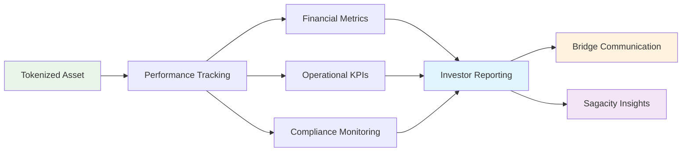

# What is Lift?

## Execution & Asset Management Platform

Lift is the asset management and performance monitoring engine of the DUC Capital Platform, designed for asset managers, project managers, and operations teams. It monitors tokenized assets post-issuance, tracking milestones, KPIs, financial performance, and regulatory compliance across all live tokenized instruments.

---

## What Does Lift Do?

### 📈 **Post-Issuance Asset Management**

Lift provides comprehensive monitoring and management of live tokenized assets:

- **Performance Tracking** - Monitor KPIs, milestones, and financial metrics across all assets
- **Budget vs Actual Analysis** - Track revenue, expenses, and variance analysis
- **Covenant Compliance** - Monitor regulatory requirements and covenant adherence
- **Portfolio Dashboards** - Unified view of performance across multiple tokenized assets
- **Revenue Tracking** - Real-time monitoring of cash flows and distributions
- **O&M Cost Management** - Operations and maintenance expense tracking and optimization
- **Regulatory Reporting** - Automated compliance reporting to investors and regulators

### 🎯 **Real-World Asset Management Example**

Consider a $50M commercial real estate tokenization managed by Lift:

**Asset Management Activities:**
- Monitors monthly rental income vs projections
- Tracks occupancy rates, lease renewals, and tenant satisfaction
- Manages O&M expenses including utilities, maintenance, and property management
- Ensures compliance with debt covenants and regulatory requirements
- Provides quarterly performance reports to tokenholders
- Monitors market conditions and property valuation trends
- Coordinates with property management for capital improvements
- Feeds performance data back to Bridge for investor communications
- Provides market insights to Sagacity for future deal evaluation

---

## Who Uses Lift?

### 📈 **Asset Management & Operations Professionals**

Lift is designed for professionals responsible for managing live tokenized assets:

**Asset Managers:**
- Monitor performance of tokenized real estate, infrastructure, and alternative investments
- Track financial metrics, cash flows, and return on investment
- Coordinate with property managers, operators, and service providers
- Provide performance reporting to investors and stakeholders

**Project Managers:**
- Oversee infrastructure projects like renewable energy installations
- Track milestone completion and budget adherence
- Coordinate between multiple contractors and stakeholders
- Ensure projects meet performance and compliance requirements

**Operations Teams:**
- Handle day-to-day asset monitoring and maintenance coordination
- Track operational expenses and revenue generation
- Monitor compliance with regulations and covenant requirements
- Coordinate with Bridge for investor communications and reporting

**Portfolio Managers:**
- Analyze performance across multiple tokenized assets
- Identify optimization opportunities and risk management strategies
- Coordinate asset-level activities with overall portfolio objectives
- Provide strategic insights for future asset acquisitions

### 🚫 **Who Typically Doesn't Use Lift**

**Deal Originators and Tokenization Specialists** usually don't need Lift access because:
- Investment bankers focus on deal origination and structuring in Sagacity
- Tokenization specialists work in Bridge to create and issue tokenized assets
- Lift is specifically for post-issuance asset management and monitoring
- It contains operational performance data not needed during deal origination or tokenization

---

## Core Features of Lift

### 📈 **Asset Performance Monitoring**

**Asset Onboarding Process:**
1. **Receive Tokenized Asset** - Asset details and structure from Bridge
2. **Configure Monitoring Parameters** - Set KPIs, benchmarks, and reporting schedules
3. **Establish Data Connections** - Link to property management, utility providers, and service contractors
4. **Set Compliance Framework** - Configure covenant monitoring and regulatory reporting requirements
5. **Initialize Performance Tracking** - Begin real-time monitoring of financial and operational metrics

**Ongoing Asset Management:**
- Monitor daily/weekly performance against budgets and projections
- Track milestone completion for development or improvement projects
- Manage variance analysis and exception reporting
- Coordinate with service providers and asset operators
- Generate investor reports and compliance documentation

### 📊 **Financial Performance Analysis**

**Core Financial Metrics:**
- **Revenue Tracking** - Rental income, utility revenues, service fees
- **Expense Management** - O&M costs, property taxes, insurance, utilities
- **Cash Flow Analysis** - Net operating income, distribution calculations
- **Budget Variance** - Actual vs projected performance with variance analysis
- **Return Metrics** - IRR, cash-on-cash returns, total return calculations

**Advanced Analytics:**
- Trend analysis and performance forecasting
- Comparative analysis across similar assets
- Market benchmark comparisons
- Sensitivity analysis for key performance drivers
- Attribution analysis for performance variations

### 📊 **Portfolio Management & Reporting**

**Portfolio-Level Analytics:**
- Consolidated performance across all tokenized assets
- Diversification analysis and risk assessment
- Asset allocation and performance attribution
- Portfolio-level cash flow projections and distributions
- Comparative performance analysis by asset class or geography

**Investor Reporting:**
- Automated quarterly and annual investor reports
- Real-time performance dashboards for tokenholders
- Compliance reporting to regulatory authorities
- Distribution calculations and payment processing coordination
- Performance attribution and market commentary

---

## What Lift Looks Like

### 📊 **Asset Management Dashboard**

When asset managers log into Lift, they see:

**Portfolio Performance Overview:**
- Real-time performance metrics across all managed assets
- Revenue and expense tracking with budget variance analysis
- Key alerts for covenant breaches or performance issues
- Upcoming reporting deadlines and compliance requirements

**Quick Actions:**
- Review performance exceptions and variances
- Access detailed asset-specific performance reports
- Generate investor communications and reports
- Coordinate with service providers and operators

**Key Metrics:**
- Asset-level and portfolio-level return metrics
- Occupancy rates, tenant satisfaction, and operational efficiency
- Cash flow generation and distribution calculations
- Regulatory compliance status and covenant adherence

### 🎛️ **Management Controls**

**User Management Panel:**
- Directory of all organizational users
- Search and filter capabilities
- Bulk operations for multiple users
- User activity and access logs

**Permission Matrix:**
- Visual representation of who can access what
- Easy modification of access levels
- Template-based permission assignment
- Audit trail of permission changes

**Team Organization View:**
- Hierarchical display of organizational structure
- Drag-and-drop team management
- Project and committee assignments
- Reporting relationship visualization

---

## How Lift Benefits Your Organization

### 🎯 **For Asset Managers**

**Comprehensive Asset Oversight:**
- Real-time monitoring of all tokenized assets under management
- Integrated financial and operational performance tracking
- Automated variance analysis and exception reporting
- Streamlined coordination with service providers and operators

**Enhanced Performance Management:**
- Budget vs actual analysis with detailed variance explanations
- Key performance indicator tracking and benchmarking
- Cash flow forecasting and distribution planning
- Risk assessment and mitigation strategies

**Investor Relations Excellence:**
- Automated quarterly and annual investor reporting
- Real-time performance dashboards for tokenholders
- Regulatory compliance monitoring and reporting
- Professional-grade investor communications

### 👥 **For Project Managers**

**Project Execution Control:**
- Milestone tracking and completion monitoring for infrastructure projects
- Budget adherence and cost control across multiple contractors
- Performance benchmarking against project specifications
- Integrated coordination with multiple stakeholders

**Risk and Compliance Management:**
- Regulatory compliance monitoring for complex infrastructure projects
- Environmental and safety compliance tracking
- Covenant adherence monitoring and early warning systems
- Documentation and audit trail maintenance

### 🏢 **For Portfolio Management**

**Strategic Portfolio Insights:**
- Portfolio-wide performance attribution and analysis
- Asset allocation optimization and diversification analysis
- Risk-adjusted return calculations across asset classes
- Market analysis and competitive benchmarking

**Business Intelligence:**
- ROI analysis and investment performance measurement
- Market trends and performance forecasting
- Asset lifecycle management and optimization
- Strategic planning data for future acquisitions

---

## Lift in Action: Real Examples

### 🆕 **New Employee Onboarding**

**Traditional Process (Without Lift):**
1. IT creates account in System A
2. Manager requests access to System B
3. HR adds to email system
4. Multiple forms and approvals needed
5. Takes days or weeks to complete
6. New employee waits, can't be productive

**With Lift:**
1. Manager clicks "Add New Employee" in Lift
2. Fills out single form with role and team
3. Lift automatically creates accounts in all systems
4. Sets appropriate permissions based on role template
5. Sends welcome email with login instructions
6. New employee productive on day one

### 🔄 **Department Reorganization**

**The Challenge:** Marketing team splits into Digital Marketing and Content Marketing.

**With Lift:**
1. Administrator creates two new teams in organizational structure
2. Reassigns users to appropriate new teams
3. Adjusts permissions based on new responsibilities
4. Updates reporting hierarchies
5. Modifies system access and resource allocation
6. All changes take effect immediately across all applications

### 🚨 **Security Incident Response**

**The Scenario:** Suspicious activity detected on a user account.

**Lift's Response:**
1. Security alert appears on administrative dashboard
2. Administrator immediately suspends affected account
3. Reviews user's recent activity and access history
4. Notifies relevant managers and security team
5. Initiates password reset and security review
6. Documents incident for compliance reporting

---

## System Settings and Configuration

### ⚙️ **Organization-Wide Settings**

**Branding and Appearance:**
- Company logo and colors
- Custom welcome messages
- Organizational terminology
- Regional date and time formats

**Security Policies:**
- Password complexity requirements
- Multi-factor authentication settings
- Session timeout configurations
- Login attempt limitations

**Workflow Configurations:**
- Approval processes for various actions
- Notification rules and schedules
- Integration settings with other systems
- Data retention and archival policies

### 📈 **Reporting and Analytics**

**Usage Analytics:**
- User login patterns and frequency
- Feature adoption and utilization
- System performance metrics
- Resource consumption trends

**Security Reporting:**
- Access audit logs
- Permission change history
- Security incident summaries
- Compliance status reports

**Business Intelligence:**
- ROI analysis of system investments
- Productivity impact measurements
- User satisfaction and feedback
- Strategic planning data

---

## Getting Started with Lift

### 🚀 **For New Administrators**

If you've been given administrative access to Lift:

1. **Understand Your Role** - [Welcome to Lift](getting-started/welcome.md)
2. **Explore the Dashboard** - [Your Admin Dashboard](getting-started/dashboard.md)
3. **Learn User Management** - [Managing Users](managing/users.md)
4. **Set Up Teams** - [Team Organization](managing/users.md)

### 📋 **Essential First Tasks**

**Week 1: Getting Oriented**
- Review current user list and permissions
- Understand organizational structure in Lift
- Identify any immediate access issues
- Connect with other administrators

**Week 2: Basic Management**
- Practice adding and modifying users
- Review permission templates and policies
- Understand reporting and analytics available
- Set up notification preferences

**Month 1: Advanced Management**
- Optimize organizational structure
- Create custom permission templates
- Set up automated workflows
- Develop regular maintenance routines

---

## Best Practices for Lift Management

### 🏆 **User Management Excellence**

**Regular Reviews:**
- Monthly review of user access and permissions
- Quarterly audit of inactive or unused accounts
- Annual comprehensive access review
- Immediate review during organizational changes

**Efficient Onboarding:**
- Create role-based permission templates
- Develop standardized onboarding checklists
- Automate common tasks where possible
- Maintain clear documentation

**Security Focus:**
- Regular password and security policy updates
- Prompt removal of departing employees
- Monitor for suspicious activity patterns
- Keep security training current

### 📊 **Effective Monitoring**

**Key Metrics to Track:**
- User adoption and engagement rates
- System performance and availability
- Security incidents and responses
- Permission changes and access patterns

**Regular Reporting:**
- Weekly system health summaries
- Monthly user activity reports
- Quarterly security and compliance reviews
- Annual strategic planning analysis

---

## Common Questions

!!! question "Do I need special training to use Lift?"
    While Lift is designed to be intuitive, administrative training is recommended. Most organizations provide specific training for Lift administrators.

!!! question "Can I delegate some Lift responsibilities to others?"
    Yes! Lift supports multiple administrator levels. You can give managers limited access to manage their own teams while maintaining overall control.

!!! question "What happens if I make a mistake in user permissions?"
    Most actions can be undone or corrected quickly. Lift maintains an audit log so you can see exactly what was changed and when.

!!! question "How do I know if someone needs access to Lift?"
    Generally, only people who need to manage other users, set up teams, or configure system settings need Lift access. Most employees only need Sagacity.

!!! question "Can I see what users are doing in other applications?"
    Lift shows usage analytics and access logs, but respects user privacy. You can see activity patterns but not detailed work content.

---

## When to Contact Support

### 🆘 **Technical Issues**
- System errors or unexpected behavior
- Performance problems or slow responses
- Integration issues with other systems
- Data synchronization problems

### 🔒 **Security Concerns**
- Suspicious user activity
- Potential security breaches
- Compliance requirements
- Access control problems

### 📚 **Training and Guidance**
- Complex organizational setup questions
- Best practice recommendations
- Advanced feature configuration
- Strategic planning assistance

---

## The Impact of Good Lift Management

### ✅ **Well-Managed Organizations Experience:**
- **Faster Employee Productivity** - New hires get access quickly
- **Better Security** - Proper permissions and regular reviews
- **Higher User Satisfaction** - People can access what they need
- **Improved Compliance** - Automated reporting and audit trails
- **Reduced IT Workload** - Self-service and automated processes

### ❌ **Poorly Managed Organizations Struggle With:**
- **Delayed Onboarding** - New employees wait for system access
- **Security Risks** - Outdated permissions and inactive accounts
- **User Frustration** - Can't access needed resources
- **Compliance Issues** - Missing audits and documentation
- **Administrative Overhead** - Manual processes and repeated work

---

!!! success "Lift: Post-Issuance Asset Management Excellence"
    While Sagacity originates deals and Bridge tokenizes assets, Lift ensures tokenized assets perform as expected throughout their lifecycle. Professional asset management in Lift maximizes investor returns, maintains regulatory compliance, and provides the performance data that feeds back into future deal origination and tokenization decisions.

!!! tip "Start with Core Metrics, Expand to Advanced Analytics"
    Begin with fundamental performance monitoring - cash flows, occupancy rates, and basic compliance tracking. As you gain experience, leverage Lift's advanced portfolio analytics, predictive modeling, and comprehensive investor reporting capabilities. The key is maintaining consistent, accurate performance tracking that builds investor confidence.