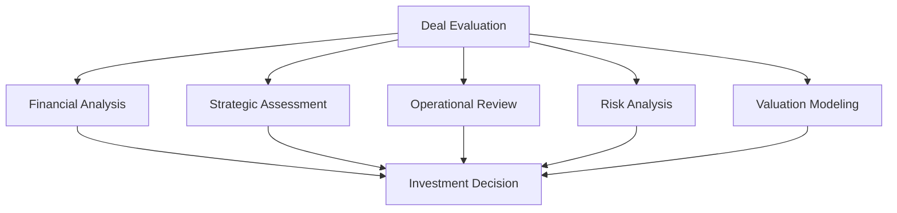
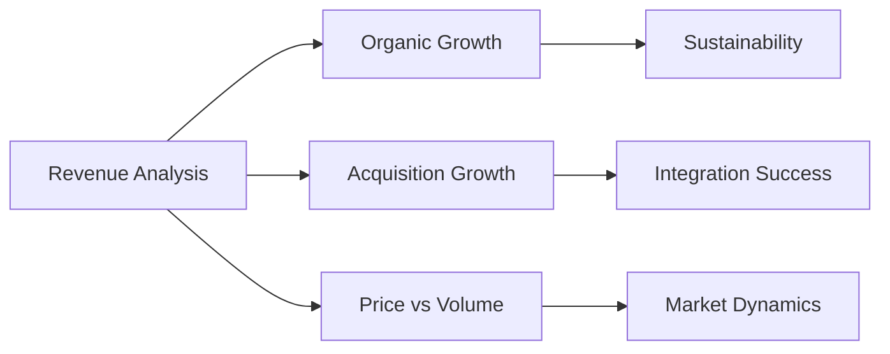
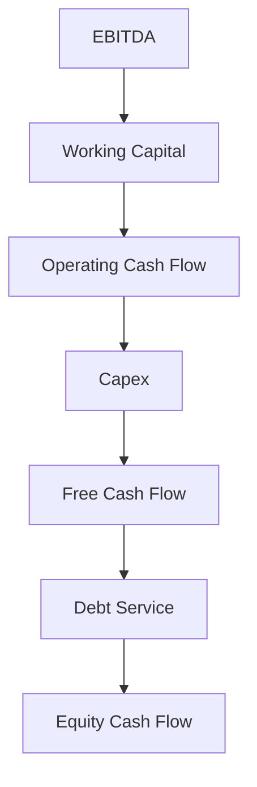
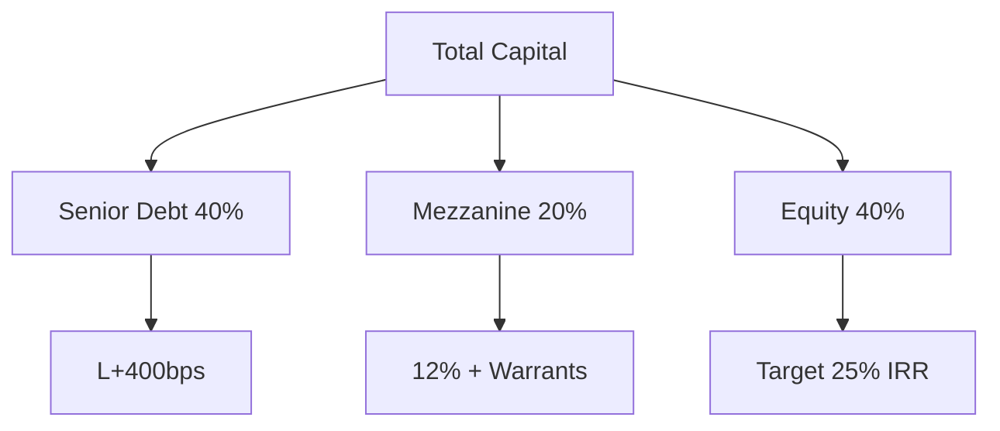
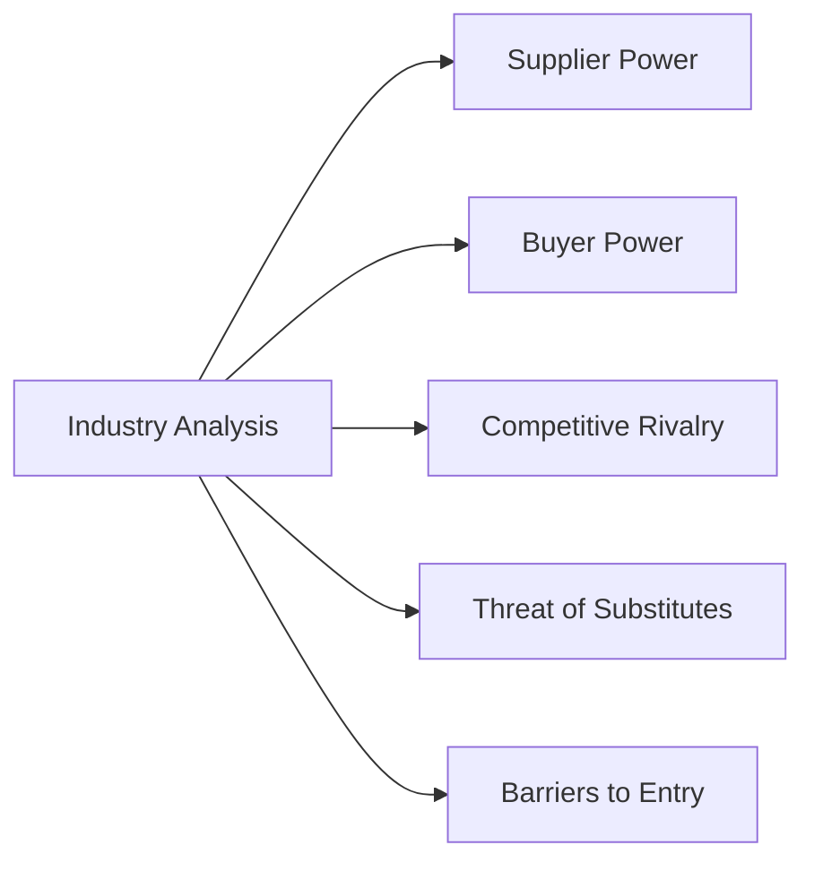
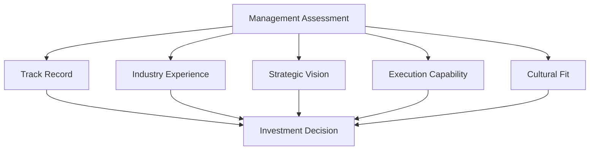
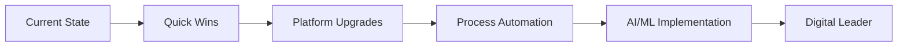
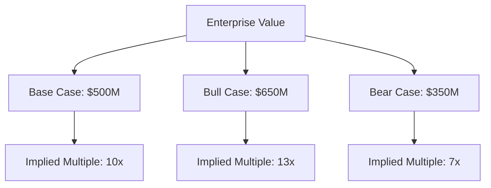
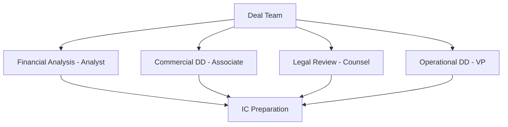

# Deal Evaluation & Analysis

## Comprehensive Investment Analysis Framework

Deal evaluation is where investment decisions are made or broken. Sagacity's advanced analytical tools transform raw data into actionable investment insights, enabling confident decision-making through systematic evaluation. This guide provides a complete framework for analyzing investment opportunities.

## The Evaluation Process Overview

### Multi-Dimensional Analysis Framework



### Evaluation Timeline

**Typical 6-8 Week Process:**
- **Week 1-2**: Initial screening and data gathering
- **Week 3-4**: Detailed financial analysis
- **Week 5-6**: Strategic and operational assessment
- **Week 7**: Risk evaluation and valuation
- **Week 8**: Investment committee preparation

## Financial Analysis Deep Dive

### Historical Performance Analysis

#### Revenue Analysis

**Growth Trajectory Assessment:**



**Key Revenue Metrics:**
| Metric | Analysis Focus | Red Flags | Green Lights |
|--------|---------------|-----------|--------------|
| **CAGR** | 3-5 year growth rate | <5% or volatile | 10-20% consistent |
| **Customer Concentration** | Top 10 customers | >50% concentration | <30% diversified |
| **Recurring Revenue** | Subscription/contract | <20% recurring | >60% predictable |
| **Pricing Power** | Annual increases | No pricing power | 3-5% annual increases |
| **Market Share** | Competitive position | Losing share | Gaining share |

**Revenue Quality Assessment:**
1. **Sustainability Testing**
   - Customer retention rates (target: >90%)
   - Contract renewal analysis
   - Pipeline visibility (12-18 months)
   - Competitive win rates

2. **Growth Driver Analysis**
   - New customer acquisition
   - Existing customer expansion
   - New product introduction
   - Geographic expansion
   - Market share capture

#### Profitability Analysis

**Margin Decomposition:**

```python
EBITDA Margin Analysis:
├── Gross Margin
│   ├── Product Mix
│   ├── Pricing Trends
│   └── COGS Management
├── Operating Leverage
│   ├── Fixed vs Variable Costs
│   ├── Capacity Utilization
│   └── Scale Economics
└── SG&A Efficiency
    ├── Sales Productivity
    ├── Marketing ROI
    └── G&A Optimization
```

**Detailed Margin Analysis:**

| Component | Current | Industry Avg | Improvement Potential |
|-----------|---------|--------------|----------------------|
| Gross Margin | 45% | 50% | +5% via pricing/mix |
| SG&A % Revenue | 25% | 22% | -3% via automation |
| EBITDA Margin | 20% | 28% | +8% total opportunity |

**Quality of Earnings Adjustments:**
- One-time expenses/income
- Owner compensation normalization
- Related party transactions
- Accounting policy changes
- Working capital normalization
- Deferred revenue adjustments
- Stock compensation
- Restructuring charges

#### Cash Flow Analysis

**Free Cash Flow Generation:**



**Cash Conversion Metrics:**
- EBITDA to OCF conversion: Target >80%
- Capex as % of revenue: Industry comparison
- Working capital efficiency: Days calculation
- Free cash flow yield: FCF/Enterprise Value

### Working Capital Deep Dive

#### Component Analysis

**Days Calculation Framework:**
```
DSO (Days Sales Outstanding) = (AR / Revenue) × 365
DPO (Days Payables Outstanding) = (AP / COGS) × 365  
DIO (Days Inventory Outstanding) = (Inventory / COGS) × 365
Cash Conversion Cycle = DSO + DIO - DPO
```

**Working Capital Optimization:**
| Component | Current | Best Practice | Impact |
|-----------|---------|---------------|--------|
| DSO | 65 days | 45 days | $5M cash release |
| DIO | 90 days | 60 days | $8M cash release |
| DPO | 45 days | 60 days | $4M cash benefit |
| **Net Impact** | 110 days | 45 days | **$17M improvement** |

### Capital Structure Assessment

#### Debt Capacity Analysis

**Leverage Metrics Framework:**
- Total Debt / EBITDA: Target 3.0-5.0x
- Senior Debt / EBITDA: Target 2.5-3.5x
- EBITDA / Interest: Minimum 3.0x
- Fixed Charge Coverage: Minimum 1.25x
- Debt / Total Capitalization: Maximum 65%

**Debt Structure Optimization:**


## Strategic Assessment

### Market Analysis

#### Industry Dynamics Evaluation

**Porter's Five Forces Analysis:**



**Market Attractiveness Scoring:**
| Factor | Weight | Score (1-10) | Weighted Score |
|--------|--------|--------------|----------------|
| Market Size | 20% | 8 | 1.6 |
| Growth Rate | 25% | 9 | 2.25 |
| Fragmentation | 15% | 7 | 1.05 |
| Margins | 20% | 6 | 1.2 |
| Stability | 20% | 8 | 1.6 |
| **Total** | **100%** | | **7.7/10** |

#### Competitive Positioning

**Competitive Analysis Matrix:**

```python
Competitive Position Assessment:
├── Market Share Analysis
│   ├── Current Position: #3 with 12% share
│   ├── Leader: 25% share
│   └── Gain Opportunity: +5% realistic
├── Differentiation Factors
│   ├── Product Quality: ★★★★☆
│   ├── Service Level: ★★★★★
│   ├── Price Position: ★★★☆☆
│   └── Innovation: ★★★★☆
└── Competitive Advantages
    ├── Proprietary Technology
    ├── Customer Relationships
    ├── Scale Economics
    └── Brand Recognition
```

### Business Model Evaluation

#### Revenue Model Analysis

**Revenue Stream Assessment:**
1. **Recurring vs Transactional**
   - Subscription revenue: 40%
   - Maintenance contracts: 20%
   - One-time sales: 30%
   - Services: 10%

2. **Customer Lifetime Value**
   ```
   CLV = (Average Revenue per Customer × Gross Margin %) / Churn Rate
   CLV = ($100,000 × 60%) / 10% = $600,000
   CAC = $50,000
   LTV/CAC Ratio = 12:1 (Target: >3:1)
   ```

#### Scalability Assessment

**Operating Leverage Analysis:**
- Revenue growth: 20% → Operating profit growth: 35%
- Incremental margins: 60% vs base margins: 25%
- Break-even analysis: 65% capacity utilization
- Margin expansion potential: +10% at 2x scale

### Management Evaluation

#### Team Assessment Framework

**Leadership Evaluation Criteria:**



**Management Scorecard:**
| Dimension | CEO | CFO | COO | CTO | Score |
|-----------|-----|-----|-----|-----|-------|
| Experience | A | B+ | A- | B | B+ |
| Track Record | A- | A | B+ | B+ | B+ |
| Leadership | A | B | A- | B | B+ |
| Vision | A+ | B+ | B | A- | B+ |
| **Overall** | **A-** | **B+** | **B+** | **B+** | **B+** |

## Operational Review

### Operational Efficiency Analysis

#### Process Optimization Opportunities

**Operations Assessment Framework:**
```python
Operational Excellence Review:
├── Manufacturing/Service Delivery
│   ├── Capacity Utilization: 75%
│   ├── Quality Metrics: 99.2%
│   ├── On-Time Delivery: 94%
│   └── Cost per Unit: $45
├── Supply Chain
│   ├── Supplier Concentration: Top 3 = 40%
│   ├── Input Cost Trends: +3% annual
│   ├── Inventory Turns: 6x
│   └── Lead Times: 45 days
└── Technology Infrastructure
    ├── ERP System: SAP (current)
    ├── Automation Level: 30%
    ├── Data Analytics: Basic
    └── Digital Maturity: 3/5
```

#### Value Creation Opportunities

**Operational Improvement Roadmap:**

| Initiative | Investment | Annual Benefit | Payback | Priority |
|------------|------------|----------------|---------|----------|
| Sales Force Automation | $2M | $3M | 8 months | High |
| Manufacturing Automation | $5M | $4M | 15 months | High |
| Procurement Optimization | $1M | $2M | 6 months | High |
| IT System Upgrade | $3M | $2M | 18 months | Medium |
| Logistics Optimization | $1M | $1M | 12 months | Medium |
| **Total** | **$12M** | **$12M** | **12 months** | |

### Technology Assessment

#### Digital Maturity Evaluation

**Technology Stack Review:**
- **ERP**: Current state and upgrade needs
- **CRM**: Customer data management
- **Analytics**: Business intelligence capabilities
- **Automation**: Process automation level
- **Security**: Cybersecurity posture

**Digital Transformation Potential:**


## Risk Analysis Framework

### Risk Identification Matrix

#### Systematic Risk Assessment

**Risk Categories and Mitigation:**

```python
Risk Assessment Framework:
├── Market Risks
│   ├── Demand Volatility: Medium → Diversification
│   ├── Competition: High → Differentiation
│   ├── Technology Disruption: Low → Innovation
│   └── Economic Sensitivity: Medium → Hedging
├── Operational Risks
│   ├── Key Person Dependency: High → Succession Planning
│   ├── Customer Concentration: Medium → Diversification
│   ├── Supplier Risk: Low → Dual Sourcing
│   └── Regulatory Compliance: Low → Monitoring
├── Financial Risks
│   ├── Leverage: Medium → Conservative Structure
│   ├── Working Capital: Low → Active Management
│   ├── FX Exposure: Low → Natural Hedging
│   └── Interest Rate: Medium → Fixed/Float Mix
└── Strategic Risks
    ├── Integration Risk: Medium → Detailed Planning
    ├── Execution Risk: Medium → Strong PMO
    ├── Market Entry: Low → Phased Approach
    └── Exit Risk: Low → Multiple Options
```

### Risk Scoring and Mitigation

**Risk Heat Map:**

| Risk Factor | Probability | Impact | Score | Mitigation Strategy |
|-------------|------------|--------|-------|-------------------|
| Customer Loss | Medium | High | 6 | Contract locks, relationships |
| Recession | Low | High | 4 | Flexible cost structure |
| Competition | High | Medium | 6 | Innovation, differentiation |
| Regulation | Low | Medium | 2 | Compliance monitoring |
| Technology | Medium | Medium | 4 | R&D investment |
| **Overall Risk** | | | **4.4/10** | **Manageable** |

## Valuation Modeling

### DCF Analysis

#### Building the Model

**Revenue Projection Framework:**
```
Year 1: Base Revenue × (1 + Organic Growth + Price Increases)
Year 2-5: Layer in growth initiatives
Terminal Year: Steady-state growth (GDP + 1-2%)
```

**Key Assumptions Dashboard:**
| Parameter | Base Case | Bull Case | Bear Case |
|-----------|-----------|-----------|-----------|
| Revenue CAGR | 12% | 18% | 7% |
| EBITDA Margin | 25% | 30% | 20% |
| Capex % Revenue | 3% | 2.5% | 4% |
| Working Capital | 10% | 8% | 12% |
| Terminal Growth | 3% | 4% | 2% |
| WACC | 10% | 9% | 11% |

**Valuation Output:**


### Comparable Company Analysis

#### Peer Group Selection

**Comparability Criteria:**
- Industry classification
- Size (0.5x - 2.0x revenue)
- Growth profile (±5% CAGR)
- Margin profile (±5% EBITDA)
- Business model similarity

**Trading Comps Analysis:**
| Company | EV/Revenue | EV/EBITDA | P/E | PEG | Premium/Discount |
|---------|------------|-----------|-----|-----|------------------|
| Peer A | 2.5x | 12x | 18x | 1.2 | Inline |
| Peer B | 2.8x | 14x | 20x | 1.4 | +15% |
| Peer C | 2.2x | 10x | 15x | 1.0 | -10% |
| **Median** | **2.5x** | **12x** | **18x** | **1.2** | |
| **Target** | 2.3x | 11x | 16x | 1.1 | **-8%** |

### Precedent Transaction Analysis

#### Transaction Comparability

**Relevant Transaction Criteria:**
- Similar size and industry
- Recent timeframe (< 2 years)
- Similar buyer type (Strategic vs Financial)
- Comparable growth and margins

**Transaction Multiples Analysis:**
| Date | Target | Buyer | EV | EV/Revenue | EV/EBITDA | Premium |
|------|--------|-------|-----|------------|-----------|---------|
| 2024 Q1 | Comp X | PE Firm | $600M | 2.8x | 13x | 35% |
| 2023 Q4 | Comp Y | Strategic | $450M | 2.5x | 11x | 28% |
| 2023 Q3 | Comp Z | PE Firm | $550M | 2.6x | 12x | 30% |
| **Average** | | | **$533M** | **2.6x** | **12x** | **31%** |

### LBO Analysis

#### Returns Modeling

**LBO Model Structure:**
```python
Sources & Uses:
├── Sources
│   ├── Senior Debt: $200M (4.0x)
│   ├── Mezzanine: $50M (1.0x)
│   └── Equity: $250M (5.0x)
├── Uses
│   ├── Purchase Price: $475M
│   └── Fees & Expenses: $25M
```

**Returns Sensitivity Analysis:**
| Exit Multiple | Year 3 | Year 4 | Year 5 | Year 6 |
|---------------|--------|--------|--------|--------|
| 8.0x | 18% | 22% | 24% | 25% |
| 10.0x | 25% | 28% | 30% | 31% |
| 12.0x | 32% | 35% | 36% | 37% |
| 14.0x | 38% | 41% | 42% | 43% |

## Investment Committee Materials

### IC Memo Structure

#### Executive Summary Framework

**Investment Thesis Summary:**
1. **Compelling Industry**: Growing 15% with consolidation opportunity
2. **Market Leader**: #2 position with path to #1
3. **Strong Financials**: 20% EBITDA margins with expansion potential
4. **Excellent Management**: Proven team staying post-transaction
5. **Clear Value Creation**: Identified $20M EBITDA improvement
6. **Multiple Exit Options**: Strategic buyers and IPO potential

#### Detailed Analysis Sections

**Standard IC Memo Sections:**
1. Executive Summary (2 pages)
2. Investment Thesis (3 pages)
3. Company Overview (5 pages)
4. Industry Analysis (4 pages)
5. Financial Analysis (6 pages)
6. Valuation (4 pages)
7. Value Creation Plan (3 pages)
8. Risk Analysis (2 pages)
9. Exit Strategy (1 page)
10. Appendices (as needed)

### Decision Framework

#### Go/No-Go Criteria

**Investment Criteria Checklist:**
- [x] Meets size parameters ($50M+ EBITDA)
- [x] Within target industries (Business Services)
- [x] Acceptable returns (25%+ IRR)
- [x] Manageable risk profile (4.4/10)
- [x] Strong management team (B+ rating)
- [x] Clear value creation (40% EBITDA growth)
- [x] Multiple exit options (3+ identified)
- [x] Financing available (commitment letters)

**Red Flags Assessment:**
- [ ] Customer concentration >40%
- [ ] Declining market share
- [ ] Technology disruption risk
- [ ] Regulatory overhang
- [ ] Management departures
- [ ] Working capital issues
- [ ] Integration complexity

## Using Sagacity for Evaluation

### Automated Analysis Features

#### Data Room Analysis

**AI-Powered Document Review:**
- Automatic extraction of key metrics
- Anomaly detection in financials
- Contract term summarization
- Risk identification from legal docs
- Management presentation insights

#### Financial Modeling Automation

**Model Building Assistance:**
- Template selection based on industry
- Automatic assumption population
- Sensitivity analysis generation
- Scenario modeling capabilities
- Output formatting for IC

### Collaboration Tools

#### Team Coordination

**Workstream Management:**


**Real-Time Collaboration:**
- Shared workspaces for analysis
- Version control for models
- Comment threading on issues
- Task assignment and tracking
- Document approval workflows

## Best Practices and Tips

### Evaluation Excellence

#### Time Management

**Efficient Evaluation Process:**
- Week 1: Data gathering sprint
- Week 2-3: Parallel workstreams
- Week 4-5: Deep dive focus areas
- Week 6: Synthesis and modeling
- Week 7: IC prep and review
- Week 8: Decision and next steps

#### Quality Control

**Analysis Quality Checklist:**
- [ ] Source data verification
- [ ] Model audit and review
- [ ] Assumption documentation
- [ ] Sensitivity testing
- [ ] Peer review completed
- [ ] Legal review integrated
- [ ] Risk mitigation planned
- [ ] Exit scenarios modeled

### Common Pitfalls to Avoid

#### Analysis Errors
- ❌ Over-relying on management projections
- ❌ Ignoring working capital needs
- ❌ Missing one-time adjustments
- ❌ Underestimating integration costs
- ❌ Overlooking market dynamics
- ❌ Inadequate sensitivity analysis
- ❌ Confirmation bias in analysis
- ❌ Rushing due diligence

### Decision Making Framework

#### Structured Decision Process

**Investment Committee Voting:**
1. **Unanimous Approval**: Proceed with confidence
2. **Majority Approval**: Address concerns and proceed
3. **Split Decision**: Further analysis required
4. **Majority Rejection**: Significant restructuring needed
5. **Unanimous Rejection**: Pass on opportunity

## Conclusion

Thorough evaluation and analysis form the foundation of successful investing. Sagacity's comprehensive toolkit enables systematic, data-driven evaluation that identifies both opportunities and risks, leading to better investment decisions.

### Key Takeaways
- **Comprehensive Analysis**: Cover all dimensions thoroughly
- **Data-Driven Decisions**: Let numbers guide conclusions
- **Risk Awareness**: Identify and mitigate proactively
- **Value Creation Focus**: Clear path to returns
- **Team Collaboration**: Leverage collective expertise

---

*Next: Proceed to [Deal Structuring](structuring.md) to learn how to optimize transaction structures for maximum returns.*