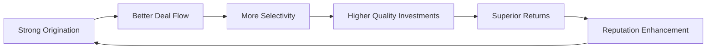
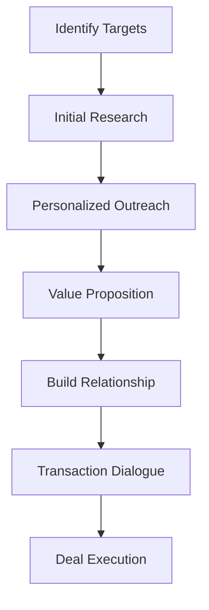
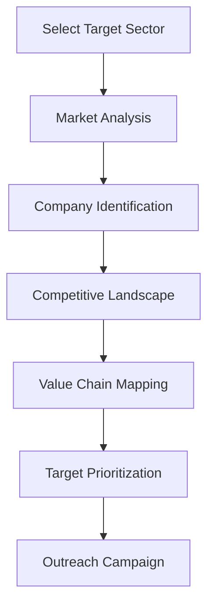
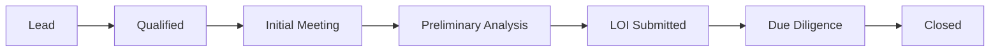
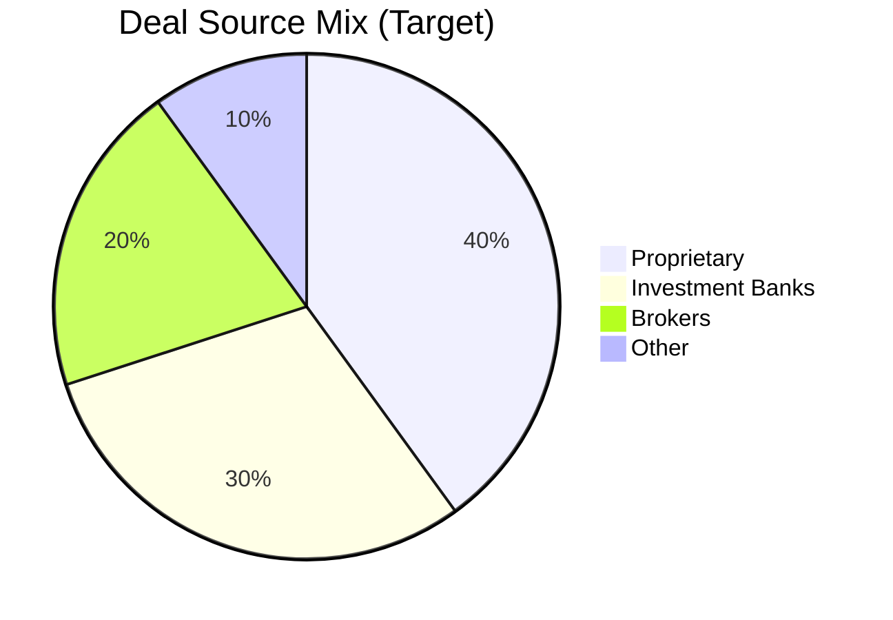
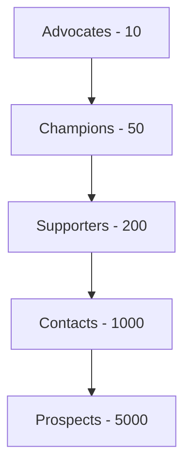
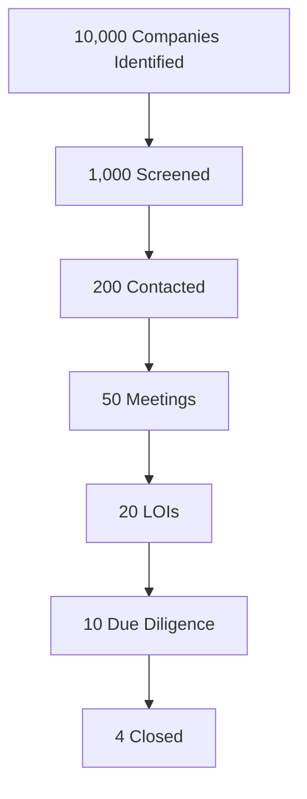

# Deal Origination

## Mastering the Art of Deal Sourcing

Deal origination is the lifeblood of successful private equity investing. Sagacity's AI-powered origination platform transforms how investment professionals source, track, and win competitive deals. This comprehensive guide covers every aspect of building and maintaining a world-class origination machine.

## Understanding Deal Origination

### What is Deal Origination?

Deal origination encompasses all activities involved in identifying, sourcing, and securing investment opportunities. It's the critical first step that determines the quality and quantity of your investment pipeline.

### Why Origination Matters

**Key Benefits:**
- **Proprietary Access**: First look at off-market opportunities
- **Better Pricing**: Avoid competitive auction dynamics
- **Relationship Value**: Build long-term partnerships
- **Market Intelligence**: Deep understanding of sectors
- **Competitive Advantage**: Differentiation in crowded market

## Origination Strategies

### 1. Direct Origination

#### Proprietary Sourcing Channels

##### Executive Networks
Building relationships with industry executives who can provide:
- Early insights into potential transactions
- Introductions to business owners
- Market intelligence and trends
- Off-market opportunities

**Best Practices:**
1. **Regular Engagement**: Monthly touchpoints with key executives
2. **Value Addition**: Share industry insights and connections
3. **Long-term View**: Invest in relationships before transactions
4. **Systematic Tracking**: Document all interactions in Sagacity

##### Industry Conferences & Events
Strategic presence at key industry gatherings:
- Speaking opportunities to build thought leadership
- Networking sessions with business owners
- Panel participation for visibility
- Sponsorship for brand building

**Event Strategy Matrix:**

| Event Type | Priority | Objective | ROI Measurement |
|------------|----------|-----------|-----------------|
| Industry Conferences | High | Deal Sourcing | Meetings to Deals |
| CEO Forums | High | Relationship Building | Executive Contacts |
| Trade Shows | Medium | Market Intelligence | Insights Gathered |
| Academic Conferences | Low | Talent Pipeline | Recruits Identified |

##### Entrepreneur Outreach
Proactive engagement with business owners:

**Outreach Best Practices:**
1. **Personalization**: Tailored messaging based on business specifics
2. **Value-First Approach**: Lead with how you can help
3. **Multiple Touchpoints**: Email, LinkedIn, conferences, introductions
4. **Patience**: Average 18-24 months from first contact to transaction

### 2. Intermediated Deals

#### Working with Investment Banks

##### Relationship Management
Building strong investment banking relationships:

**Tier 1 Banks** (Bulge Bracket)
- Coverage: Large cap, $500M+ deals
- Advantages: High-quality processes, broad distribution
- Challenges: Highly competitive, expensive

**Tier 2 Banks** (Middle Market)
- Coverage: $50M-$500M deals
- Advantages: Sector expertise, reasonable competition
- Optimal sweet spot for most funds

**Boutique Advisors**
- Coverage: <$50M deals, specific sectors
- Advantages: Deep relationships, off-market situations
- Key for proprietary deal flow

##### Auction Process Management

**Phase 1: Initial Screening**
- Teaser review and NDA execution
- Initial indication of interest
- Management presentation attendance
- Preliminary bid submission

**Phase 2: Due Diligence**
- Data room access and review
- Management meetings and site visits
- Expert calls and customer references
- Detailed financial modeling

**Phase 3: Final Bidding**
- Final bid preparation and submission
- Markup of purchase agreement
- Negotiation of key terms
- Closing preparation

#### Business Brokers & M&A Advisors

**Broker Network Development:**
1. **Geographic Coverage**: Build relationships across target regions
2. **Sector Specialists**: Identify brokers with industry expertise  
3. **Deal Size Alignment**: Focus on brokers handling relevant sizes
4. **Reputation Vetting**: Due diligence on broker track records

**Effective Broker Management:**
- Clear communication of investment criteria
- Rapid response to opportunities
- Fair treatment and professional conduct
- Success fee arrangements for proprietary deals
- Regular feedback on opportunities shown

### 3. Thematic Sourcing

#### Sector-Focused Approach

##### Industry Mapping
Systematic analysis of target sectors:

**Sector Analysis Framework:**
1. **Market Dynamics**
   - Size and growth rates
   - Regulatory environment
   - Technology disruption
   - Consolidation trends

2. **Competitive Landscape**
   - Market leaders identification
   - Fragmentation analysis
   - M&A activity tracking
   - Strategic buyer behavior

3. **Investment Thesis Development**
   - Value creation opportunities
   - Risk factors assessment
   - Exit strategy clarity
   - Return expectations

##### Buy-and-Build Strategies

**Platform Identification:**
- Industry leadership position
- Scalable business model
- Strong management team
- Acquisition integration capabilities

**Add-on Sourcing:**
- Geographic expansion targets
- Product line extensions
- Customer base diversification
- Capability acquisitions

**Integration Planning:**
- Synergy identification
- Cultural alignment
- System integration
- Management retention

## Sagacity's Origination Tools

### AI-Powered Deal Sourcing

#### Intelligent Company Discovery

**Machine Learning Algorithms:**
- Pattern recognition from successful deals
- Predictive scoring of opportunity quality
- Automated matching to investment criteria
- Anomaly detection for special situations

**Data Sources Integration:**
- Company databases and filings
- News and media monitoring
- Social media sentiment analysis
- Patent and trademark filings
- Web scraping and data mining

#### Smart CRM Features

##### Relationship Mapping
Visual representation of your network:
- Contact interconnections
- Relationship strength scoring
- Engagement history tracking
- Opportunity heat mapping
- Referral path analysis

##### Pipeline Management

**Pipeline Analytics:**
- Conversion rates by stage
- Average time in stage
- Source effectiveness analysis
- Team member performance
- Win/loss analysis

### Workflow Automation

#### Automated Outreach Campaigns

**Email Sequences:**
1. Initial introduction
2. Follow-up with value content
3. Meeting request
4. Nurture campaigns
5. Re-engagement triggers

**Personalization at Scale:**
- Dynamic content insertion
- Industry-specific messaging
- Role-based customization
- Behavioral triggers
- A/B testing optimization

#### Document Management

**Automated Document Creation:**
- Teaser review summaries
- Initial screening memos
- IOI templates
- Meeting notes
- Pipeline reports

**Version Control:**
- Document history tracking
- Collaborative editing
- Approval workflows
- Distribution management
- Compliance archiving

## Building Your Origination Process

### Step 1: Define Investment Criteria

#### Clear Parameters Setting

**Industry Focus:**
- Primary sectors (2-3 maximum)
- Adjacent sectors considered
- Excluded industries
- Geographic boundaries
- Regulatory considerations

**Deal Characteristics:**
- Revenue range: $10M - $500M
- EBITDA range: $5M - $100M
- Growth profile: 5%+ annually
- Margin profile: 15%+ EBITDA
- Management: Strong and retained

**Investment Size:**
- Minimum check: $25M
- Maximum check: $200M
- Equity percentage: 51% - 100%
- Co-investment capability
- Follow-on capacity

### Step 2: Develop Sourcing Channels

#### Multi-Channel Strategy

**Channel Development Priorities:**
1. **Year 1**: Establish banker relationships
2. **Year 2**: Build executive network
3. **Year 3**: Develop proprietary flow
4. **Ongoing**: Maintain all channels

### Step 3: Create Origination Infrastructure

#### Team Structure

**Origination Team Roles:**
- **Head of Origination**: Strategy and senior relationships
- **Origination Directors**: Sector coverage and execution
- **Origination Associates**: Research and campaign management
- **Analysts**: Data analysis and pipeline support

**Coverage Model:**
- Geographic assignments
- Sector specialization
- Intermediary coverage
- Thematic initiatives

#### Technology Stack

**Essential Tools:**
- CRM system (Sagacity)
- Data providers (PitchBook, CapIQ)
- Communication tools (email, video)
- Document management
- Analytics platforms

### Step 4: Execute Systematic Outreach

#### Outreach Calendar

**Weekly Activities:**
- Monday: Pipeline review and prioritization
- Tuesday: New opportunity screening
- Wednesday: Intermediary meetings
- Thursday: Executive outreach
- Friday: Follow-ups and reporting

**Monthly Campaigns:**
- Week 1: Sector-specific outreach
- Week 2: Geographic expansion
- Week 3: Broker engagement
- Week 4: Relationship nurturing

### Step 5: Track and Optimize

#### Key Performance Indicators

**Activity Metrics:**
| Metric | Target | Frequency |
|--------|--------|-----------|
| Companies Reviewed | 50/month | Weekly |
| First Meetings | 10/month | Weekly |
| LOIs Submitted | 2/month | Monthly |
| Deals Closed | 4/year | Quarterly |

**Quality Metrics:**
- Proprietary deal percentage
- Win rate on LOIs
- Time from first contact to close
- Returns on originated deals
- Relationship NPS scores

## Advanced Origination Techniques

### Reverse Origination

Starting with the exit in mind:

1. **Identify Strategic Buyers**: Who will want this asset?
2. **Understand Buyer Criteria**: What are they looking for?
3. **Source to Specification**: Find companies meeting criteria
4. **Pre-Negotiate Exit**: Establish strategic relationships
5. **Execute Investment**: With clear exit path

### Distressed Origination

Identifying special situations:

**Early Warning Signals:**
- Covenant breaches
- Management changes
- Declining performance
- Industry disruption
- Liquidity challenges

**Approach Strategy:**
- Respectful engagement
- Solution-oriented proposals
- Speed of execution
- Flexible structuring
- Stakeholder alignment

### International Origination

Cross-border opportunity sourcing:

**Market Entry Strategy:**
1. Partner with local advisors
2. Understand regulatory requirements
3. Build in-country relationships
4. Leverage diaspora networks
5. Consider joint ventures

## Origination Best Practices

### Do's and Don'ts

#### Do's ✅
- Be persistent but respectful
- Add value in every interaction
- Maintain systematic follow-up
- Share market intelligence
- Build long-term relationships
- Document everything in CRM
- Respond quickly to opportunities
- Honor confidentiality always
- Collaborate with team members
- Measure and optimize constantly

#### Don'ts ❌
- Over-promise capabilities
- Breach confidentiality
- Burn bridges with intermediaries
- Ignore small opportunities
- Rely on single channels
- Delay response times
- Forget follow-through
- Neglect relationship maintenance
- Work in silos
- Stop learning and adapting

### Relationship Management Excellence

#### The Relationship Pyramid

**Engagement Strategy by Tier:**
- **Advocates**: Monthly personal engagement
- **Champions**: Quarterly touchpoints
- **Supporters**: Bi-annual updates
- **Contacts**: Annual outreach
- **Prospects**: Automated nurturing

### Competitive Differentiation

#### Value Proposition Development

**Key Differentiators:**
1. **Sector Expertise**: Deep industry knowledge
2. **Operational Value-Add**: Proven playbooks
3. **Speed of Execution**: Rapid decision-making
4. **Flexible Structuring**: Creative solutions
5. **Portfolio Synergies**: Cross-portfolio opportunities

**Communicating Differentiation:**
- Case studies and success stories
- Executive testimonials
- Thought leadership content
- Industry recognition
- Track record presentation

## Technology and Automation

### Sagacity AI Features

#### Predictive Deal Scoring

**Algorithm Inputs:**
- Company financials and growth
- Industry dynamics
- Management quality
- Market timing
- Competitive situation

**Output Insights:**
- Probability of success
- Optimal approach strategy
- Key risk factors
- Valuation guidance
- Timeline estimation

#### Automated Research

**Company Intelligence Gathering:**
- Financial performance tracking
- News and event monitoring
- Competitive intelligence
- Management background checks
- Customer sentiment analysis

**Report Generation:**
- Executive summaries
- Industry overviews
- Company profiles
- Competitive analyses
- Investment theses

### Integration Capabilities

#### Data Source Connections

**Financial Data:**
- S&P Capital IQ
- PitchBook
- Preqin
- Bloomberg
- Refinitiv

**Business Intelligence:**
- LinkedIn Sales Navigator
- ZoomInfo
- Dun & Bradstreet
- Gartner
- Forrester

**News and Media:**
- Factiva
- Google Alerts
- Social media APIs
- Industry publications
- Regulatory filings

## Measuring Origination Success

### Origination Funnel Metrics

### ROI Analysis

**Cost per Acquisition:**
- Origination team costs
- Technology and data
- Travel and entertainment
- External advisors
- Opportunity cost

**Value Creation:**
- Proprietary deal premium
- Relationship value
- Market intelligence
- Portfolio synergies
- Exit optionality

## Conclusion

Successful deal origination requires a systematic approach combining strategic thinking, relationship building, and technological leverage. Sagacity's platform provides the tools and intelligence needed to build a world-class origination capability.

### Key Success Factors
- **Systematic Approach**: Consistent process and discipline
- **Multi-Channel Strategy**: Diversified sourcing channels
- **Technology Enablement**: AI and automation leverage
- **Relationship Focus**: Long-term value creation
- **Continuous Improvement**: Data-driven optimization

---

*Next: Continue to [Deal Evaluation](evaluation.md) to learn how to analyze and assess originated opportunities.*