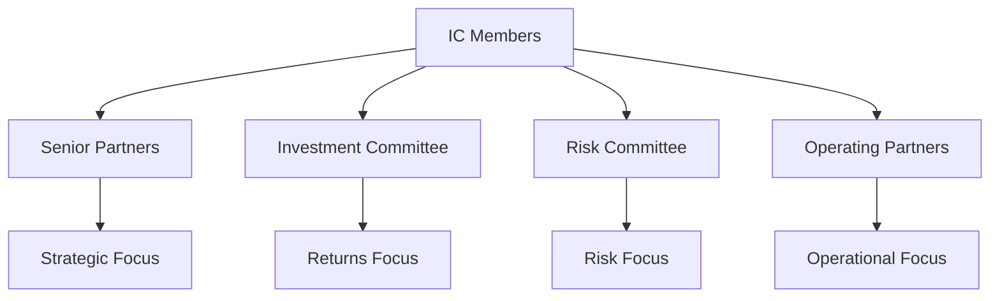
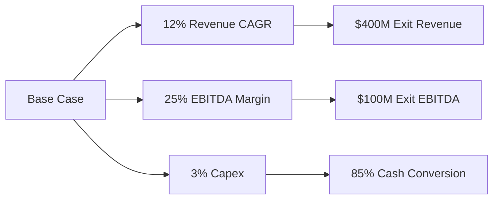
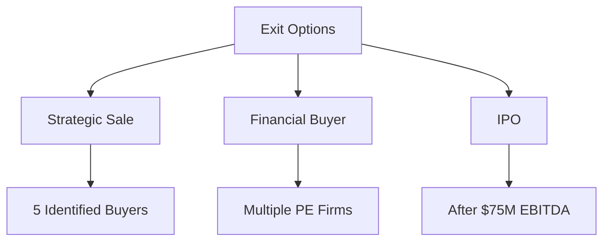

# Investment Committee Memos

## Creating Compelling IC Presentations

The Investment Committee (IC) memo is the most critical document in the investment process. It synthesizes months of analysis into a compelling investment narrative that drives decision-making. Sagacity's IC memo builder transforms complex analysis into clear, persuasive presentations.

## Understanding the IC Process

### Purpose and Importance

The IC memo serves multiple critical functions:
- **Decision Document**: Primary basis for investment approval
- **Risk Documentation**: Comprehensive risk assessment
- **Alignment Tool**: Ensures team consensus
- **Reference Guide**: Living document throughout ownership
- **Legal Record**: Due diligence documentation

### IC Audience Analysis



## IC Memo Structure

### Executive Summary (2 pages)

#### Investment Snapshot
```
Company: TechCo Industries
Sector: Business Services / Technology
Headquarters: San Francisco, CA
Revenue: $250M (2024E)
EBITDA: $50M (2024E) / 20% margin
Purchase Price: $500M / 10x EBITDA
Equity Investment: $200M / 40%
Target IRR: 25%+
Target Multiple: 3.0x
```

#### Investment Thesis
1. **Market Leader**: #2 position in $5B growing market
2. **Secular Growth**: 15% market CAGR driven by digital transformation
3. **Margin Expansion**: Path to 30% EBITDA margins
4. **Platform Opportunity**: 10+ identified add-on targets
5. **Clear Exit**: Multiple strategic buyers identified

### Company Overview (5 pages)

#### Business Description

**Detailed Business Model**
- Core products and services
- Customer value proposition
- Revenue model and pricing
- Competitive advantages
- Go-to-market strategy

#### Management Assessment

| Role | Name | Experience | Assessment | Retention |
|------|------|------------|------------|----------|
| CEO | John Smith | 20 years | Exceptional | Retained |
| CFO | Jane Doe | 15 years | Strong | Retained |
| CTO | Bob Johnson | 12 years | Strong | Retained |
| COO | Mary Wilson | 10 years | Good | Evaluating |

### Market Analysis (4 pages)

#### Industry Dynamics

```python
Market Analysis Framework:
├── Market Size & Growth
│   ├── TAM: $5B growing 15% CAGR
│   ├── SAM: $2B accessible market
│   └── SOM: $500M (25% share target)
├── Competitive Landscape
│   ├── Fragmented: Top 5 = 40% share
│   ├── Consolidating: 20+ deals last 3 years
│   └── Defensible: High switching costs
└── Growth Drivers
    ├── Digital transformation
    ├── Regulatory requirements
    └── Outsourcing trends
```

### Financial Analysis (6 pages)

#### Historical Performance

| Metric | 2021A | 2022A | 2023A | 2024E | CAGR |
|--------|-------|-------|-------|-------|------|
| Revenue | $180M | $200M | $225M | $250M | 11.6% |
| EBITDA | $27M | $34M | $41M | $50M | 22.8% |
| Margin | 15% | 17% | 18% | 20% | +5pp |
| FCF | $20M | $26M | $32M | $40M | 26.0% |

#### Projections and Assumptions



### Valuation (4 pages)

#### Valuation Summary

| Method | Value | Multiple | Weight | Weighted |
|--------|-------|----------|--------|----------|
| DCF | $525M | 10.5x | 40% | $210M |
| Comps | $500M | 10.0x | 30% | $150M |
| Precedents | $475M | 9.5x | 30% | $143M |
| **Blended** | **$503M** | **10.1x** | **100%** | **$503M** |

### Value Creation Plan (3 pages)

#### 100-Day Plan

```python
Week 1-2: Governance & Setup
├── Board composition
├── Management alignment
└── Quick wins identification

Week 3-4: Deep Dive Analysis
├── Customer interviews
├── Operational assessment
└── System evaluation

Week 5-8: Strategy Development
├── Growth initiatives
├── Cost optimization
└── Org design

Week 9-12: Execution Launch
├── Initiative kickoff
├── Team mobilization
└── Tracking systems

Week 13-14: Review & Adjust
├── Progress review
├── Plan refinement
└── Communication
```

### Risk Analysis (2 pages)

#### Risk Matrix

| Risk | Probability | Impact | Mitigation |
|------|-------------|--------|------------|
| Customer Concentration | Medium | High | Diversification plan |
| Technology Disruption | Low | High | R&D investment |
| Key Person Dependency | High | Medium | Retention packages |
| Integration Complexity | Medium | Medium | Dedicated PMO |
| Market Downturn | Low | Medium | Flexible cost structure |

### Exit Strategy (1 page)

#### Exit Options Analysis



## Using Sagacity for IC Memos

### Automated Content Generation

#### Data Integration
- Automatic population from data room
- Financial model integration
- Market data incorporation
- Management interview summaries
- Due diligence findings compilation

#### AI-Powered Writing

```python
Content Generation Features:
├── Executive Summary
│   ├── Investment thesis extraction
│   ├── Key metrics highlighting
│   └── Risk summary generation
├── Market Analysis
│   ├── Industry research synthesis
│   ├── Competitive positioning
│   └── Growth driver identification
└── Financial Analysis
    ├── Historical trend analysis
    ├── Projection narrative
    └── Assumption documentation
```

### Collaboration Features

#### Team Contributions
- Assigned sections by expertise
- Real-time collaborative editing
- Comment threading and resolution
- Version control and tracking
- Approval workflows

### Quality Control

#### Review Checklist
- [ ] All numbers tie to model
- [ ] Consistent messaging throughout
- [ ] Risk mitigation documented
- [ ] Exit strategy clear
- [ ] Value creation specific
- [ ] Assumptions documented
- [ ] Sources cited
- [ ] Legal review complete

## Best Practices

### Writing Excellence

#### Clarity and Conciseness
- Lead with conclusions
- Use bullet points effectively
- Include visual elements
- Avoid jargon
- Be specific, not general

#### Persuasive Narrative
1. **Hook**: Compelling opportunity
2. **Context**: Market dynamics
3. **Solution**: Our approach
4. **Evidence**: Supporting data
5. **Call to Action**: Clear recommendation

### Common Pitfalls

#### To Avoid
- ❌ Burying the lead
- ❌ Inconsistent data
- ❌ Overlooking risks
- ❌ Vague value creation
- ❌ Missing competition
- ❌ Unrealistic projections
- ❌ Poor formatting
- ❌ Length over substance

## IC Presentation

### Presentation Structure

#### 45-Minute Format
- 5 min: Executive summary
- 10 min: Company overview
- 10 min: Financial analysis
- 10 min: Value creation
- 5 min: Risk discussion
- 5 min: Q&A setup

### Q&A Preparation

#### Anticipated Questions
1. **Why this valuation?**
2. **Key risks and mitigation?**
3. **Management assessment?**
4. **Competition concerns?**
5. **Exit timing and options?**
6. **Value creation specifics?**
7. **Downside scenarios?**
8. **Integration complexity?**

## Post-IC Process

### Approval Conditions

#### Typical Conditions
- Complete legal documentation
- Finalize debt financing
- Management reference checks
- Environmental assessment
- Insurance review
- Working capital adjustment

### Documentation Updates

#### Living Document
- Regular updates during ownership
- Actual vs projection tracking
- Value creation progress
- Risk evolution
- Exit planning updates

## Conclusion

The IC memo is your opportunity to demonstrate thorough analysis and compelling investment logic. Sagacity's tools ensure comprehensive, professional, and persuasive IC materials that drive successful investment decisions.

---

*Next: Learn about [Valuation Reports](valuation-reports.md) generation.*