# What is Sagacity?

## Corporate Finance & Deal Preparation Platform

Sagacity is the deal origination and preparation engine of the DUC Capital Platform, designed specifically for investment bankers, M&A advisors, and corporate development teams. It manages the complete deal lifecycle from origination through due diligence, producing validated deals ready for tokenization in Bridge.

---

## What Does Sagacity Do?

### 🎯 **Complete Deal Lifecycle Management**

Sagacity manages the entire deal process from origination through validation:

- **Deal Origination** - Source and screen investment opportunities using AI-driven market analysis
- **Evaluation & Analysis** - AI-powered valuation models (DCF, comparables, precedent transactions)
- **Risk & Covenant Analysis** - Comprehensive risk assessment and covenant structuring
- **Due Diligence** - Graph-RAG powered data rooms and DD workflow management
- **Financial Modeling** - Advanced DuPont+ ROE analysis and scenario modeling
- **Deal Book Generation** - Complete investment committee memos and valuation reports ready for tokenization

### 🌟 **Real-World Example**

Consider a commercial real estate deal:
- Deal team identifies a $50M office building opportunity through AI market screening
- Sagacity's AI performs automated DCF valuation and comparable property analysis
- Risk analysis evaluates location, tenant quality, market conditions, and covenant structures
- DuPont+ ROE modeling projects returns under multiple economic scenarios
- Graph-RAG data room manages property inspections, legal reviews, and environmental assessments
- AI generates comprehensive investment committee memo and deal book
- Validated deal automatically flows to Bridge for tokenization structuring

---

## Who Uses Sagacity?

### 👥 **Corporate Finance Professionals**

Sagacity is purpose-built for financial industry professionals:

- **Investment Bankers** - Originate, evaluate, and structure deals for institutional clients
- **M&A Advisors** - Manage merger and acquisition transactions from LOI to close
- **Corporate Finance Teams** - Structure capital raises, refinancing, and strategic transactions
- **Deal Analysts** - Perform financial modeling, valuation analysis, and risk assessment
- **Financial Consultants** - Evaluate assets for tokenization potential and structure offerings
- **Private Equity/VC Professionals** - Source deals, conduct due diligence, and manage portfolio companies

!!! info "Specialized Tool"
    Sagacity is designed specifically for professionals who structure and execute complex financial transactions, particularly those preparing assets for tokenization.

---

## What Makes Sagacity Special?

### ✨ **Designed for Real People**

**Not Technical** - You don't need any special training or computer skills
**Not Complicated** - Everything is where you expect it to be
**Not Overwhelming** - You only see what's relevant to your job

### 🧩 **Adapts to Your Finance Role**

Sagacity provides role-specific interfaces for different finance functions:

```mermaid
graph TD
    A[👤 You Log In] --> B{Your Role}
    B -->|Investment Banker| C[Deal Pipeline<br/>Client Relationships<br/>Transaction History]
    B -->|Deal Analyst| D[Valuation Models<br/>Financial Analysis<br/>Risk Metrics]
    B -->|M&A Advisor| E[Target Screening<br/>Due Diligence<br/>Deal Structuring]
    B -->|Private Equity| F[Portfolio Companies<br/>Investment Analysis<br/>Exit Planning]
    
    style A fill:#e1f5fe
    style C fill:#e8f5e8
    style D fill:#fff3e0
    style E fill:#f3e5f5
    style F fill:#fce4ec
```

### 🔄 **Always Up-to-Date**

- Data refreshes automatically
- You always see the latest information
- Changes made by team members appear instantly
- No need to manually refresh or sync

---

## Your Sagacity Experience

### 🏠 **What You See When You Log In**

**Your Deal Dashboard:**
- Active deal pipeline with status updates
- AI-generated market insights and opportunities
- Key financial metrics and portfolio performance
- Pending due diligence items and approvals
- Team collaboration and messaging

**Professional Navigation:**
- Deal lifecycle workflow navigation
- Financial modeling and analysis tools
- Document management and deal rooms
- Client relationship management interface

### 📱 **Works Everywhere**

**On Your Computer:**
- Full-featured desktop experience
- Multiple windows and panels
- Keyboard shortcuts for speed

**On Your Tablet:**
- Touch-friendly interface
- Perfect for presentations and meetings
- Same features, optimized for touch

**On Your Phone:**
- Essential features always available
- Quick updates and notifications
- Perfect for when you're on the go

---

## Key Features That Help You Work Better

### 📋 **Intelligent Deal Management**

**AI-Powered Organization:**
- Deals prioritized by tokenization potential and market conditions
- Risk-adjusted returns and probability of success scoring
- Automated workflow routing based on deal type and stage
- Real-time market data integration for valuation updates

**Professional Workflow:**
- One-click status updates through deal stages
- Comprehensive due diligence checklists
- Automated client and stakeholder notifications
- Integration with legal and compliance requirements

### 📊 **Advanced Financial Analytics**

**Professional-Grade Analysis:**
- Real-time market valuations and comparable analysis
- Risk-adjusted return calculations and sensitivity analysis
- Portfolio performance tracking and attribution analysis
- Market trend analysis and investment opportunity scoring

**Institutional Reporting:**
- Regulatory-compliant deal books and offering memoranda
- Investor presentations with dynamic financial models
- Due diligence reports with automated data validation
- Export to institutional formats (PDF, Excel, PowerPoint)

### 💬 **Built-in Communication**

**Stay Connected:**
- Direct messages with colleagues
- Group discussions for projects
- Notifications when you're mentioned
- File sharing and collaboration

**Context-Aware:**
- Messages linked to specific tasks
- Historical conversations preserved
- Smart notifications (only what matters)
- Team presence indicators

---

## Real-World Examples

### 🏢 **David - Investment Banker**

**Deal Origination Week:**
1. Logs into Sagacity and reviews AI-identified opportunities in CRE sector
2. Sees market analysis showing 15% increase in office building values
3. Initiates evaluation of $75M mixed-use development opportunity
4. AI valuation models suggest 12-18% IRR potential
5. Structures preliminary term sheet for client presentation

**Complete origination-to-validation workflow producing tokenization-ready deals**

### 📊 **Rachel - Deal Analyst**

**Due Diligence Process:**
1. Opens comprehensive DD checklist for $50M logistics facility
2. Reviews automated property valuation and market comparables
3. Validates financial projections using Sagacity's modeling tools
4. Tracks progress of legal, environmental, and technical reviews
5. Generates risk-adjusted return analysis for investment committee

**AI-powered due diligence with comprehensive risk and covenant analysis**

### 🏦 **Michael - M&A Advisor**

**Transaction Management:**
1. Manages acquisition pipeline for $200M manufacturing client
2. AI screening identifies 12 potential targets meeting criteria
3. Initiates preliminary valuation analysis on top 5 targets
4. Structures indicative bid ranges using market multiples
5. Prepares comprehensive deal books for client review

**End-to-end deal preparation optimized for tokenization readiness**

---

## How Sagacity Learns About You

### 🎯 **Personalized Experience**

**Sagacity gets smarter as you use it:**

**Week 1:** Shows standard layout and common features
**Week 2:** Notices what you use most, prioritizes those features
**Month 1:** Suggests shortcuts and time-savers
**Month 3:** Predicts what you need before you ask for it

**Examples of Personalization:**
- Frequently used reports appear first
- Your most common tasks get shortcuts
- Colleagues you work with most are prioritized
- Relevant notifications, less noise

### 🔧 **Customizable Without Complexity**

**Easy Customizations:**
- Drag widgets to rearrange your dashboard
- Hide sections you don't need
- Set your preferred date/time formats
- Choose color themes

**Advanced Options:**
- Create custom views for specific projects
- Set up automated workflows
- Build personal reports
- Configure notification preferences

---

## Benefits You'll Experience

### ⚡ **Immediate Benefits (First Week)**
- Comprehensive deal pipeline visibility and management
- AI-powered market insights and opportunity identification
- Automated valuation models saving hours of manual analysis
- Integrated due diligence workflows reducing coordination overhead

### 🚀 **Growing Benefits (First Month)**
- Enhanced deal origination through predictive market analysis
- Faster transaction execution with automated workflows
- Improved client relationships through professional presentation tools
- Better risk management with comprehensive analysis capabilities

### 🎯 **Long-term Benefits (Ongoing)**
- Competitive advantage through advanced AI-powered deal analysis
- Increased transaction volume with streamlined processes
- Enhanced client satisfaction with faster turnarounds
- Career advancement through access to institutional-grade tools

---

## Getting Started with Sagacity

### 🌱 **Your First Steps**

1. **Review Your Deal Pipeline** - Understand current opportunities and stages
2. **Explore Market Analysis Tools** - Familiarize yourself with AI-powered insights
3. **Run a Sample Valuation** - Test financial modeling capabilities
4. **Set Up Client Profiles** - Configure relationship management features
5. **Customize Deal Workflows** - Adapt processes to your practice areas

### 📚 **Professional Resources**

- [Deal Origination Guide](deals/origination.md)
- [Financial Modeling Tools](ai-tools/financial-modeling.md)
- [Due Diligence Workflows](deals/due-diligence.md)
- [Client Relationship Management](daily/managing-work.md)

---

## Common Questions

!!! question "Is Sagacity difficult to learn for finance professionals?"
    Sagacity is designed with finance industry workflows in mind. Most investment bankers and deal professionals are productive within their first day using familiar financial concepts and terminology.

!!! question "Can I access Sagacity remotely for client meetings?"
    Yes! Sagacity provides secure access from any location with enterprise-grade security. Perfect for client presentations and remote deal management.

!!! question "What if I make an error in financial models?"
    Sagacity includes comprehensive audit trails and version control. Financial models can be easily revised, and all changes are tracked for compliance purposes.

!!! question "Do I need special training beyond my finance background?"
    Your existing finance and deal experience is the foundation. Sagacity builds on familiar concepts with training focused on platform-specific features and AI tools.

!!! question "Can I use it for client presentations?"
    Absolutely! Sagacity generates professional-grade presentations, deal books, and financial models suitable for institutional clients and investment committees.

---

## Why Financial Institutions Choose Sagacity

### 🏢 **Business Benefits**
- **Enhanced Deal Flow** - AI-powered opportunity identification increases deal volume
- **Faster Execution** - Automated workflows reduce transaction timelines by 40-60%
- **Better Risk Management** - Comprehensive analysis tools improve deal quality
- **Regulatory Compliance** - Built-in compliance frameworks reduce regulatory risk
- **Competitive Advantage** - Advanced analytics provide market differentiation

### 👥 **Professional Benefits**
- **Career Advancement** - Access to institutional-grade tools enhances professional capabilities
- **Client Satisfaction** - Faster turnaround and professional presentations improve client relationships
- **Market Expertise** - AI insights and market analysis enhance advisory capabilities
- **Efficiency Gains** - Automated processes allow focus on high-value activities
- **Professional Recognition** - Superior deal execution enhances industry reputation

---

## Ready to Start?

### 🚀 **Next Steps:**

1. **Request Access** - Contact your administrator for Sagacity credentials and permissions
2. **Complete Onboarding** - Follow our [professional setup guide](getting-started/first-setup.md)
3. **Configure Your Practice** - Set up [deal types](deals/evaluation.md) and [client workflows](daily/managing-work.md)
4. **Begin Deal Management** - Start with [deal origination](deals/origination.md) or [existing deal analysis](deals/evaluation.md)

---

!!! success "Professional-Grade Tools"
    Sagacity provides institutional-quality capabilities previously available only to top-tier investment banks. It combines advanced AI analysis with proven deal management workflows to enhance your professional practice.

!!! tip "Build Your Expertise Gradually"
    Start with core deal management features, then progressively explore advanced AI analytics and modeling tools. The platform grows with your expertise and deal complexity requirements.